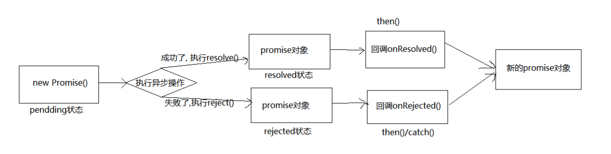
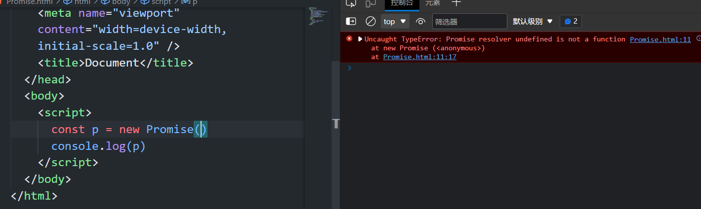
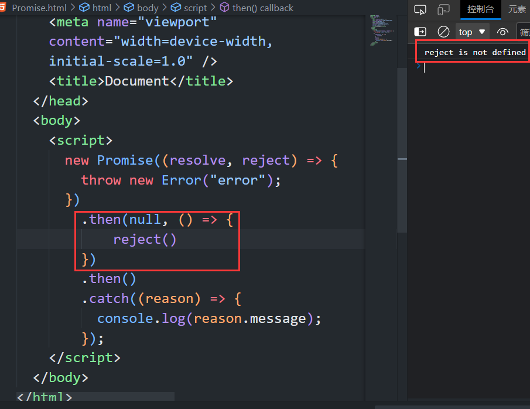
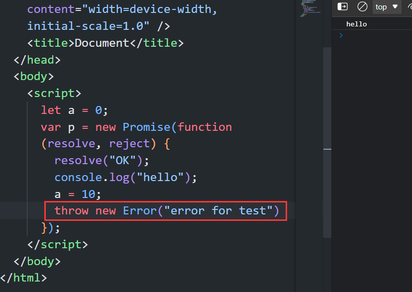
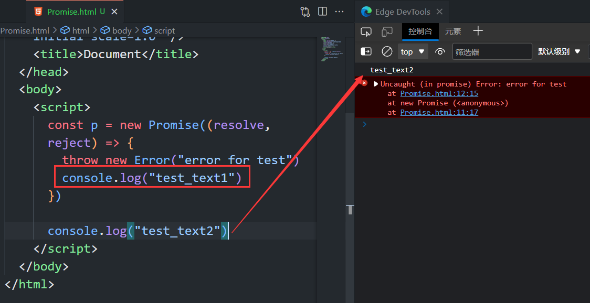
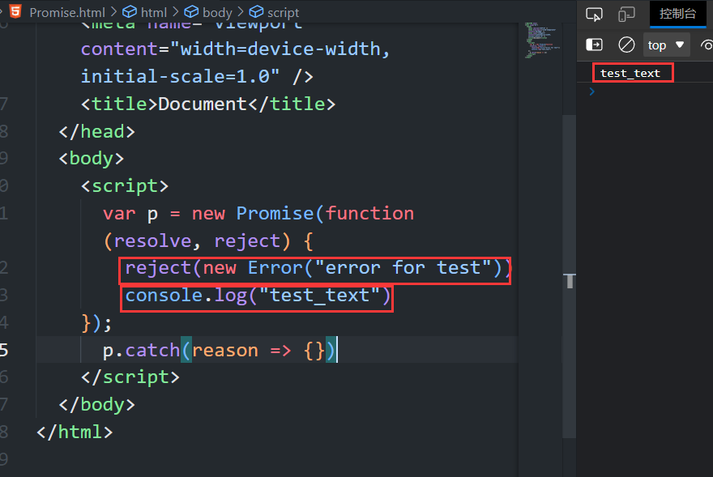
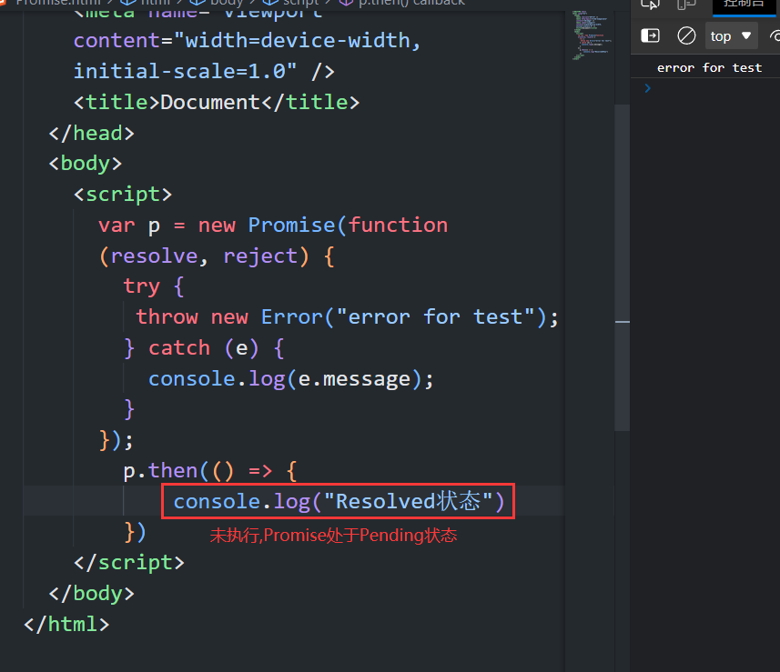

### Promise基本介绍

#### 理解

>1. 抽象表达:  
>
>   Promise 是 JS 中`进行异步编程`的新解决方案 备注：旧方案是单纯使用回调函数
>
>2. 具体表达: 
>
>    1) 从语法上来说: Promise 是一个`构造函数`
>
>    2) 从功能上来说: promise 对象用来封装一个异步操作并保存着其成功/ 失败的结果值.

#### promise 的状态

##### 	a) promise 的状态

>一个Promise对象，在任意时刻，都处于下面三个独立状态中的一个：
>
>1、处于完成Resolved状态，会立刻调用完成状态的函数f。
>
>2、处于失败Rejected状态，会立刻调用失败状态的函数r。
>
>3、处于进行Pending状态，表示延迟（异步）操作正在进行中。

##### 	b) promise 的状态改变

>Promise对象的状态不受外界影响，只有异步操作的结果可以决定当前Promise对象的状态，任何其他操作都无法改变这个Promise对象的状态。
>
>一旦Promise对象的状态发生改变，就不会再变,即状态只能改变一次。**任何时候再去取值都会得到这个结果**。Promise对象状态的改变只有两种可能：
>
>- pending 变为 resolved 
>
>- ending 变为 rejected
>
>当手动调用resolve()时Promise状态从pending 变为 resolved 
>
>当手动调用reject()或者Promise的函数参数中发生错误(被动产生或者主动抛出)时Promise状态从pending 变为 rejected

##### c) 异步任务的执行结果

>promise的状态无论变为成功还是失败, 都会有一个结果数据 成功的结果数据一般称为 value, 失败的结果数据一般称为 reason


#### promise的基本流程

>


### promise的特征

**Promise对象会在新建的时候立刻执行**，一旦开始执行，则无法中途停止或取消，而且也无法获取执行的进度（异步操作本身有提供接口除外）。

**如果不在Promise内部设置回调函数，那么Promise内部抛出的错误不会反应到外部**。

>```js
>var p1 = new Promise(function (resolve, reject) {
>    console.log("Pending");
>}); // "Pending"
>```
>
>无需调用p1，“Pending”会立刻输出，说明Promise对象会在新建的时候立刻执行，由于没有在内部调用resolve或reject，故**p1的状态一直是Pending**。
>
>```js
>try {
>    var p2 = new Promise(function (resolve, reject) {
>        throw new Error("Pending Error");
>    }); 
>} catch (e) {
>    console.log("catch error");
>}
>```
>
>上述代码不会输出"catch error"，反而，异常不会被捕获，而是会触发"Uncaught (in promise) Error: Pending Error"，即Promise内部抛出的错误不会反应到外部，此时**p2的状态是Rejected**。


### promise的基本使用

#### Promise构造函数

```js
new Promise(function (resolve, reject) {});
```

Promise构造函数接受一个函数作为参数，该函数有两个函数参数用于**改变promise的状态和向then()方法中传递参数**, 分别是resolve和reject，这两个函数由JavaScript引擎提供，不需要自己部署，

>调用Promise构造函数时传入的函数参数是必需的,如不传入则会报语法错误
>
>


当手动调用resolve()时Promise状态从pending 变为 resolved 

当手动调用reject()或者Promise的函数参数中发生错误(被动产生或者主动抛出)时Promise状态从pending 变为 rejected


如果调用resolve函数和reject函数时带有参数，那么这些参数会被传递给回调函数。reject函数的参数通常是Error对象的实例，表示抛出的错误。resolve函数的

参数除了正常的值外，还有可能是另一个Promise实例，表示异步操作的结果可能是一个值，也可能是另一个异步操作。


在Promise实例生成之后，可以用then方法分别指定Resolve状态和Rejected状态的回调函数。

#### Promise.prototype.then()

**then方法的函数参数以及函数参数的参数**

Promise.prototype上定义了then方法，为Promise实例添加状态改变时的回调函数。then方法的第一个参数是Resolved状态的回调函数，第二个参数是Rejected状态的回调函数。

这两个回调函数都接受一个参数，Resolved回调函数的参数是在Promise中调用resolve()时携带的参数，Rejected回调函数的参数是在Promise中调用reject()

时携带的参数或者Promise中发生错误的Error对象。

==如果then的参数不是函数，那么会在内部被替换为(x) => x ，即原样返回Promise最终结果的函数。==

```js
var p = new Promise(function (resolve, reject) {
    resolve('fun');
});

p.then('bar').then(function (value) {
    coonsole.log(value);
}); // "fun"
```

由于bar不是函数，故在内部会被替换成(bar)=>bar的形式


##### then方法的返回值

`then`方法返回的是一个新的`Promise`实例（注意，不是原来那个`Promise`实例）,这个Promise的行为与then方法的函数参数有关:

- 如果then中的回调函数**不返回任何值**或者返回一个非Promise实例对象的值，那么then返回的Promise将会成为Resolved状态，并且将返回的值作为Resolved状态的回调函数的参数值, 即返回`Promise.resolve([返回值])`

  ```js
  var p = new Promise(function (resolve, reject) {
      resolve('fun');
  });
  
  p.then(function () {
      return 1; // 返回一个非Promise值
  }).then(function (value) {
      console.log(value);
  }); // 1
  ```

- 如果then中的回调函数发生错误(被动产生或主动抛出)，那么then返回的Promise将会成为Rejected状态，并且将抛出的错误作为Rejected状态的回调函数的参数值, 即返回`Promise.reject([错误])`

  ```js
  var p = new Promise(function (resolve, reject) {
      resolve('fun');
  });
  
  p.then(function () {
      throw new Error('error');
      //unknownVariable //// 使用一个不存在的变量
  }).then(function () {}, function (value) {
      console.log(value.message);
  }); // "error"
  ```

- 当then中的回调函数返回一个Promise实例对象时,then会将此Promise实例对象作为返回值, 两个Promise实例对象的状态以及传给其状态改变回调函数的参数完全一致

  > 返回Resolved状态的Promise:
  >
  > ```js
  > var p = new Promise(function (resolve, reject) {
  >     resolve('fun');
  > });
  > 
  > p.then(function () {
  >     return new Promise(function (resolve, reject) {
  >          resolve('bar');
  >     }); // 返回一个已经是Resolved状态的Promise
  > }).then(function (value) {
  >     console.log(value);
  > }); // "bar"
  > ```
  >
  > 返回Rejected状态的Promise:
  >
  > ```js
  > var p = new Promise(function (resolve, reject) {
  >     resolve('fun');
  > });
  > 
  > p.then(function () {
  >     return new Promise(function (resolve, reject) {
  >          reject('bar');
  >     }); // 返回一个已经是Rejected状态的Promise
  > }).then(function (value) {}, function (value) {
  >     console.log('on rejected');
  >     console.log(value);
  > }); 
  > /*
  > on rejected
  > bar
  > */
  > ```
  >
  > 返回Pending状态的Promise:
  >
  > ```js
  > var p = new Promise(function (resolve, reject) {
  >     resolve('fun');
  > });
  > 
  > p.then(function () {
  >     return new Promise(function (resolve, reject) {
  >         setTimeout(() => {
  >             resolve(2);
  >         }, 2000); 
  >     }); // 返回一个Pending状态的Promise，这个Promise2秒后会变成Resolved
  > }).then(function (value) {
  >     console.log(value);
  > }); // 2秒后被执行，输出2
  > ```

#### Promise.prototype.catch()

`Promise.prototype.catch()`方法是`.then(null, rejection)`或`.then(undefined, rejection)`的别名，用于指定发生错误时的回调函数。

catch方法接受一个参数，该参数是一个函数，拥有一个参数是在Promise中调用reject()时携带的参数或者Promise中发生错误的Error对象。


下面两种写法是等价的:

```js
const promise = new Promise(function(resolve, reject) {
  throw new Error('test');
});
promise.catch(function(error) {
  console.log(error);
});
// Error: test
```

```js
const promise = new Promise(function(resolve, reject) {
  reject(new Error('test'));
});
promise.catch(function(error) {
  console.log(error);
});
```

一般来说，不要在`then()`方法里面定义 Reject 状态的回调函数（即`then`的第二个参数），总是使用`catch`方法。

```js
// bad
promise
  .then(function(data) {
    // success
  }, function(err) {
    // error
  });

// good
promise
  .then(function(data) { //cb
    // success
  })
  .catch(function(err) {
    // error
  });
```

上面代码中，第二种写法要好于第一种写法，理由是第二种写法可以捕获前面`then`方法执行中的错误，也更接近同步的写法（`try/catch`）。


一般总是建议，Promise 对象后面要跟`catch()`方法，这样可以处理 Promise 内部发生的错误。


catch()方法的返回值与then()方法完全一致,因此后面还可以接着调用`then()`或`catch()`方法。


#### Promise.prototype.finally()

Promise.prototype.finally()方法返回一个Promise，在Promise执行结束时，无论结果是Resolved或者是Rejected，在执行then()和catch()后，都会执行finally指定的回调函数。这为指定执行完Promise后，无论结果是Resolved或者是Rejected都需要执行的代码提供了一种方式，避免同样的语句需要在then()和catch()中各写一次的情况。


Promise.prototype.finally方法接受一个回调函数作为参数，由于无法知道Promise实例的最终状态，所以finally的回调函数中不接收任何参数，它仅用于无论最终结果如何都要执行的情况。

```js
server.listen(0)
.then(function (){})
.catch(function (){})
.finally(server.stop);
```

上述代码演示了服务器使用Promise处理请求，对正常的情况在then方法中处理，异常情况在catch中处理，但无论是正常还是异常，最终都在finally中关闭了服务器连接。

### resolve()的参数为Promise

`resolve`函数的参数除了正常的值以外，还可能是另一个 Promise 实例，`resolve`函数的参数除了正常的值以外，还可能是另一个 Promise 实例.

```js
const p1 = new Promise(function (resolve, reject) {
  // ...
});

const p2 = new Promise(function (resolve, reject) {
  // ...
  resolve(p1);
})
```

注意，p2返回另一个Promise:p1,则会使p2自己的状态无效,后面的then语句都会变成针对p1,就相当于后面的then方法都变成了p1的then方法,有点类似于p2被p1"夺舍"了..

### Promise的链式调用

`then`方法返回的是一个新的`Promise`实例（注意，不是原来那个`Promise`实例）。因此可以采用链式写法，即`then`方法后面再调用另一个`then`方法。

#### Promise异常穿透的原理

Promise对象的错误具有“冒泡”性质，会顺着链式向后传递，直到被onReject函数处理或catch语句捕获为止。

```js
var p = new Promise(function (resolve, reject) {    
    throw new Error("error");    
});

p.then(function () { console.log('pass');})       // 没有输出
 .then(function () { console.log('pass');})       // 没有输出
 .then(function () { console.log('pass');})       // 没有输出 
 .catch(function (value) { console.log(value);}); // 输出error
```

但是在then()中并没有传入处理失败数据的回调, 为什么还会正常往下传递呢? 其实, 当我们在.then()中, 不写第二个参数时, 默认是这样的:

```js
.then(
(data) => { ...处理data },
// 不写第二个参数, 相当于默认传了:
(err) => Promise.reject(err), 
// 或
(err) => { throw err; }
).then()
```

可是一旦手动添加了then方法的Onjected回调函数,则此then方法会按照规则返回Promise对象.

所以:**要想异常穿透到最后的catch中,则链上的每一个then方法最好都别添加Onjected回调函数,要添加则必须确保返回正确的Promise**



图中因为在链中的第一个then方法中设置了Onjected回调函数,且没有返回正确的Promise,所以导致后续的Onjected无法接收到最开始的异常.


#### 中断Promise链

想要中断Promise链,只需要then方法的第二个参数函数中或者catch的回调函数中返回一个一直处于Pending状态的Promise即可

```js
.catch((err) => {
  console.log('onRejected', err);
  // 中断promise链:
  return new Promise(() => {})
})
```


### Promise中的Error

首先,js中的原生错误类型Error有六种派生错误类型:

- SyntaxError:解析代码时发生的语法错误;

- ReferenceError:引用一个不存在的变量时发生的错误

- RangeError:一个值超出有效范围时发生的错误

- TypeError:变量或参数不是预期类型时发生的错误

- URIError :URI 相关函数的参数不正确时抛出的错误

- EvalError:eval函数没有被正确执行时，会抛出EvalError错误(已废弃使用)

>被动产生的错误必然是这六种之一,原生错误类型Error只能主动抛出:`throw new Error("发生错误")`

被动发生SyntaxError错误(语法错误)是全局性的,无论错误是否在Promise中,执行被动发生的语法错误时程序会直接停止运行并且在控制台报语法错误:`Uncaught SyntaxError:xxx`,并且错误类型前没有附加的`(in promise)` 

下面所说的发生错误是指除了被动发生语法错误之外的其它错误


在Promise中发生错误会将Promise的状态改变为rejected,然后控制台报错时会在错误类型前附加`(in promise)`表示这是promise中的错误,eg:`Uncaught (in promise) ReferenceError: num is not defined`,并且不会使Promise外部程序停止执行.

>注意:有一种情况下Promise中的错误会成为全局错误:
>
>Promise的函数参数中指定下一轮事件循环发生错误:
>
>```js
>const promise = new Promise(function (resolve, reject) {
>  resolve('ok');
>  setTimeout(function () { throw new Error('test') }, 0)
>});
>promise.then(function (value) { console.log(value) });
>// ok
>// Uncaught Error: test
>```
>
>上面代码中，Promise 指定在下一轮“事件循环”再抛出错误。到了那个时候，Promise 的运行已经结束了，所以这个错误是在 Promise 函数体外抛出的，所以会成为全局错误.


**Promise中Error的特征**

- 在Promise中执行错误就相当于调用reject()方法并且传入了对应的错误对象,即reject(new Error("error"))

- Promise的状态一旦发生改变（调用resolve()或reject()或者执行错误）,则之后的错误将不会被执行

  

- Promise内的错误无论是否被捕获(使用then方法的第二个参数或catch方法指定错误处理的回调函数),都不会影响Promise外部程序的执行,但Promise的参数函数在报错后停止运行.

  

  这与手动调用reject()是不同的: 手动调用resolve()或reject()并不会终结Promise的参数函数的执行:

  

  一般来说，调用`resolve`或`reject`以后，Promise 的使命就完成了，后继操作应该放到`then`方法里面，而不应该直接写在`resolve`或`reject`的后面。所以，最好在它们前面加上`return`语句，这样就不会有意外。

  ```js
  new Promise((resolve, reject) => {
    return resolve(1);
    // 后面的语句不会执行
    console.log(2);
  })
  ```

  这与try...catch代码块也是不同的,try代码块后必须有catch或finally代码块,否则会报语法错误.

- **异常穿透**

  Promise对象的错误具有“冒泡”性质，会顺着链式向后传递，直到被onReject函数处理或catch语句捕获为止。

  ```js
  var p = new Promise(function (resolve, reject) {    
      throw new Error("error");    
  });
  
  p.then(function () { console.log('pass');})       // 没有输出
   .then(function () { console.log('pass');})       // 没有输出
   .then(function () { console.log('pass');})       // 没有输出 
   .catch(function (value) { console.log(value);}); // 输出error
  ```

- 也可以在Promise中使用try...catch来捕获Promise中的错误,并且**由于错误被捕获,所以不会因为此错误而改变Promise的状态.**



### Promise的其它API

#### Promise.resolve()

`Promise.resolve()`会依据其参数来生成一个Promise对象并返回.

`Promise.resolve()`方法的参数分成四种情况。

**（1）参数是一个 Promise 实例**

如果参数是 Promise 实例，那么`Promise.resolve`将不做任何修改、原封不动地返回这个实例。

**（2）参数是一个`thenable`对象**

`thenable`对象指的是具有`then`方法的对象，比如下面这个对象。

```js
let thenable = {
  then: function(resolve, reject) {
    resolve(42);
  }
};
```

`Promise.resolve()`方法会将这个对象的then方法作为传入Promise构造函数中的参数函数

```js
let thenable = {
  then: function(resolve, reject) {
    resolve(42);
  }
};

let p1 = Promise.resolve(thenable);
//相当于:
//let p1 = Promise(function(resolve, reject) {
//    resolve(42);
//  })


p1.then(function (value) {
  console.log(value);  // 42
});
```

上面代码中，`thenable`对象的`then()`方法执行后，对象`p1`的状态就变为`resolved`，从而立即执行最后那个`then()`方法指定的回调函数，输出42。

**（3）参数不是具有`then()`方法的对象，或根本就不是对象**

如果参数是一个原始值，或者是一个不具有`then()`方法的对象，则`Promise.resolve()`方法会将此参数作为返回的Promise中的resolve()函数的参数, 此种情况返回的是一个resolved状态的Promise

```js
const p = Promise.resolve('Hello');
//相当于:
//const p = Promise(function(resolve, reject) {
//    resolve("Hello");
//  })


p.then(function (s) {
  console.log(s)
});
// Hello
```

上面代码生成一个新的 Promise 对象的实例`p`。由于字符串`Hello`不属于异步操作（判断方法是字符串对象不具有 then 方法），返回 Promise 实例的状态从一生成就是`resolved`，所以回调函数会立即执行。`Promise.resolve()`方法的参数，会同时传给回调函数。

**（4）不带有任何参数**

`Promise.resolve()`方法允许调用时不带参数，直接返回一个`resolved`状态的 Promise 对象。

所以，如果希望得到一个 Promise 对象，比较方便的方法就是直接调用`Promise.resolve()`方法。

```js
const p = Promise.resolve();

p.then(function () {
  // ...
});
```

上面代码的变量`p`就是一个 Promise 对象。

需要注意的是，立即`resolve()`的 Promise 对象，是在本轮“事件循环”（event loop）的结束时执行，而不是在下一轮“事件循环”的开始时。

```js
setTimeout(function () {
  console.log('three');
}, 0);

Promise.resolve().then(function () {
  console.log('two');
});

console.log('one');

// one
// two
// three
```

上面代码中，`setTimeout(fn, 0)`在下一轮“事件循环”开始时执行，`Promise.resolve()`在本轮“事件循环”结束时执行，`console.log('one')`则是立即执行，因此最先输出。

#### Promise.reject()

`Promise.reject(reason)`方法也会返回一个新的 Promise 实例，该实例的状态为`rejected`。

```js
const p = Promise.reject('出错了');
// 等同于
const p = new Promise((resolve, reject) => reject('出错了'))

p.then(null, function (s) {
  console.log(s)
});
// 出错了
```

上面代码生成一个 Promise 对象的实例`p`，状态为`rejected`，回调函数会立即执行。

`Promise.reject()`方法的参数，会原封不动地作为`reject`的理由，变成后续方法的参数。

```js
Promise.reject('出错了')
.catch(e => {
  console.log(e === '出错了')
})
// true
```

上面代码中，`Promise.reject()`方法的参数是一个字符串，后面`catch()`方法的参数`e`就是这个字符串。


#### Promise.all()

`Promise.all()`方法用于将多个 Promise 实例，包装成一个新的 Promise 实例。

```js
const p = Promise.all([p1, p2, p3]);
```

上面代码中，`Promise.all()`方法接受一个数组作为参数，`p1`、`p2`、`p3`都是 Promise 实例，如果不是，就会先调用+6Promise.resolve`方法，将参数转为 Promise 实例，再进一步处理。另外，`Promise.all()`方法的参数可以不是数组，但必须具有 Iterator 接口，且返回的每个成员都是 Promise 实例。

`p`的状态由`p1`、`p2`、`p3`决定，分成两种情况。

（1）只有`p1`、`p2`、`p3`的状态都变成`fulfilled`，`p`的状态才会变成`fulfilled`，此时`p1`、`p2`、`p3`的返回值组成一个数组，传递给`p`的回调函数。

（2）只要`p1`、`p2`、`p3`之中有一个被`rejected`，`p`的状态就变成`rejected`，此时第一个被`reject`的实例的返回值，会传递给`p`的回调函数。

下面是一个具体的例子。

```js
// 生成一个Promise对象的数组
const promises = [2, 3, 5, 7, 11, 13].map(function (id) {
  return getJSON('/post/' + id + ".json");
});

Promise.all(promises).then(function (posts) {
  // ...
}).catch(function(reason){
  // ...
});
```

上面代码中，`promises`是包含 6 个 Promise 实例的数组，只有这 6 个实例的状态都变成`fulfilled`，或者其中有一个变为`rejected`，才会调用`Promise.all`方法后面的回调函数。

下面是另一个例子。

```js
const databasePromise = connectDatabase();

const booksPromise = databasePromise
  .then(findAllBooks);

const userPromise = databasePromise
  .then(getCurrentUser);

Promise.all([
  booksPromise,
  userPromise
])
.then(([books, user]) => pickTopRecommendations(books, user));
```

上面代码中，`booksPromise`和`userPromise`是两个异步操作，只有等到它们的结果都返回了，才会触发`pickTopRecommendations`这个回调函数。

注意，如果作为参数的 Promise 实例，自己定义了`catch`方法，那么它一旦被`rejected`，并不会触发`Promise.all()`的`catch`方法。

```js
const p1 = new Promise((resolve, reject) => {
  resolve('hello');
})
.then(result => result)
.catch(e => e);

const p2 = new Promise((resolve, reject) => {
  throw new Error('报错了');
})
.then(result => result)
.catch(e => e);

Promise.all([p1, p2])
.then(result => console.log(result))
.catch(e => console.log(e));
// ["hello", Error: 报错了]
```

上面代码中，`p1`会`resolved`，`p2`首先会`rejected`，但是`p2`有自己的`catch`方法，该方法返回的是一个新的 Promise 实例，`p2`指向的实际上是这个实例。该实例执行完`catch`方法后，也会变成`resolved`，导致`Promise.all()`方法参数里面的两个实例都会`resolved`，因此会调用`then`方法指定的回调函数，而不会调用`catch`方法指定的回调函数。

如果`p2`没有自己的`catch`方法，就会调用`Promise.all()`的`catch`方法。

```js
const p1 = new Promise((resolve, reject) => {
  resolve('hello');
})
.then(result => result);

const p2 = new Promise((resolve, reject) => {
  throw new Error('报错了');
})
.then(result => result);

Promise.all([p1, p2])
.then(result => console.log(result))
.catch(e => console.log(e));
// Error: 报错了
```

#### Promise.any()

ES2021 引入了[`Promise.any()`方法](https://github.com/tc39/proposal-promise-any)。该方法接受一组 Promise 实例作为参数，包装成一个新的 Promise 实例返回。

```js
Promise.any([
  fetch('https://v8.dev/').then(() => 'home'),
  fetch('https://v8.dev/blog').then(() => 'blog'),
  fetch('https://v8.dev/docs').then(() => 'docs')
]).then((first) => {  // 只要有一个 fetch() 请求成功
  console.log(first);
}).catch((error) => { // 所有三个 fetch() 全部请求失败
  console.log(error);
});
```

只要参数实例有一个变成`fulfilled`状态，包装实例就会变成`fulfilled`状态；如果所有参数实例都变成`rejected`状态，包装实例就会变成`rejected`状态。

`Promise.any()`跟`Promise.race()`方法刚好是相反的.

下面是`Promise()`与`await`命令结合使用的例子。

```js
const promises = [
  fetch('/endpoint-a').then(() => 'a'),
  fetch('/endpoint-b').then(() => 'b'),
  fetch('/endpoint-c').then(() => 'c'),
];

try {
  const first = await Promise.any(promises);
  console.log(first);
} catch (error) {
  console.log(error);
}
```

上面代码中，`Promise.any()`方法的参数数组包含三个 Promise 操作。其中只要有一个变成`fulfilled`，`Promise.any()`返回的 Promise 对象就变成`fulfilled`。如果所有三个操作都变成`rejected`，那么`await`命令就会抛出错误。

`Promise.any()`抛出的错误是一个 AggregateError 实例（详见《对象的扩展》一章），这个 AggregateError 实例对象的`errors`属性是一个数组，包含了所有成员的错误。

下面是一个例子。

```
var resolved = Promise.resolve(42);
var rejected = Promise.reject(-1);
var alsoRejected = Promise.reject(Infinity);

Promise.any([resolved, rejected, alsoRejected]).then(function (result) {
  console.log(result); // 42
});

Promise.any([rejected, alsoRejected]).catch(function (results) {
  console.log(results instanceof AggregateError); // true
  console.log(results.errors); // [-1, Infinity]
});
```

#### Promise.race()

`Promise.race()`方法同样是将多个 Promise 实例，包装成一个新的 Promise 实例。

```
const p = Promise.race([p1, p2, p3]);
```

上面代码中，只要`p1`、`p2`、`p3`之中有一个实例率先改变状态，`p`的状态就跟着改变。那个率先改变的 Promise 实例的返回值，就传递给`p`的回调函数。

`Promise.race()`方法的参数与`Promise.all()`方法一样，如果不是 Promise 实例，就会先调用下面讲到的`Promise.resolve()`方法，将参数转为 Promise 实例，再进一步处理。

下面是一个例子，如果指定时间内没有获得结果，就将 Promise 的状态变为`reject`，否则变为`resolve`。

```
const p = Promise.race([
  fetch('/resource-that-may-take-a-while'),
  new Promise(function (resolve, reject) {
    setTimeout(() => reject(new Error('request timeout')), 5000)
  })
]);

p
.then(console.log)
.catch(console.error);
```

上面代码中，如果 5 秒之内`fetch`方法无法返回结果，变量`p`的状态就会变为`rejected`，从而触发`catch`方法指定的回调函数。

#### Promise.allSettled()

有时候，我们希望等到一组异步操作都结束了，不管每一个操作是成功还是失败，再进行下一步操作。但是，现有的 Promise 方法很难实现这个要求。

`Promise.all()`方法只适合所有异步操作都成功的情况，如果有一个操作失败，就无法满足要求。

```
const urls = [url_1, url_2, url_3];
const requests = urls.map(x => fetch(x));

try {
  await Promise.all(requests);
  console.log('所有请求都成功。');
} catch {
  console.log('至少一个请求失败，其他请求可能还没结束。');
}
```

上面示例中，`Promise.all()`可以确定所有请求都成功了，但是只要有一个请求失败，它就会报错，而不管另外的请求是否结束。

为了解决这个问题，[ES2020](https://github.com/tc39/proposal-promise-allSettled) 引入了`Promise.allSettled()`方法，用来确定一组异步操作是否都结束了（不管成功或失败）。所以，它的名字叫做”Settled“，包含了”fulfilled“和”rejected“两种情况。

`Promise.allSettled()`方法接受一个数组作为参数，数组的每个成员都是一个 Promise 对象，并返回一个新的 Promise 对象。只有等到参数数组的所有 Promise 对象都发生状态变更（不管是`fulfilled`还是`rejected`），返回的 Promise 对象才会发生状态变更。

```
const promises = [
  fetch('/api-1'),
  fetch('/api-2'),
  fetch('/api-3'),
];

await Promise.allSettled(promises);
removeLoadingIndicator();
```

上面示例中，数组`promises`包含了三个请求，只有等到这三个请求都结束了（不管请求成功还是失败），`removeLoadingIndicator()`才会执行。

该方法返回的新的 Promise 实例，一旦发生状态变更，状态总是`fulfilled`，不会变成`rejected`。状态变成`fulfilled`后，它的回调函数会接收到一个数组作为参数，该数组的每个成员对应前面数组的每个 Promise 对象。

```
const resolved = Promise.resolve(42);
const rejected = Promise.reject(-1);

const allSettledPromise = Promise.allSettled([resolved, rejected]);

allSettledPromise.then(function (results) {
  console.log(results);
});
// [
//    { status: 'fulfilled', value: 42 },
//    { status: 'rejected', reason: -1 }
// ]
```

上面代码中，`Promise.allSettled()`的返回值`allSettledPromise`，状态只可能变成`fulfilled`。它的回调函数接收到的参数是数组`results`。该数组的每个成员都是一个对象，对应传入`Promise.allSettled()`的数组里面的两个 Promise 对象。

`results`的每个成员是一个对象，对象的格式是固定的，对应异步操作的结果。

```
// 异步操作成功时
{status: 'fulfilled', value: value}

// 异步操作失败时
{status: 'rejected', reason: reason}
```

成员对象的`status`属性的值只可能是字符串`fulfilled`或字符串`rejected`，用来区分异步操作是成功还是失败。如果是成功（`fulfilled`），对象会有`value`属性，如果是失败（`rejected`），会有`reason`属性，对应两种状态时前面异步操作的返回值。

下面是返回值的用法例子。

```
const promises = [ fetch('index.html'), fetch('https://does-not-exist/') ];
const results = await Promise.allSettled(promises);

// 过滤出成功的请求
const successfulPromises = results.filter(p => p.status === 'fulfilled');

// 过滤出失败的请求，并输出原因
const errors = results
  .filter(p => p.status === 'rejected')
  .map(p => p.reason);
```

### async和await

从字面意思来理解。async 是“异步”的简写，而 await 可以认为是 async wait 的简写。所以很好理解 async 用于申明一个 function 是异步的，而 await 用于等待一个异步方法执行完成。

#### async

async的作用：**用于将一个函数的返回值封装为Promise**，async放在函数(准确说是放在function关键字前,ES6中方法的简化写法则是在函数名称前）前，组成一个“async函数”，async函数返回一个Promise:返回规则与then()方法的返回规则相同:

- 如果在async函数中没有return或 return一个非Promise的值，async会通过Promise.resolve()将其封装成Promise ,此时返回的Promise是resolved状态的.
- 如果在async函数中发生错误(主动或被动),则会返回一个rejectd状态的promise,即返回`Promise.reject([error])`

>注：如果一个函数本身就返回一个Promise且没有用到await,则没必要在此函数之前加上async。

#### await

await的作用：**用来得到一个Promise的resolve函数的参数**，await放在表达式之前，组成一个await表达式，如果表达式的结果是一个非Promise的值，则将这个值作为await表达式的结果，如果表达式的结果为Promise，则await会阻塞后面的代码，等着 Promise 对象 resolve，然后将 resolve 的值(调用resolve函数时传入的参数）作为 await 表达式的结果。
>注：await必须等待其后的表达式返回结果才会继续往下执行, 所以会阻塞程序的运行，这正是await只能用在async函数中的原因

#### async和await联用

async和await联用可以将promise链改写为同步代码的写法:

>用promise链和async写法的对比:
>
>promise链:
>
>```js
>function doIt() {
>    console.time("doIt");
>    const time1 = 300;
>    step1(time1)
>        .then(time2 => {
>            return step2(time1, time2)
>                .then(time3 => [time1, time2, time3]);
>        })
>        .then(times => {
>            const [time1, time2, time3] = times;
>            return step3(time1, time2, time3);
>        })
>        .then(result => {
>            console.log(`result is ${result}`);
>            console.timeEnd("doIt");
>        });
>}
>
>doIt();
>```
>
>async写法:
>
>```js
>async function doIt() {
>    console.time("doIt");
>    const time1 = 300;
>    const time2 = await step1(time1);
>    const time3 = await step2(time1, time2);
>    const result = await step3(time1, time2, time3);
>    console.log(`result is ${result}`);
>    console.timeEnd("doIt");
>}
>
>doIt();
>
>// c:\var\test>node --harmony_async_await .
>// step1 with 300
>// step2 with 800 = 300 + 500
>// step3 with 1800 = 300 + 500 + 1000
>// result is 2000
>// doIt: 2907.387ms
>```
>
>
