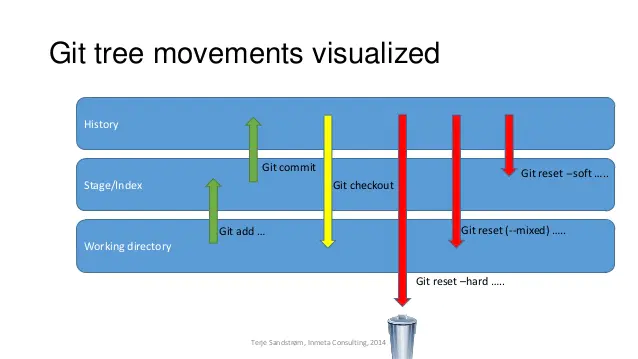

# Git

## Git概述

### Git安装

Git官网:https://git-scm.com/


- 一直下一步就可以，按自己意愿改安装路径

## Git工作流


**概念及解释**

**本地仓库**：是在开发人员自己电脑上的Git仓库,存放此仓库的提交记录等文件, 被git管理的文件夹中的.git 隐藏文件夹就是我们的本地仓库		
**远程仓库**：是在远程服务器上的Git仓库

>远程仓库:
>
>- 局域网(内网)
>  - gitlab
>- 公网（外网）
>  - gitlab
>  - github
>  - gitee 码云

**工作区**: 我们自己写代码(文档)的地方, 被git管理的文件夹中,除了.git 隐藏文件夹之外的所有文件(夹)都属于工作区
**暂存区**: 在 本地仓库中的一个特殊的文件(index) 叫做暂存区,临时保存工作区文件的改动


## Git操作

### 设置用户签名

签名的作用就是用来标识用户，以区分不同的开发人员。

- 设置用户签名

```shell
  git config --global user.email "you@example.com"
  git config --global user.name "Your Name"
```

- 查看用户签名

```shell
git config --global user.name   //查看用户名
git config --global user.email  //查看邮箱
```

- 查看git配置项

`git config --global --list`

git全局用户配置项存放在用户文件夹中的".gitconfig"文件中,可通过此文件查看或更改配置.


### 初始化本地仓库

#### 方式一: 创建本地仓库

- 在希望被git管理的文件夹内单击鼠标右键，点开 `Git Bash Here`, 输入指令`git init`
- 然后文件夹内会多一个 `.git` 的文件夹（这个文件夹是一个隐藏文件夹）
- 此文件夹及其所有的子文件夹和子文件都会被管理

> **注意**
>
> **只有当一个文件夹被 git 管理以后，我们才可以使用 git 的功能去做版本管理**
>
> 也就是说，我们必须要把我们电脑中的某一个文件夹授权给 `git`, `git` 才能对这个文件夹里面的内容进行各种操作, 而 `git init` 就是在进行这个授权的操作

#### 方式二: 克隆远程仓库

指令:`git clone <远程仓库地址>`, 会自动创建包含.git文件夹的本地仓库文件夹, 并会把远程仓库的内容克隆一份放在本地仓库里

>**注意**
>
>克隆到本地的仓库会自动添加这个远程仓库,且名称为origin
>
>

### 从工作区到到暂存区

#### 将文件提交到暂存区

`git add`命令用于将变化的文件，从工作区提交到暂存区。它的作用就是告诉 Git，下一次哪些变化需要保存到仓库区。用户可以使用`git status`命令查看目前的暂存区放置了哪些文件。

```shell
# 将指定文件放入暂存区
$ git add <file>

# 将当前目录下所有变化的文件，放入暂存区
$ git add .
```

**参数**

`-u`参数表示只添加暂存区已有的文件（包括删除操作），但不添加新增的文件。

```shell
$ git add -u
```

`-A`或者`--all`参数表示追踪所有改变，包括新增、修改和删除, 作用等同于`git add .`。

```shell
$ git add -A
```

`-f`参数表示强制添加某个文件，不管`.gitignore`是否包含了这个文件。

```shell
$ git add -f <fileName>
```

`-p`参数表示进入交互模式，指定哪些修改需要添加到暂存区。即使是同一个文件，也可以只提交部分变动。

```shell
$ git add -p
```

#### 将文件从暂存区/工作区删除

`git rm -f <file>`可以将指定文件从暂存区和工作区都删除(无论暂存区和工作区的此文件是否一致)

`git rm -f --cached <file>`可以将文件从暂存区删除,但保留工作区的文件

删除文件夹时要加上参数`-r`


### 将暂存区的变化提交到本地仓库

`git commit`命令用于将暂存区中的变化提交到仓库区。

```shell
$ git commit -m "message"
```

#### 参数

**-m**

`-m`参数用于添加提交说明, 是必需的。如果省略`-m`参数，`git commit`会自动打开文本编辑器，要求输入。

```shell
$ git commit -m "message"
```

**-a**

`-a`参数用于先将所有工作区的变动文件，提交到暂存区，再运行`git commit`。用了`-a`参数，就不用执行`git add .`命令了。

==注意: 使用此参数必须所有文件都不是untracked状态,即新建文件后的第一次提交不能使用此参数,因为此时新增的文件是unracked状态.==

```shell
$ git commit -a -m "message"
```

**--allow-empty**

`--allow-empty`参数用于没有提交信息的 commit。

```shell
$ git commit --allow-empty
```

**—amend**

`--amend`参数用于撤销上一次 commit，然后生成一个新的 commit。

```shell
$ git commit --amend - m "new commit message"
```

**—fixup**

`--fixup`参数的含义是，当前添加的 commit 是以前某一个 commit 的修正。以后执行互动式的`git rebase`的时候，这两个 commit 将会合并成一个。

```sh
$ git commit --fixup <commit>
```

执行上面的命令，提交说明将自动生成，即在目标 commit 的提交说明的最前面，添加“fixup! ”这个词。

**—squash**

`--squash`参数的作用与`--fixup`类似，表示当前添加的 commit 应该与以前某一个 commit 合并成一个，以后执行互动式的`git rebase`的时候，这两个 commit 将会合并成一个。

```shell
$ git commit --squash <commit>
```


#### 查看本地仓库提交日志

`git log`可以查看本地仓库的提交历史,里面含有每一次提交的版本号和提交说明


添加`--pretty=oneline` 参数, 会把每条记录以一行的形式输出：


`git reflog`可以查看本地仓库的所有操作记录,包括版本回退后抹除的提交记录

### 版本回退

>回退版本时用什么指定目标版本:
>
>**HEAD** ：
>
>- HEAD 表示当前版本
>- HEAD^ 上一个版本
>- HEAD^^ 上上一个版本
>- HEAD^^^ 上上上一个版本
>- 以此类推...
>
>**可以使用 ～数字表示**
>
>- HEAD~0 表示当前版本
>- HEAD~1 上一个版本
>- HEAD^2 上上一个版本
>- HEAD^3 上上上一个版本
>- 以此类推...
>
>**版本号**
>
>直接用目标版本对应的版本号指定版本

#### reset

git reset 命令用于回退版本，可以指定退回某一次提交的版本, 它是通过将HEAD指针直接移动到指定版本来实现回退的,所以回退版本之后HEAD之后的提交记录都将抹除.

它的三个参数对应三种回退模式:

- **--soft** 把最新节点和reset目标节点之间的所有变化 和 最后一次commit之后添加到暂存区的变化 按序合并之后将最终的变化添加进暂存区, 不会改变工作区

- **--mixed(默认)** 把最新节点和reset目标节点之间的所有变化 和 最后一次commit之后添加到暂存区的变化 以及 提交到暂存区之后对于工作区文件的改变 按序合并之后将最终的变化放入工作区, 不会改变工作区,就相当于将reset目标节点的全部文件与工作区的文件做对比,把工作区文件相较于reset目标节点的文件的变化添加进工作区, 用`git status`指令可以看到被放到工作区的各种变化
- **--hard** 将工作区文件变为与目标版本完全一样,并且清空暂存区和工作区文件的变化

 

##### 三种模式的使用场景

1. **--hard**

   (1) **要放弃目前本地的所有改变時**，即去掉所有add到暂存区的改变和工作区的改变，可以执行 **git reset -hard HEAD** 来强制恢复git管理的文件夹的內容及状态；

   (2) **真的想抛弃目标节点后的所有commit**（可能觉得目标节点到原节点之间的commit提交都是错了，之前所有的commit有问题）。

2. **--soft**

   原节点和**reset**节点之间的【差异变更集】会放入**index暂存区**中(**Staged files**)，所以假如我们之前工作目录没有改过任何文件，也没add到暂存区，那么使用**reset --soft**后，我们可以直接执行 **git commit** 將 index暂存区中的內容提交至 **repository** 中。为什么要这样呢？这样做的使用场景是：假如我们想合并「当前节点」与「**reset**目标节点」之间不具太大意义的 **commit** 记录(可能是阶段性地频繁提交,就是开发一个功能的时候，改或者增加一个文件的时候就**commit**，这样做导致一个完整的功能可能会好多个**commit**点，这时假如你需要把这些**commit**整合成一个**commit**的时候)時，可以考虑使用**reset --soft**来让 **commit** 演进线图较为清晰。总而言之，**可以使用--soft合并commit节点**。

3. **--mixed（默认）**

   (1)使用完**reset --mixed**后，我們可以直接执行 **git add** 将這些改变果的文件內容加入 **index 暂存区**中，再执行 **git commit** 将 **Index暂存区** 中的內容提交至**Repository**中，这样一样可以达到合并**commit**节点的效果（与上面--soft合并commit节点差不多，只是多了git add添加到暂存区的操作）；

   (2)移除所有Index暂存区中准备要提交的文件(Staged files)，我们可以执行 **git reset HEAD** 来 **Unstage** 所有已列入 **Index暂存区** 的待提交的文件。(有时候发现add错文件到暂存区，就可以使用命令);

   (3)**commit**提交某些错误代码，或者没有必要的文件也被**commit**上去，不想再修改错误再**commit**（因为会留下一个错误**commit**点），可以回退到正确的**commit**点上，然后所有原节点和**reset**节点之间差异会返回工作目录，假如有个没必要的文件的话就可以直接删除了，再**commit**上去就OK了。

#### revert

revert用于撤销某一次提交,并将撤销提交后的所有文件做一次提交,如果要撤销的目标节点和之后的任一个节点修改了同一文件,则会发生冲突.

[(39条消息) Git如何优雅的进行版本回退：git reset 和 git revert区别_琦彦的博客-CSDN博客](https://blog.csdn.net/fly910905/article/details/88635673)

[一文彻底搞清git reset和revert区别 - 掘金 (juejin.cn)](https://juejin.cn/post/7021320176998023182)


### 
