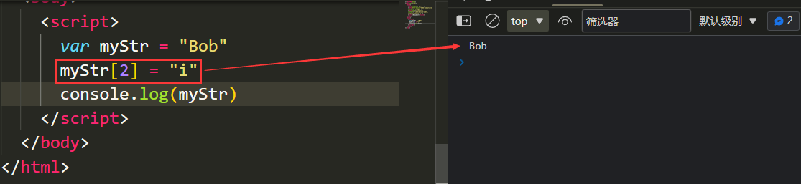

# 一、ECMAscript


## 1. JS绪论

### 1-1 JavaScript发展历史

```txt
1. 1994年，网景公司(Netscape)发布了Navigator浏览器0.9版，这是世界上第一款比较成熟的网络浏览器，轰动一时。但是这是一款名副其实的浏览器--只能浏览页面，浏览器无法与用户互动,当时解决这个问题有两个办法，一个是采用现有的语言,许它们直接嵌入网页。另一个是发明一种全新的语言。
	liveScript ==> javaScript ==> ECMAscript

2. 1995年Sun公司将Oak语言改名为Java，正式向市场推出。Sun公司大肆宣传，许诺这种语言可以"一次编写，到处运行"(Write Once, Run Anywhere)，它看上去很可能成为未来的主宰。

3. 网景公司动了心，决定与Sun公司结成联盟

4. 34岁的系统程序员Brendan Eich登场了。1995年4月，网景公司录用了他,他只用10天时间就把Javascript设计出来了。

5.
	(1)借鉴C语言的基本语法
	(2)借鉴Java语言的数据类型和内存管理
	(3)借鉴Scheme语言，将函数提升到"第一等公民"(first class)的地位
	(4)借鉴Self语言，使用基于原型(prototype)的继承机制
```


### 1-2 Javacript的组成


```txt
1. ECMAScript: 定义了javascript的语法规范,描述了语言的基本语法和数据类型
2. BOM (Browser Object Model): 浏览器对象模型
  - 是一套成熟的可以操作浏览器的 API，通过 BOM 可以操作浏览器。比如： 弹出框、浏览器跳转、获取分辨率等
3. DOM (Document Object Model): 文档对象模型
  - 是一套成熟的可以操作页面元素的 API，通过 DOM 可以操作页面中的元素。比如： 增加个 div，减少个 div，给 div 换个位置等
```

总结： JS 就是通过固定的语法去操作 浏览器 和 标签结构 来实现网页上的各种效果


### 1-3 JavaScript能干什么

```txt
1. 常见的网页效果【表单验证，轮播图。。。】
2. 与H5配合实现游戏【水果忍者：http://www.jq22.com/demo/html5-fruit-ninja/】
3. 实现应用级别的程序【http://naotu.baidu.com】
4. 实现图表统计效果【https://echarts.apache.org/examples/zh/】
5. js可以实现人工智能【面部识别】
6. 后端开发，app开发，桌面端开发......
```


## 2. JavaScript代码的书写位置

- 和 `css`一样， `js`也可以有多种方式书写在页面上让其生效
- 分为 `行内式`， `内嵌式`，`外链式`

### - 行内式 （不推荐）

写在标签上的 js 代码需要依靠事件（行为）来触发

```html
<!-- 写在 a 标签的 href 属性上 -->
<a href="javascript:alert('我是一个弹出层');">点击一下试试</a>

<!-- 写在 div 标签的 onclick 属性上 -->
<div onclick="alert('我是一个弹出层')">点一下试试看</div>

<!--
注：onclick 是一个事件（点击事件），当点击元素的时候执行后面的 js 代码
-->
```


### - 内嵌式 JS 代码

在 html 页面书写一个 `<script>` 标签，标签内部书写 js 代码

```html
<script type="text/javascript"> <!--type属性可省略-->
        alert('我是一个弹出层')
</script>
```

注意：内嵌式代码中不能出现“`</script>`”，确有需求，需利用转义字符\进行转义：`<\/script>`


### ※ 外链式 JS 代码

新建一个 `.js` 后缀的文件，在文件内书写js代码，通过`<script src="js文件路径"></script>`把写好的js文件引入html文件中

```javascript
// 我是 index.js 文件
alert('我是一个弹出层')
```

```html
<!-- 我是一个 html 文件 -->
<script src="index.js"></script>
```

### JavaScript 代码执行顺序

一个html文件中可以有多对`<script></script>`标签(无论是内嵌式还是外链式), 并且`<script></script>`标签可以出现在html文件中的任意位置  

浏览器在解析 HTML 文档时，将根据文档流从上到下逐行解析和显示。

JavaScript 代码也是 HTML 文档的组成部分，因此 JavaScript 脚本的执行顺序也是根据`<script></script>`标签的位置来确定的

> **示例**
> 使用浏览器测试下面示例，会看到 JavaScript 代码从上到下逐步被解析的过程。
>
> ```javascript
> <!DOCTYPE html>
> <script>
>   `    alert("顶部脚本");
> </script>
> <html>
> <head>
>   `    <meta charset="UTF-8">
>   `    <title>test</title>
>   `    <script>
>       `        alert("头部脚本");
>   `    </script>
> </head>
> <body>
>   `    <h1>网页标题</h1>
>   `    <script>
>       `        alert("页面脚本");
>   `    </script>
>   `    <p>正文内容</p>
> </body>
> <script>
>   `    alert("底部脚本");
> </script>
> </html>
> ```

> 在浏览器中浏览上面示例网页，首先弹出提示文本“顶部脚本”，然后显示网页标题“test”，接着弹出提示文本“头部脚本”，下面才显示一级标题文本“网页标题”，继续弹出提示文本“页面脚本”， 接着显示段落文本“正文内容”，最后弹出提示文本“底部脚本”。

对于导入的 JavaScript 文件，也将按照 ＜script> 标签在文档中出现的顺序来执行，而且执行过程是文档解析的一部分，不会单独解析或者延期执行。

如果想改变 JavaScript 文件的执行顺序，可以给 <script> 标签增加 defer 或者 async 属性


## 3. 注释

- 语法

  ​	单行注释: `//+单行代码`

  ​	多行注释: `/*单行或多行代码*/`

  

- VSCode快捷键

  ​	单行注释：`Ctrl+/`

  ​	多行注释: `Shift+Ctrl+/`

  

- 嵌套注释

  js代码(外链式和内嵌式)支持嵌套注释

  ```js
  /* alert("Hello World");
  // document.write("Hello World");
  // // console.log("Hello World"); */
  ```

  

## 4. 变量（重点）

### 定义变量及赋值

```javascript
// 定义一个变量
var num;

// 给一个变量赋值
num = 100;

// 定义一个变量的同时给其赋值
var num2 = 200;
```

### 标识符的命名规则和命名规范

**标识符（Identifier）就是名称的专业术语。JavaScript 标识符包括变量名、函数名、参数名和属性名。**

- 规则： 必须遵守的，不遵守就是错

  1. 一个变量名称可以由 **数字**、**字母**、**英文下划线（_）**、**美元符号（$）**组成
  2. 严格区分大小写
  3. 不能由数字开头
  4. 不能是 **保留字** 或者 **关键字**
  5. 不能出现空格或汉字

  >**提示**
  >
  >可以使用 Unicode 转义序列。例如，字符 a 可以使用“\u0061”表示。
  >示例
  >在下面示例中，定义变量 a，使用 Unicode 转义序列表示变量名。
  >
  >```javascript
  >var a = "字符 a 的 Unicode 转义序列是 \u0061";
  >document.write(\u0061);
  >12
  >```
  >
  >使用转义序列不是很方便，一般常用转义序列表示特殊字符或名称，如 JavaScript 关键字、程序脚本等。

- 规范： 建议遵守的（开发者默认），不遵守不会报错

  1. 标识符尽量有意义（语义化）
  2. 遵循驼峰命名规则，由多个单词组成的时候，从第二个单词开始首字母大写


### 数据类型（重点）

分为两大类 **基本数据类型** 和 **复杂数据类型**

**基本数据类型(值类型)**

1. 数值类型（number）

   - 一切数字都是数值类型，包括整数（支持二进制(以0b或0B开头)、八进制(以0o或0O开头)、十六进制(以0x或0X开头))、浮点数,还有科学计数法(eg:3e5)

     >提示:
     >
     >整数取值范围: 最大整数:2⁵³ - 1，即 9007199254740991, 最小整数-(2⁵³ - 1)，即 -9007199254740991
     >
     >浮点数取值范围: 最大值±1.7976931348623157e+308, 最小值±5e-324, 也即数值类型变量的取值范围

   - 另外，Number 类型中还有一些比较特殊的值，分别为 Infinity、-Infinity 和 NaN，其中

     - Infinity：用来表示正无穷大的数值，一般指大于 1.7976931348623157e+308 的数；
     - -Infinity：用来表示负无穷大的数值，一般指小于 5e-324 的数；

     >提示：如果某次计算的结果超出了 JavaScript 中 Number 类型的取值范围，那么这个数就会自动转化为无穷大，正数为 Infinity，负数为 -Infinity。
     >
     >```js
     >vara =5 /0;// 等于 Infinity         
     >varb =-5 /0;// 等于 -Infinity
     >```

     - NaN

       即非数值（Not a Number 的缩写），用来表示某个值不是数字。NaN 不等于（通过`== != === !==`比较）其它任何值（包括另外一个 NaN 值），使用 isNaN() 函数可以判断一个数是否为 NaN。

     

2. 字符串类型（string）

   - 被双引号或单引号包裹的所有内容

   - 需要注意的是，单引号和双引号是定义字符串的不同方式，并不是字符串的一部分,所以字符串在输出时不含引号

   - 定义字符串时，如果字符串中包含引号，可以使用反斜杠`\`来转义字符串中的引号，或者选择与字符串中不同的引号来定义字符串，如下例所示：

     ```js
     var str = "Let's have a cup of coffee.";  // 双引号中包含单引号
     var str = 'He said "Hello" and left.';    // 单引号中包含双引号
     var str = 'We\'ll never give up.';        // 使用反斜杠转义字符串中的单引号
     ```

3. 布尔类型（boolean）

   - 布尔类型变量的值只有两个（`true` 或者 `false`）

4. null类型（null）

   - null类型变量的值只有一个，就是 `null`

     虽然`typeof(null)`的值为object,但null并不是对象,这是历史遗留bug

5. undefined类型（undefined）

   - undefined类型变量的值只有一个，就是 `undefined`，变量在被提升时默认是undefined类型变量

**复杂数据类型(引用类型)**

对象(Object)、数组(Array)、函数(Function)

>JS可谓"万物皆对象",其实数组和函数本质上也是对象


**判断数据类型** 

- 使用 `typeof` 关键字来进行判断，有两种使用方法：

```javascript
typeof x;       // 获取变量 x 的数据类型
typeof(x);      // 获取变量 x 的数据类型
```

注意：typeof  undefined 输出为undefined，而typeof unll 输出为object

提示：“typeof  任意类型变量”的输出一定是一个字符串，eg：typeof typeof 100  ，输出为“number”，是字符串


### 基本和复杂数据类型的区别

**存储**

存储空间分成两种 **栈** 和 **堆**

- 栈： 主要存储基本数据类型的内容
- 堆： 主要存储复杂数据类型的内容


**基本数据类型在内存中的存储情况**

直接在 **栈空间** 内有存储一个数据


**复杂数据类型在内存中的存储情况**

1. 在堆里面开辟一个存储空间
2. 把数据存储到存储空间内
3. 把存储空间的**地址**赋值给栈里面的变量


>string、bigint、symbol虽然是基本数据类型,但是实际存放在堆空间中.


**赋值**

基本数据类型的赋值是直接将值存储到对应的栈空间

```js
var a = 10
var b = a //将变量a中所存储的10也存储到b中
```

复杂数据类型是将存储数据的堆空间的地址存储到对应的栈空间

```js
var a = {
    name : "Jack"
}

var b = a //将a中存储的对象的地址也存储到b中
```


**比较**

- 基本数据类型是 **值** 之间的比较

  ```javascript
  var num = 1
  var str = '1'
  
  console.log(num == str) // true
  ```

- 复杂数据类型是 **地址** 之间的比较

  ```javascript
  var obj = { name: 'Jack' }
  var obj2 = { name: 'Jack' }
  
  console.log(obj == obj2) // false
  ```

  - 因为我们创建了两个对象，那么就会在 堆空间 里面开辟两个存储空间存储数据（两个地址）
  - 虽然存储的内容是一样的，但是是两个存储空间，所以有两个地址
  - 复杂数据类型之间就是地址的比较，`obj` 和 `obj2` 两个变量的地址不一样,所以我们得到的就是 `false`


**传参**

函数的形参也可以看做是一个变量，

当我们把一个**值**类型变量作为参数传给函数的形参时，其实是把变量在栈空间里的值复制了一份给形参，那么在方法内部对形参做任何修改，都不会影响到的外部变量。

当我们把**引用**类型变量传给形参时，其实是把变量在栈空间里保存的堆地址复制给了形参，形参和实参其实保存的是同一个堆地址，所以操作的是同一个对象。(浅拷贝)

## 5. ※数据类型转换

### 其他数据类型转成数值


---

这个方法适用于所有类型变量


1. 利用全局方法Number()：`Number(变量/字面量)`

   > - 布尔值true转换为1，false转换为0  
   >
   > ```javascript
   > var a = false // true false
   > var b = Number(a) // 1 , 0 
   > console.log(a,b)
   > ```
   >
   > - null转换为0
   >
   > ```js
   > var a = null 
   > var b = Number(a) // 0 
   > console.log(a,b)
   > ```
   >
   > - 由数值组成的字符串转换为对应数值
   >
   > ```js
   > var a = "123.45" 
   > var b = Number(a) // 123.45
   > console.log(a,b)
   > ```
   >
   > - 其它类型都会转换为 `NaN` (NaN是Number类型中的一个特殊值)，如string，undefined
   >
   > ```js
   > var a = "123abc" 
   > var b = Number(a) // NaN
   > console.log(a,b)
   > 
   > var a
   > var b = Number(a) // NaN
   > console.log(a,b)
   > ```

   

   ---

   以下三种方法适用于将字符串转换为数值

   

2. 利用全局方法parseInt()：`parseInt(变量/字面量)`

   > 从第一位开始检查，是数字就转换，直到一个不是数字的内容，开头就不是数字，那么直接返回 `NaN`
   >
   > 不认识小数点，只能保留整数
   >
   > ```js
   > var a = "250px" 
   > var b = parseInt(a) // 250
   > console.log(a,b) 
   > 
   > var a = 250.5 
   > var b = parseInt(a) // 250
   > console.log(a,b)
   > ```

3. 利用全局方法parseFloat()：`parseFloat(变量/字面量)`

   > 从第一位开始检查，是数字就转换，直到一个不是数字的内容，开头就不是数字，那么直接返回 `NaN`
   >
   > 认识一次小数点
   >
   > ```js
   > var a = "1.25rem"
   > var b = parseFloat(a) //1.25
   > console.log(a,b)
   > 
   > var a = 1.25
   > var b = parseFloat(a) //1.25
   > console.log(a,b)
   > ```

4. 除了加法以外的数学运算

   > 这几种运算符可以将由数字组成的字符串隐式转化为数值：当运算符两边是数值或者由数字组成的字符串，会将两个变量都转化为数值然后进行运算，所以可以利用“变量-0”、“变量*1”、“变量/1”将一个由数字组成的字符串显示转化为数值变量
   >
   > 只要运算符任意一边不是一个可运算数字，那么就会返回 `NaN`
   >
   > ```js
   > 非加号 -0 /1 *1
   > var a = "100"
   > var b = a*1 
   > console.log(a,b) //100
   > 
   > var obj = {}
   > var res = obj*1  
   > console.log(res) //NaN
   > 
   > //特殊的两种：+和-可以直接将一个由数字组成的字符串转化为数值
   > var a = "123"
   > var b = +a
   > var c = -a
   > console.log(b) //123
   > console.log(c) //-123
   > ```
   >

将其它数据类型转化为数值后, 可以通过isNaN(value)判断是否转化为了一个合法的数字,如果是一个是则返回true,否则返回false.

### 其他数据类型转成布尔

`Boolean(变量)`

> 在 js 中，只有 0`、`"∅"`(空字符串)、null`、`undefined`、`NaN`，这些经过`Boolean()` 转化后为`false`
>
> ```js
> // 0 , "", undefined , null, NaN
> var a = ""
> console.log(Boolean(a)) //false
> let b = Symbol()
> console.log(Boolean(b)) //true
> ```
>
> 其余都是 `true`


### 其他数据类型转成字符串

1. 利用方法:`变量.toString()`

   > **null，undefined没有toString方法**
   >
   > ```js
   > var a = null
   > var b = a.toString() //TypeError
   > console.log(a,b)
   > 
   > var a
   > var b = a.toString()
   > console.log(a,b)   //TypeError
   > ```

2. 利用全局方法String()：`String(变量/字面量)`

   > 所有数据类型都可以

3. +空字符串

   > `+`运算符只要有一边是字符串，就会将两边的变量都转化为字符串，然后进行拼接，所以可以利用“ 变量+"" ”将一个变量显式转化为字符串

4. 各种数据类型转化为字符串的规则：[(12条消息) javascript-数字，字符串，对象，数组之间进行相加_chenchenxiaojian的博客-CSDN博客_js字符串数字与数字相加](https://blog.csdn.net/weixin_42100456/article/details/115310751)，对象转化为字符串时很特殊：[关于JS对象的toString()方法 - 简书 (jianshu.com)](https://www.jianshu.com/p/0c6a2427e47f)，“String(对象)”的结果也会因为对象的内置toString()方法而改变


## 6. 运算符

### 算术运算符

1. `+`

   > 当两边都没有字符串时，会调用Number()函数将两边的值都转化为数值然后进行数学加法运算
   >
   > **只要有一边是字符串，就会将两边的变量都转化为字符串，然后进行拼接**

2. `-`

   > 会执行减法运算
   >
   > 会自动把两边的数都转换成数字(调用Number()方法)进行运算

3. `*`

   > 会执行乘法运算
   >
   > 会自动把两边的数都转换成数字(调用Number()方法)进行运算

4. `/`

   > 会执行除法运算
   >
   > 会自动把两边的数都转换成数字(调用Number()方法)进行运算

5. `%`

   > 会执行取余运算
   >
   > 会自动把两边的数都转换成数字(调用Number()方法)进行运算

```js
var a = 1000 //分钟
var b= parseInt(a/60) //16.66666=>16 
var c = 1000 % 60 //40]
console.log("1000分钟是"+b+"个小时"+c+"分钟")  //1000分钟是16个小时40分钟
```


### 赋值运算符

1. `=`

   > 就是把 `=` 右边的赋值给等号左边的变量名
   >
   > `var num = 100`
   >
   > 就是把 100 赋值给 num 变量
   >
   > 那么 num 变量的值就是 100

2. `+=`

   > ```javascript
   > var a = 10;
   > a += 10;
   > console.log(a); //=> 20
   > ```
   >
   > `a += 10` 等价于 `a = a + 10`

3. `-=`

   > var a = 10;
   >
   > ```javascript
   > a -= 10;
   > console.log(a); //=> 0
   > ```
   >
   > `a -= 10` 等价于 `a = a - 10`

4. `*=`

   > ```javascript
   > var a = 10;
   > a *= 10;
   > console.log(a); //=> 100
   > ```
   >
   > `a *= 10` 等价于 `a = a * 10`

5. `/+`

   > ```javascript
   > var a = 10;
   > a /= 10;
   > console.log(a); //=> 1
   > ```
   >
   > `a /= 10` 等价于 `a = a / 10`

6. `%=`

   > ```javascript
   > var a = 10;
   > a %= 10;
   > console.log(a); //=> 0
   > ```
   >
   > `a %= 10` 等价于 `a = a % 10`


### 自增自减运算符

1. `++`

   - 进行自增运算

   - 分成两种，**前置++** 和 **后置++**

   - 前置++，会先把值自动 +1，在返回

     ```javascript
     var a = 10;
     console.log(++a); //等价于：a+=1; console.log(a)
     // 会返回 11，并且把 a 的值变成 11
     ```

   - 后置++，会先把值返回，在自动+1

     ```javascript
     var a = 10;
     console.log(a++); //等价于：console.log(a); a+=1
     // 会返回 10，然后把 a 的值变成 11
     ```

2. `--`

   - 进行自减运算
   - 分成两种，**前置--** 和 **后置--**
   - 和 `++` 运算符道理一样


###  比较运算符

根据比较结果返回布尔值true或false

1. `==`

   - 比较符号两边的值是否相等，不管数据类型

     >`1 == '1'`
     >
     >两个的值是一样的，所以得到 `true`

2. `===`

   - 比较符号两边的值和数据类型是否都相等

     >`1 === '1'`
     >
     >两个值虽然一样，但是因为数据类型不一样，所以得到 `false`
     >
     >```js
     >console.log(ture==1) //true
     >console.log(ture===0) //false
     >
     >console.log(false==0) //true
     >console.log(false===0) //false
     >
     >console.log(""==0) //true
     >console.log(""===0) //false
     >
     >console.log(undefined==0) //false
     >console.log(undefined===0) //false
     >
     >console.log(null==0) //false
     >console.log(null===0) //false
     >```
     >
     >

3. `!=`

   - 比较符号两边的值是否不等

     >`1 != '1'`
     >
     >因为两边的值是相等的，所以比较他们不等的时候得到 `false`

4. `!==`

   - 比较符号两边的数据类型和值是否不等

     >`1 !== '1'`
     >
     >因为两边的数据类型确实不一样，所以得到 `true`

5. `>=`

   - 比较左边的值是否 **大于或等于** 右边的值

     >`1 >= 1`  结果是 `true`
     >
     >`1 >= 0`  结果是 `true`
     >
     >`1 >= 2`  结果是 `false`

6. `<=`

   - 比较左边的值是否 **小于或等于** 右边的值

     >`1 <= 2`  结果是 `true`
     >
     >`1 <= 1`  结果是 `true`
     >
     >`1 <= 0`  结果是 `false`

7. `>`

   - 比较左边的值是否 **大于** 右边的值

     >`1 > 0`  结果是 `true`
     >
     >`1 > 1`  结果是 `false`
     >
     >`1 > 2`  结果是 `false`

8. `<`

   - 比较左边的值是否 **小于** 右边的值

     >`1 < 2`  结果是 `true`
     >
     >`1 < 1`  结果是 `false`
     >
     >`1 < 0`  结果是 `false`


### 逻辑运算符

1. `&&`

   - 进行 与 的运算

   - 运算逻辑如下：

     - 第 1 步：计算第一个操作数（左侧表达式）的值。
     - 第 2 步：检测第一个操作数的值。如果左侧表达式的值可转换为 false（null、undefined、NaN、0、""、false），那么就会结束运算，直接返回第一个操作数的值。
     - 第 3 步：如果第一个操作数可以转换为 true，则计算第二个操作数（右侧表达式）的值。
     - 第 4 步：返回第二个操作数的值。

     >示例：
     >
     >```js
     >var x = 某值
     >x && console.log(x.toString()) //确保当x值为真值时才转换为字符串
     >```

     

2. `||`

   - 进行 或 的运算
   - 运算逻辑如下：
     - 第 1 步：计算第一个操作数（左侧表达式）的值。
     - 第 2 步：检测第一个操作数的值。如果左侧表达式的值可转换为 true，那么就会结束运算，直接返回第一个操作数的值。
     - 第 3 步：如果第一个操作数可以转换为 false，则计算第二个操作数（右侧表达式）的值。
     - 第 4 步：返回第二个操作数的值。

   >逻辑与和逻辑或运算符具有以下 2 个特点：
   >
   >- **在逻辑运算过程中，临时把操作数转换为布尔值，然后根据布尔值决定下一步的操作，但是不会影响操作数的类型和最后返回结果。**
   >- 受控于第一个操作数，可能不会执行第二个操作数。

   >示例：
   >
   >```js
   >var x = 某字符串
   >document.write(x || "这个家伙很懒，什么也没留下") //当字符串x为空字符串时，显示默认语句
   >```

   

3. `!`

   - 把操作数的值转换为布尔值，取反并返回。

     >本身是为真的，会变成 `false`
     >
     >本身是假的，会变成 `true`
     >
     >`!真值`  结果是 `false`
     >
     >`!假值`  结果是 `true`

   - 逻辑与和逻辑或运算的返回值不必是布尔值，但是逻辑非运算的返回值一定是布尔值。

   - 如果对操作数执行两次逻辑非运算操作，就相当于把操作数转换为布尔值。

     ```js
     console.log( ! 0 );  //返回true
     console.log( ! ! 0 ); //返回false
     ```


### 三元运算符

三元运算符（也被称为条件运算符），由一个问号和一个冒号组成，语法格式如下：

`条件表达式 ? 表达式1 : 表达式2`

如果“条件表达式”的结果为真（true），则执行“表达式1”中的代码，否则就执行“表达式2”中的代码。

更多关于三元运算符的内容请转到：[JS条件运算符（?:）详解](http://c.biancheng.net/view/5475.html)

示例代码如下：

```js
var x = 11,
    y = 20;

x > y ? console.log("x 大于 y") : console.log("x 小于 y");  // 输出：x 小于 y
```


### 位运算符

位运算符用来对二进制位进行操作，JavaScript 中支持的位运算符如下表所示：

| 运算符 |                             描述                             | 示例                                                   |
| :----- | :----------------------------------------------------------: | :----------------------------------------------------- |
| &      |      按位与：如果对应的二进制位都为 1，则该二进制位为 1      | 5 & 1 等同于 0101 & 0001 结果为 0001，十进制结果为 1   |
| \|     |    按位或：如果对应的二进制位有一个为 1，则该二进制位为 1    | 5 \| 1 等同于 0101 \| 0001 结果为 0101，十进制结果为 5 |
| ^      |  按位异或：如果对应的二进制位只有一个为 1，则该二进制位为 1  | 5 ^ 1 等同于 0101 ^ 0001 结果为 0100，十进制结果为 4   |
| ~      |     按位非：反转所有二进制位，即 1 转换为 0，0 转换为 1      | ~5 等同于 ~0101 结果为 1010，十进制结果为 -6           |
| <<     | 按位左移：将所有二进制位统一向左移动指定的位数，并在最右侧补 0 | 5 << 1 等同于 0101 << 1 结果为 1010，十进制结果为 10   |
| >>     | 按位右移（有符号右移）：将所有二进制位统一向右移动指定的位数，并拷贝最左侧的位来填充左侧 | 5 >> 1 等同于 0101 >> 1 结果为 0010，十进制结果为 2    |
| >>>    | 按位右移零（无符号右移）：将所有二进制位统一向右移动指定的位数，并在最左侧补 0 | 5 >>> 1 等同于 0101 >>> 1 结果为 0010，十进制结果为 2  |


示例代码如下：

```js
var a = 5 & 1,
    b = 5 | 1,
    c = 5 ^ 1,
    d = ~ 5,
    e = 5 << 1,
    f = 5 >> 1,
    g = 5 >>> 1;
console.log(a);  // 输出：1
console.log(b);  // 输出：5
console.log(c);  // 输出：4
console.log(d);  // 输出：-6
console.log(e);  // 输出：10
console.log(f);  // 输出：2
console.log(g);  // 输出：2
```


更多关于位运算符的内容请转到：

- [JS移位运算符（<<、>>和>>>）](http://c.biancheng.net/view/5471.html)
- [JS &、|、^和~（逻辑位运算符）](http://c.biancheng.net/view/5469.html)


## 10. 分支结构

- 我们的 `js` 代码都是顺序执行的（从上到下）
- 逻辑分支就是根据我们设定好的条件来决定要不要执行某些代码


### IF 条件分支结构（重点）

**if 语句**

- 通过一个 `if` 语句来决定代码是否执行

- 语法： `if (条件) { 要执行的代码 }`

- 通过 `()` 里面的条件是否成立来决定 `{}` 里面的代码是否执行

  ```javascript
  // 条件为 true 的时候执行 {} 里面的代码
  if (true) {
    alert('因为条件是 true，我会执行')
  }
  
  // 条件为 false 的时候不执行 {} 里面的代码
  if (false) {
  	alert('因为条件是 false，我不会执行')    
  }
  ```


**if else 语句**

- 通过 `if` 条件来决定，执行哪一个 `{}` 里面的代码

- 语法： `if (条件) { 条件为 true 的时候执行 } else { 条件为 false 的时候执行 }`

- 两个 `{}` 内的代码一定有一个会执行

  ```javascript
  // 条件为 true 的时候，会执行 if 后面的 {} 
  if (true) {
    alert('因为条件是 true，我会执行')
  } else {
    alert('因为条件是 true，我不会执行')
  }
  
  // 条件为 false 的时候，会执行 else 后面的 {}
  if (false) {
    alert('因为条件为 false，我不会执行')
  } else {
    alert('因为条件为 false，我会执行')
  }
  ```


**if else if ... 语句**

- 可以通过 `if` 和 `else if` 来设置多个条件进行判断

- 语法：`if (条件1) { 条件1为 true 的时候执行 } else if (条件2) { 条件2为 true 的时候执行 }`

- 会从头开始依次判断条件

  - 如果第一个条件为 `true` 了，那么就会执行后面的 `{}` 里面的内容
  - 如果第一个条件为 `false`，那么就会判断第二个条件，依次类推

- 多个 `{}` ，只会有一个被执行，一旦有一个条件为 `true` 了，后面的就不在判断了

  ```javascript
  // 第一个条件为 true，第二个条件为 false，最终会打印 “我是代码段1”
  if (true) {
    	alert('我是代码段1')
  } else if (false) {
  	alert('我是代码段2')           
  }
  
  // 第一个条件为 true，第二个条件为 true，最终会打印 “我是代码段1”
  // 因为只要前面有一个条件满足了，就不会继续判断了
  if (true) {
    	alert('我是代码段1')
  } else if (true) {
    	alert('我是代码段2')
  }
  
  // 第一个条件为 false，第二个条件为 true，最终会打印 “我是代码段2”
  // 只有前一个条件为 false 的时候才会继续向后判断
  if (false) {
    	alert('我是代码段1')
  } else if (true) {
    	alert('我是代码段2')
  }
  
  // 第一个条件为 false，第二个条件为 false，最终什么也不会发生
  // 因为当所有条件都为 false 的时候，两个 {} 里面的代码都不会执行
  if (false) {
    	alert('我是代码段1')
  } else if (false) {
    	alert('我是代码段2')
  }
  ```


**if else if … else 语句**

- 和之前的 `if else if ...` 基本一致，只不过是在所有条件都不满足的时候，执行最后 `else` 后面的 `{}`

  ```javascript
  // 第一个条件为 false，第二个条件为 false，最终会打印 “我是代码段3”
  // 只有前面所有的条件都不满足的时候会执行 else 后面的 {} 里面的代码
  // 只要前面有一个条件满足了，那么后面的就都不会执行了
  if (false) {
    	alert('我是代码段1')
  } else if (false) {
    	alert('我是代码段2')
  } else {
    	alert('我是代码段3')
  }
  ```


### SWITCH 条件分支结构（重点）

- 也是条件判断语句的一种

- 是对于某一个变量的判断

- 语法：

  ```javascript
  switch (要判断的变量) {
    case 情况1:
      情况1要执行的代码
      break
    case 情况2:
      情况2要执行的代码
      break
    case 情况3:
      情况3要执行的代码
      break
    default:
      上述情况都不满足的时候执行的代码
  }
  ```

  - 要判断某一个变量 **等于** 某一个值得时候使用

- 例子🌰： 根据变量给出的数字显示是星期几

  ```javascript
  var week = 1
  switch (week) {
    case 1:
      alert('星期一')
      break
    case 2:
      alert('星期二')
      break
    case 3:
      alert('星期三')
      break
    case 4:
      alert('星期四')
      break
    case 5:
      alert('星期五')
      break
    case 6:
      alert('星期六')
      break
    case 7:
      alert('星期日')
      break
    default:
      alert('请输入一个 1 ～ 7 之间的数字')
  }
  ```

  

## 11. 循环结构（重点）

- 循环结构，就是根据某些给出的条件，重复的执行同一段代码
- 循环必须要有某些固定的内容组成
  1. 初始化
  2. 条件判断
  3. 要执行的代码
  4. 自身改变


### WHILE 循环

- `while`，中文叫 当…时，其实就是当条件满足时就执行代码，一旦不满足了就不执行了

- 语法 `while (条件) { 满足条件就执行 }`

- 因为满足条件就执行，所以我们写的时候一定要注意，就是设定一个边界值，不然就一直循环下去了

  ```javascript
  // 1. 初始化条件
  var num = 0;
  // 2. 条件判断
  while (num < 10) {
    // 3. 要执行的代码
    console.log('当前的 num 的值是 ' + num)
    // 4. 自身改变
    num = num + 1
  }
  ```

  - 如果没有自身改变，那么就会一直循环不停了


### DO WHILE 循环

- 是一个和 `while` 循环类似的循环

- `while` 会先进行条件判断，满足就执行，不满足直接就不执行了

- 但是 `do while` 循环是，先不管条件，先执行一回，然后在开始进行条件判断

- 语法： `do { 要执行的代码 } while (条件)`

  ```javascript
  // 下面这个代码，条件一开始就不满足，但是依旧会执行一次 do 后面 {} 内部的代码
  var num = 10
  do {
    console.log('我执行了一次')
    num = num + 1
  } while (num < 10)
  ```

  

### FOR 循环

#### for循环语法

JS for 循环适合在已知循环次数时使用，语法格式如下：

```js
for(initialization; condition; increment) {
    // 要执行的代码
}
```


for 循环中包含三个可选的表达式 initialization、condition 和 increment，其中：

- initialization：为一个表达式或者变量声明，我们通常将该步骤称为“初始化计数器变量”，在循环过程中只会执行一次；
- condition：为一个条件表达式，与 while 循环中的条件表达式功能相同，通常用来与计数器的值进行比较，以确定是否进行循环，通过该表达式可以设置循环的次数；
- increment：为一个表达式，用来在每次循环结束后更新（递增或递减）计数器的值。


【示例】使用 for 循环遍历数组中的内容：

```js
var fruits = ["Apple", "Banana", "Mango", "Orange", "Papaya"];

for(var i = 0; i < fruits.length; i++) {
    document.write(fruits[i] + "&emsp;");
}
```

运行结果：
Apple Banana Mango Orange Papaya

#### for循环中的三个表达式

JS for 循环中括号中的三个表达式是可以省略的，但是用于分隔三个表达式的分号不能省略，如下例所示：

```js
// 省略第一个表达式
var i = 0;
for (; i < 5; i++) {
    // 要执行的代码
}
// 省略第二个表达式
for (var y = 0; ; y++) {
    if(y > 5){
        break;
    }
    // 要执行的代码
}
// 省略第一个和第三个表达式
var j = 0;
for (; j < 5;) {
    // 要执行的代码
    j++;
}
// 省略所有表达式
var z = 0;
for (;;) {
    if(z > 5){
        break;
    }
    // 要执行的代码
    z++;
}
```

#### for循环嵌套

无论是哪种循环，都可以嵌套使用（即在一个循环中再定义一个或多个循环），下面就以 for 循环为例，来演示一下循环的嵌套使用：

```js
for (var i = 1; i <= 9; i++) {
    for (var j = 1; j <= i; j++) {
        document.write(j + " x " + i + " = " + (i * j) + "&emsp;");
    }
    document.write("<br>");
}
```

运行结果：

```
1 x 1 = 1 
1 x 2 = 2 2 x 2 = 4 
1 x 3 = 3 2 x 3 = 6 3 x 3 = 9 
1 x 4 = 4 2 x 4 = 8 3 x 4 = 12 4 x 4 = 16 
1 x 5 = 5 2 x 5 = 10 3 x 5 = 15 4 x 5 = 20 5 x 5 = 25 
1 x 6 = 6 2 x 6 = 12 3 x 6 = 18 4 x 6 = 24 5 x 6 = 30 6 x 6 = 36 
1 x 7 = 7 2 x 7 = 14 3 x 7 = 21 4 x 7 = 28 5 x 7 = 35 6 x 7 = 42 7 x 7 = 49 
1 x 8 = 8 2 x 8 = 16 3 x 8 = 24 4 x 8 = 32 5 x 8 = 40 6 x 8 = 48 7 x 8 = 56 8 x 8 = 64 
1 x 9 = 9 2 x 9 = 18 3 x 9 = 27 4 x 9 = 36 5 x 9 = 45 6 x 9 = 54 7 x 9 = 63 8 x 9 = 72 9 x 9 = 81
```

#### for循环变体

为了更加方便地遍历对象、数组、字符串等内容，JS 还支持两种 for 循环变体，分别是 for in 循环和 for of 循环:

##### for in循环

for in 循环是一种特殊类型的循环，也是普通 for 循环的变体，主要用来遍历对象，使用它可以将对象中的属性依次循环出来，

其语法格式如下：

```js
for (variable in object) {
    // 要执行的代码
}
```

其中:

`variable` 为一个变量，每次循环时这个变量都会被赋予`object`对象的一个属性,常将这个变量命名为key或k

`object` 为要遍历的对象，在每次循环中，会将 object 对象中的一个属性的键赋值给变量 variable，直到对象中的所有属性都遍历完。

在循环体中使用对象的属性:

`key`为对象的每个属性的属性名

`object[key]`为每个属性的属性值

对象有几个属性,循环体就执行几次,在循环体中可以不使用key或object[key]

>**示例**
>
>```js
>let obj = {
>    nama : 'Jack',
>    age : 18
>}
>//遍历对象的属性
>for(key in obj) {
>    console.log(key + obj[key])
>}
>```

**注意**: JS for in 循环是为遍历对象而创建的，虽然也可以遍历数组，但是并不推荐，若要遍历数组，可以使用 [for](http://c.biancheng.net/view/9345.html) 循环或者 [for of](http://c.biancheng.net/view/9347.html) 循环

- [JS for in循环语句的用法](http://c.biancheng.net/view/9346.html)
- [JS for of循环语句的用法](http://c.biancheng.net/view/9347.html)


##### for of循环

for of 循环是 ECMAScript6 中新添加的一个循环方式，与 for in 循环类似，也是普通 for 循环的一种变体。使用 for of 循环可以轻松的遍历数组或者其它可遍历的对象，例如字符串、对象等。

JS for of 循环的语法格式如下：

```js
for (variable of iterable) {
  // 要执行的代码
}
```

其中:

`variable` 为一个变量，每次循环时这个变量都会被赋予不同的值，我们可以在后面的`{ }`中使用这个变量来进行一系列操作；

`iterable` 为要遍历的内容，在每次循环中，会将 iterable 中的一个值赋值给变量 variable，直到 iterable 中的所有值都遍历完。

>示例：
>
>```js
>// 定义一个数组
>var arr = ['a', 'b', 'c', 'd', 'e', 'f'];
>// 使用 for of 循环遍历数组中的每个元素
>for (var value of arr) {
>    document.write(value + ", ");
>}
>document.write("<br>");
>
>// 定义一个字符串
>var str = "Hello World!";
>// 使用 for of 循环遍历字符串中的每个字符
>for (var value of str) {
>    document.write(value + ", ");
>}
>document.write("<br>");
>
>// 定义一个对象
>var obj = {"name": "Clark", "surname": "Kent", "age": "36"};
>// 使用 for of 循环遍历对象中的所有属性
>for(var value in obj) {
>    document.write(value + ", ");
>}
>```
>
>运行结果：
>
>a, b, c, d, e, f,
>H, e, l, l, o, , W, o, r, l, d, !,
>name, surname, age,

**注意**: 虽然 for of 循环也可以遍历对象，但并不推荐，遍历对象最好使用 [for in](http://c.biancheng.net/view/9346.html) 循环。

### 跳出循环

默认情况下循环会在表达式结果为假时自动退出循环，否则循环会一直持续下去。某些情况下，我们不用等待循环自动退出，可以主动退出循环，JavaScript 中提供了 break 和 continue 两个语句来实现退出循环和退出（跳过）当前循环.

#### break 语句

使用 break 语句可以跳出 switch 语句, 还可以用来跳出循环，让程序继续执行循环之后的代码（如果有的话）。

>【示例】使用 break 语句跳出 [for](http://c.biancheng.net/view/9345.html) 循环：
>
>```js
>for (var i = 0; i < 10; i++) {
>    if(i == 5) {
>        break;
>    }
>    document.write("i = " + i + "<br>");
>}
>document.write("循环之外的代码");
>```
>
>运行结果：
>
>i = 0
>i = 1
>i = 2
>i = 3
>i = 4
>循环之外的代码

#### continue 语句

continue 语句用来跳过本次循环，执行下次循环。

当遇到 continue 语句时，程序会立即重新检测条件表达式，如果表达式结果为真则开始下次循环，如果表达式结果为假则退出循环。

`break` 语句用来跳出整个循环，执行循环后面的代码；`continue` 语句用来跳过当次循环，继续执行下次循环。

>【示例】使用 continue 语句跳出 for 循环：
>
>```js
>for (var i = 0; i < 10; i++) {
>    if(i % 2 == 0) {
>        continue;
>    }
>    document.write(i + "&nbsp;");
>}
>```
>
>运行结果：
>1 3 5 7 9

#### JavaScript 标签

从 JavaScript 1.2 开始，可以将标签与 `break` 和 `continue` 结合使用，来更精确的控制程序的执行。

JavaScript 中的标签与 HTML 中的标签不同，JavaScript 中的标签就是一个标识符（类似变量名），后面跟随一个冒号 `:` 。

JavaScript 标签可以声明在任何语句或者代码块之前，并与 `break` 或 `continue` 配合来跳出特定的循环，例如当多个循环嵌套使用时，单纯使用 `break` 只能跳出当前的循环，无法跳出外层循环，如果将 `break` 与标签配合使用，则可以一次跳出多层循环。

>示例：
>
>```js
>document.write("开始循环!<br /> ");
>outerloop:          // 定义一个标签    
>for (var i = 0; i < 5; i++) {
>   document.write("外层循环: " + i + "<br />");
>   innerloop:       // 定义一个标签
>   for (var j = 0; j < 5; j++) {
>      if (j > 3 ) break ;           // 跳出内层循环
>      if (i == 2) break innerloop;  // 跳出内层讯息
>      if (i == 4) break outerloop;  // 跳出外层循环
>      document.write("内层循环: " + j + " <br />");
>   }
>}      
>document.write("循环结束!<br /> ");
>```
>
>运行结果：
>
>开始循环!
>外层循环: 0
>内层循环: 0
>内层循环: 1
>内层循环: 2
>内层循环: 3
>外层循环: 1
>内层循环: 0
>内层循环: 1
>内层循环: 2
>内层循环: 3
>外层循环: 2
>外层循环: 3
>内层循环: 0
>内层循环: 1
>内层循环: 2
>内层循环: 3
>外层循环: 4
>循环结束!

**注意**：break 或 continue 与标签之间不能出现换行。另外，标签名称和相关循环之间不能出现其它代码。


## 12. 函数


### 定义函数

有两种定义方式 **声明式** 和 **赋值式**

**声明式**

- 使用 `function` 这个关键字来声明一个函数

- 语法：

  ```javascript
  function fn() {
    // 一段代码
  }
  // function: 声明函数的关键字，表示接下来是一个函数了
  // fn: 函数的名字，我们自己定义的（遵循变量名的命名规则和命名规范）
  // (): 必须写，是用来放参数的位置
  // {}: 就是我们用来放一段代码的位置（也就是我们刚才说的 “盒子”）
  ```

**赋值式**

- 首先使用定义一个变量，把一个函数当作值直接赋值给这个变量就可以了

- 语法： 

  ```javascript
  var fn = function () {
    // 一段代码
  }
  // 不需要在 function 后面书写函数的名字了，因为在前面已经有了
  ```

  

### 调用函数

语法:`函数名()` 

```javascript
// 声明式函数
function fn() {
  console.log('我是 fn 函数')
}

// 调用函数
fn()

// 赋值式函数
var fn2 = function () {
  console.log('我是 fn2 函数')
}

// 调用函数
fn()
```

**注意：定义完一个函数以后，如果没有函数调用，那么写在 {} 里面的代码没有意义，只有调用以后才会执行**


**两种定义方式在调用上的区别**

- 声明式函数： 调用可以在 **定义之前或者定义之后**

  ```javascript
  // 可以调用
  fn()
  
  // 声明式函数
  function fn() {
    console.log('我是 fn 函数')
  }
  
  // 可以调用
  fn()
  ```

- 赋值式函数： 调用只能在 **定义之后**

  ```javascript
  // 会报错
  fn()
  
  // 赋值式函数
  var fn = function () {
    console.log('我是 fn 函数')
  }
  
  // 可以调用
  fn()
  ```

  

### 函数的参数

参数分为两种 **行参** 和 **实参**

```javascript
// 声明式
function fn(行参写在这里) {
  // 一段代码
}

fn(实参写在这里)

// 赋值式函数
var fn = function (行参写在这里) {
  // 一段代码
}
fn(实参写在这里)
```

**行参和实参的作用**

1. 行参

   - 就是在函数内部可以使用的变量，在函数外部不能使用

   - 每写一个形参，就相当于在函数内部定义了一个可以使用的变量（遵循变量名的命名规则和命名规范）

   - 多个形参之间以 `,` 分隔

     ```javascript
     // 书写一个参数
     function fn(num) {
       // 在函数内部就可以使用 num 这个变量
     }
     
     var fn1 = function (num) {
     	// 在函数内部就可以使用 num 这个变量
     }
     
     // 书写两个参数
     function fun(num1, num2) {
       // 在函数内部就可以使用 num1 和 num2 这两个变量
     }
     
     var fun1 = function (num1, num2) {
       // 在函数内部就可以使用 num1 和 num2 这两个变量
     }
     ```

   - 如果只有行参的话，那么在函数内部使用的值个变量是没有值的，也就是 `undefined`

   - **行参的值是在函数调用的时候由实参决定的**

2. 实参

   - 在函数调用的时候给行参赋值的

   - 也就是说，在调用的时候是给一个实际的内容的

     ```javascript
     function fn(num) {
       // 函数内部可以使用 num 
     }
     
     // 这个函数的本次调用，书写的实参是 100
     // 那么本次调用的时候函数内部的 num 就是 100
     fn(100) 
     
     // 这个函数的本次调用，书写的实参是 200
     // 那么本次调用的时候函数内部的 num 就是 200
     fn(200)
     ```

   - **函数内部的行参的值，由函数调用的时候传递的实参决定**

   - **多个参数的时候，是按照顺序一一对应的**

     ```javascript
     function fn(num1, num2) {
       // 函数内部可以使用 num1 和 num2
     }
     
     // 函数本次调用的时候，书写的参数是 100 和 200
     // 那么本次调用的时候，函数内部的 num1 就是 100，num2 就是 200
     fn(100, 200)
     ```

     

**参数个数的关系**

1. 行参比实参少

   - 因为是按照顺序一一对应的

   - 行参少就会拿不到实参给的值，所以在函数内部就没有办法用到这个值

     ```javascript
     function fn(num1, num2) {
       // 函数内部可以使用 num1 和 num2
     }
     
     // 本次调用的时候，传递了两个实参，100 200 和 300
     // 100 对应了 num1，200 对应了 num2，300 没有对应的变量
     // 所以在函数内部就没有办法依靠变量来使用 300 这个值
     fn(100, 200, 300)
     ```

     

2. 行参比实参多

   - 因为是按照顺序一一对应的

   - 所以多出来的行参就是没有值的，就是 `undefined`

     ```javascript
     function fn(num1, num2, num3) {
       // 函数内部可以使用 num1 num2 和 num3
     }
     
     // 本次调用的时候，传递了两个实参，100 和 200
     // 就分别对应了 num1 和 num2
     // 而 num3 没有实参和其对应，那么 num3 的值就是 undefined
     fn(100, 200)
     ```

     

### 函数的return

`return` 是返回的意思，其实就是给函数一个 **返回值** 和 **终断函数**


**返回值**

- 函数调用本身也是一个表达式，表达式就应该有一个值出现

- 现在的函数执行完毕之后，是不会有结果出现的

  ```javascript
  // 比如 1 + 2 是一个表达式，那么 这个表达式的结果就是 3
  console.log(1 + 2) // 3
  
  function fn() {
    // 执行代码
  }
  
  // fn() 也是一个表达式，这个表达式就没有结果出现
  console.log(fn()) // undefined
  ```

- `return` 关键字就是可以给函数执行完毕一个结果

  ```javascript
  function fn() {
    // 执行代码
    return 100
  }
  
  // 此时，fn() 这个表达式执行完毕之后就有结果出现了
  console.log(fn()) // 100
  ```

  - 我们可以在函数内部使用 `return` 关键把任何内容当作这个函数运行后的结果


**终断函数**

- 当我开始执行函数以后，函数内部的代码就会从上到下的依次执行

- 必须要等到函数内的代码执行完毕

- 而 `return` 关键字就是可以在函数中间的位置停掉，让后面的代码不在继续执行

  ```javascript
  function fn() {
    console.log(1)
    console.log(2)
    console.log(3)
    
    // 写了 return 以后，后面的 4 和 5 就不会继续执行了
    return
    console.log(4)
    console.log(5)
  }
  
  // 函数调用
  fn()
  ```

## 13. 对象

### 对象成员(属性和方法)

对象成员由键值对`key : value`组成

#### key

key的值可以为以下几种:

 - 符合命名规则的标识符(布尔值true和false也是符合命名规范的,所以true和false也可以作为属性名)
  - 数值、字符串类型的字面量(非引用类型但不包括symbol类型)
  - 不符合命名规范的标识符和引用类型的字面量可以写成字符串字面量的形式
  - `[变量/表达式/字面量]`:会将[]里的值最终转化为字符串然后作为成员名,这种方法常用来将symbol变量作为成员名

```js
let variable = Symbol()
var obj = {
    a$_2 : "member1", //符合命名规则的变量名
    20 : "member2" , //数值字面量
    "string" : "member4", //字符串字面量
    "2name" : "member5", //不符合命名规范的标识符要写成字符串字面量的形式
    "{a : 2}" : "member6" //引用类型的字面量要写成字符串字面量的形式
    [variable] : "member7" //将symbol变量作为成员名
}
```

>注意: key的值本质上是字符串,即使书写成员名时不是字符串,最终都会自动转化为字符串,所以`{test: 10}`和`{'test': 10}`是完全相同的

#### value

value的值可以是任何类型的字面量、变量、表达式

如果值是变量或表达式,会将最终的结果(值)作为value的值

当值为变量时,且变量名与属性名相同,则可以简写:

```js
const test = 10
{
    test: test,
}
//可简写为:
{
    test
}
```


>如果value是一个匿名函数,则这个属性也被称为"方法",并且方法只能用这种方式(`key: function() {}`)创建,而不能使用`function funName() {} `来创建

#### 访问规则

对象成员的访问可以细分为:**取值**、**赋值**和**创建成员并赋值**

##### 对象名.成员名

利用`对象名.成员名`访问对象的成员时,成员名必须是符合命名规范的标识符(包括布尔类型的字面量"true"和"false",因为这两个字面量是复合命名规范的)

```js
var obj = {
    member1 : 1,
    member2 : 2
}
var temp = obj.member1 //取值
obj.member2 = 3 //赋值
obj.member3 = 3 //创建成员并赋值
```

##### 对象名[]

利用`对象名[]`访问对象的成员时,[]里的内容可以是:

- 变量(不能是目标对象的成员,只能是目标对象之外的变量)
- 表达式
- 字面量(任何类型的字面量皆可,会调用variable.toString()或String(variable)将其转化为字符串之后,将字符串作为成员名)

>key的值本质上是字符串,即使书写成员名时不是字符串,最终都会自动转化为字符串,所以`{test: 10}`和`{'test': 10}`是完全相同的

当[]里的内容为**变量或表达式**时,如果最终值是字符串，则将字符串作为成员名来访问成员，**如果是其他类型的数据，则会先将值转化为字符串**

```js
var obj = {
    member1 : 1,
    member2 : 2
}

var obj2 = {
    str : "member1"
}
var str2 = "member2"
var str3 = "member3"

var temp = obj[obj2.str] //取值,取的是"member1"属性的值
obj[str2] = 3 //赋值,给"member2"属性赋值
obj[str3] = 3 //创建成员并赋值,创建属性"member3"并赋值
```

如果是其他类型的数据，则将值转化为字符串然后作为成员名:

```js
//当"内容"是对象时:
var a = {},
	b = { key: '123' },
	c = { key: '456' };
	
a[b] = 'b' //对象转化为字符串为"[object Object]",所以等于是为对象a新增了一个"[object Object]"属性,值为'b'
a[c] = 'c' //对象转化为字符串为"[object Object]",所以等于是将对象a的"[object Object]"属性值改为了'c'
console.log(a[b]); // c

//当"内容"是数组时:
var obj = {},
    arr = [12, 23];
    
obj[arr] = 'jingzhi';

console.log(obj); // obj = { "12, 23": 'jingzhi'}
```

>**注意**
>
>[]里的变量不能是目标对象的成员,只能是目标对象之外的变量
>
>```js
>var obj = {
>          name : "jsg",
>        }
>        console.log(obj[name])  //undefined
>```
>

#### 判断一个对象中有没有指定的属性

使用**in运算符**可以判断一个对象中有没有指定的属性，如果有，则返回true，否则返回false。
语法格式如下：

`“属性名” in 对象;`

```js
“属性名” in 对象;
var test=new Object();
test.grade=90;
“grade” in test ; //true
"score"in test;//false
```

#### 注意

对象的成员名最后都会转换为字符串形式,所以使用`对象名[内容]`和`对象名["内容"]`大多数情况下效果是一样的,不一样的情况如下:

当"内容"为变量或表达式时,`对象名[内容]`会将"内容"的值作为成员名,而`对象名["内容"]`会将"内容"直接作为成员名

### 创建对象

- 字面量的方式创建一个对象

  ```javascript
  var obj = {
      name: 'Jack', //每个键值对后必须要加“,”
      age: 18,
      sayHigh: function() {
      console.log("Heigh!")
      }
  }
  
  // 也可以先创建一个空对象
  var obj = {}
  // 然后给对象中添加成员
  obj.name = 'Jack'
  obj.age = 18
  obj.sayHigh = function() {
      console.log("Heigh!")
  }
  ```

- 利用内置构造函数`new Object()`创建对象

  ```js
  // 创建一个空对象
  var obj = new Object() //O要大写，JS严格区分大小写
  // 1)用赋值的方法添加对象的属性和方法
  // 2)每个成员之间用分号结束而不是逗号
  obj.name = 'Rose'
  obj.age = 20
  obj.sayHigh = function() {
      console.log("Heigh!")
  }
  ```

- 利用自定义构造函数创建对象

  利用构造函数创建对象的过程也称为对象的实例化 
  
  ```js
  //1、定义一个构造函数
  function Person(name, age) { //注意:构造函数首字母要大写
      this.name = name
      this.age = age
      this.sayHigh = function() {
          console.log("Heigh!")
      }
  }
  //2、用关键词new来调用函数并赋值给一个变量
  var p1 = new Person('Rose', '20')
  ```
  


### 对象的基本操作

以上面的对象为例：

增：

```js
obj.sex = 'nan' //添加一个新属性
obj.sayBye = function() {
    console.log("Bye!")
}  //添加一个新方法
```

删：需要使用delete关键字

```js
delete obj.age
```

改

```js
obj.name = 'Jack'
```

查

```js
document.write("name is"+obj.name)
```

### 遍历对象

```js
for (var key in obj) {
    console.log(k)  //输出属性名
    console.log(obj[k]) //输出属性值
}
// for in 里的变量通常使用k或key
```

### getter和setter

#### 概述

get方法也称为getter,set方法也称为seter,getter和setter统称为存取器, 它们都是属性描述对象中的方法, 当设置了存取器的属性被读/写时，其对应的get/set方法被执行, getter和setter往往用于属性的值依赖对象内部数据的场合。

>当在属性描述对象中仅设置了这两个方法的其中一个时,另一个会自动添加(值为undefined)

#### 设置方法

**第一种方法**:利用`Object.defineProperty()`方法设置

```js
//新建一个obj对象,并且添加一个p属性,同时还为此属性设置了存取器
var obj = Object.defineProperty({}, 'p', {
  get: function () {
    return 'getter';
  },
  set: function (value) {
    console.log('setter: ' + value);
  }
});

obj.p // "getter"
obj.p = 123 // "setter: 123"
```

**第二种方法**:利用get和set关键字

```js
// 写法二
var obj = {
    //为obj对象添加一个p属性的同时为其设置存取器
  get p() {
    return 'getter';
  },
  set p(value) {
    console.log('setter: ' + value);
  }
};
```

>注意，此时p并不是一个函数,而是obj对象的一个属性,get和set关键字可以为对象添加一个属性并同时为其设置存取器

**两种方法的区别**

上面两种写法，虽然属性`p`的读取和赋值行为是一样的，但是有一些细微的区别。第一种写法，属性`p`的`configurable`和`enumerable`都为`false`，从而导致属性`p`是不可遍历的；第二种写法，属性`p`的`configurable`和`enumerable`都为`true`，因此属性`p`是可遍历的。**实际开发中，第二种设置方法更常用。**

>不能在一个Object.defineProperty()方法中同时设置 get和set方法 与 value和writable
>
>用第二种方法为属性设置了存取器后,不能再给属性设置value和writable,否则会报错


### 包装对象

在JS中,可以将基本数据类型变量包装成对应类型的对象,以便调用方法来便捷地操作变量.

>`提示: 在实际使用中, 可以不用主动包装对象而直接调用方法, 因为非对象类型的变量直接调用方法时会自动将这个变量包装成对应类型的对象`

#### Number对象

Number 对象是原始数值的包装对象，创建 Number 对象的语法格式如下：

```js
var myNum = new Number(value);
var myNum = Number(value);
```

其中 value 为要创建的 Number 对象的值，若 value 为一个非数字的值，则会尝试将其转换为数字，若转换失败则会返回 NaN。

当 Number() 函数和 new 运算符一起使用时，会创建一个新的 Number 对象; 如果不用 new 运算符，把 Number() 当作一个函数来调用，则会将其中的参数转换为一个数值，并且返回这个值（如果转换失败，则返回 NaN）。

示例代码如下：

```js
var a = new Number("123");
var b = Number("456");
var c = 789;
var d = new Number("abc");
document.write(typeof a + "<br>");      // 输出：object
document.write(typeof b + "<br>");      // 输出：number
document.write(typeof c + "<br>");      // 输出：number
document.write(d + "<br>");             // 输出：NaN
```

**Number 属性和方法**

Number 对象中提供了一些属性和方法，详情请见:[JavaScript Number 参考手册 (w3school.com.cn)](https://www.w3school.com.cn/jsref/jsref_obj_number.asp)

#### Boolean对象

Boolean 对象是原始数值的包装对象，创建 Boolean 对象的语法格式如下：

```js
var myBoolean=new Boolean(value);
var myBoolean=Boolean(value);
```

其中 value 为要创建的 Boolean 对象的值，若 value 为一个非Boolean类型的值，则会尝试将其转换为Boolean类型值

当 Boolean() 函数和 new 运算符一起使用时，会创建一个新的 Boolean 对象; 如果不用 new 运算符，把 Boolean() 当作一个函数来调用，则会将其中的参数转换为一个Boolean类型的值，并且返回这个值.


**Boolean 属性和方法**

Boolean 对象中提供了一些属性和方法，详情请见:[JavaScript Boolean 参考手册 (w3school.com.cn)](https://www.w3school.com.cn/jsref/jsref_obj_boolean.asp)

#### String对象

JavaScript String 对象用于处理字符串，其中提供了大量操作字符串的方法，以及一些属性。

创建 String 对象的语法格式如下：

```js
var val = new String(value);
var val = String(value);
```

其中 value 为要创建的 String 对象的值，若 value 为一个非String类型的值，则会尝试将其转换为String类型值

当 String() 函数和 new 运算符一起使用时，会创建一个新的 String 对象; 如果不用 new 运算符，把 String() 当作一个函数来调用，则会将其中的参数转换为一个String类型的值，并且返回这个值.


##### 字符串的不变性

体现在两方面:

- 字符串一旦创建就不可以改变

  ```js
  var myStr = "Bob"
  myStr[2] = "i"
  console.log(myStr)
  ```

  

- 对字符串重新赋值以及**每种字符串的方法(包括利用"+"拼接字符串)都会产生一个新的字符串**,而原来的字符串并未发生改变,依然在内存中

```js
// 由于字符串的不可变，在大量拼接字符串的时候会有效率问题
var str = '';
for (var i = 0; i < 100000; i++) {
    str += i;
}
console.log(str); // 这个结果需要花费大量时间来显示，因为需要不断的开辟新的空间

```


**String 属性和方法**

String 对象中提供了一些属性和方法，详情请见:[JavaScript String 参考手册 (w3school.com.cn)](https://www.w3school.com.cn/jsref/jsref_obj_string.asp)


##### String对象 常用方法

###### 根据字符返回对应索引/判断是否含有指定字符

| **方法名**                       | **说明**                                                     | **用法**              |
| -------------------------------- | ------------------------------------------------------------ | --------------------- |
| indexOf('要查找的字符',起始索引) | 从起始索引位置往后找,返回找到的第一个匹配字符的索引,如果找不到则返回-1,,,起始索引可以省略,省略则默认为0 | strName.indexOf()     |
| lastIndexof()                    | 从后往前找,参数与用法同indexOf()                             | strName.lastIndexOf() |

```js
var str = 'Jacka'

// 使用 indexOf 找到对应的索引
var index = str.indexOf('a',2)
console.log(index) // 4
//省略起始索引默认从第一个字符开始
var index2 = str.indexOf('a')
console.log(index2) // 1


//使用lastIndexOf()从后往前找
var index3 = str.lastIndexOf('a')
console.log(index3) // 4
var index4 = str.lastIndexOf('a',3)
console.log(index4) //1
```

indexOf()练习: 封装函数查找字符串中指定字符出现的位置以及次数

>方法:
>
>1. 先查找目标字符第一次出现的位置
>2. 然后只要indexOf返回的结果不是-1就继续往后查找
>3. 因为indexOf 只能查找到第一个，所以后面的查找，利用第二个参数，当前索引加1，从而继续查找

```js
//indexOf()练习 ：封装函数查找字符串中所有指定字符出现的位置以及次数

//函数说明:若字符串中至少包含一个目标字符则返回一个数组,数组中的元素为目标字符在字符串中的索引,且由小到大,目标字符出现的次数为所返回数组的元素个数
//如果字符串中不包含目标字符则返回-1
        function indexOfChar(str,tarChar ) { //str为字符串,tarChar为目标字符
            var arr = []
            var num = 0
            var index = str.indexOf(tarChar)
            if(index === -1) {
                return -1
            }
            else {
                while(index !== -1) {
                arr[num] = index
                num++
                index = str.indexOf(tarChar,index+1) //目标字符所在索引值加一,从这个位置开始往后查找
            }
            return arr
            }
        }

//例:查找字符串"abcoefoxyozzopp"中所有'o'和'h'出现的位置以及次数
        var str = "abcoefoxyozzopp"
        var test1 = indexOfChar(str,'o') 
        console.log(test1) //(4) [3, 6, 9, 12]
        var test2 = indexOfChar(str,'h') 
        console.log(test2) //-1
```


###### 根据索引查找对应字符

| **方法名**        | **说明**                                               |
| ----------------- | ------------------------------------------------------ |
| charAt(index)     | 返回指定位置的字符,如果没有对应的索引则返回空字符串"∅" |
| strName[index]    | 获取指定位置的字符,和charAt()等效                      |
| charCodeAt(index) | 获取指定位置处字符的ASCII码                            |

```javascript
// 使用 charAt 返回指定索引处的字符
var str = 'Jack'
var index = str.charAt(2)
console.log(index) // c

//没有指定索引时会返回空字符串
var str = 'Jack'
var index = str.charAt(10)
console.log(index) // '∅'

//使用strName[index]返回指定索引处的字符
var str = 'Jack'
var index = str[2]
console.log(index) // c

// 使用 charAt 返回指定索引处字符的ASCII码
var str = 'Jack'
var index = str.charCodeAt(0)
console.log(index) // 74 (`J`的ASCII码为74)
```


charAt()练习: 判断一个字符串中出现次数最多的字符,并统计其个数

>方法:
>
>1. 创建一个对象，以字符串中每个字符为属性名,以每个字符出现次数为属性值
>2. 利用charAt()遍历这个字符串
>3. 把每个字符都存储给对象，如果对象没有该属性，就为1，如果存在了就+1
>4. 遍历对象，得到最大值和该字符

```js
var str = "abcoefoxyozzopp"  //以此字符串为例

var obj = {}
for(var i = 0; i<str.length; i++) {
    //获取字符串的每个元素，作为obj对象的属性，如果属性存在，则该属性的值+1
    if(obj[str.charAt(i)]) { //str.charAt(i)也可换为str[i]
        obj[str.charAt(i)]++ //str.charAt(i)也可换为str[i]
    }
    //如果属性不存在，则该属性的值设置为 1；
    else {
        obj[str.charAt(i)] = 1 //str.charAt(i)也可换为str[i]
    }
}

var maxChar //出现次数最多的字符
var maxSum = 0 //出现次数最多的字符的个数
for(var key in obj) {
    if(maxSum < obj[key]) {
        maxSum = obj[key]
        maxChar = key
    }
}

console.log("出现次数最多的字符为: " + maxChar + " ,出现的次数为: " + maxSum)
```


###### 截取字符串

| **方法名**                     | **说明**                                                     |
| ------------------------------ | ------------------------------------------------------------ |
| substr(index,num)              | `substr(从哪个索引开始，截取多少个)`,包含开始索引            |
| substring(beginIndex,endIndex) | `substring(从哪个索引开始，到哪个索引截止)`，包含开始索引，不包含结束索引,省略第二个参数则会截取到字符串末尾,参数**不可以**为负值 |
| slice(beginIndex,endIndex)     | `slice(从哪个索引开始，到哪个索引截止)`，包含开始索引，不包含结束索引,省略第二个参数则会截取到字符串末尾,参数**可以**为负值 |

```javascript
// 使用 substr 截取字符串
var str = 'hello'
//         01234
var newStr = str.substr(1, 3)
console.log(newStr)// ell

// 使用 substring 截取字符串
var str = 'hello'
//         01234
var newStr = str.substring(1, 3)
console.log(newStr) // el

// 使用 slice 截取字符串
var str = 'hello'
//         01234
var newStr = str.slice(1, -1) //参数可以为负值
console.log(newStr)// ell
```


###### 分割字符串

**split()**

`split()` 方法将字符串拆分为子字符串数组。

`split()` 方法返回新数组，不会更改原始字符串。

如果 (" ") 用作分隔符，则字符串在单词之间进行拆分。

**参数**

| 参数        | 描述                                                         |
| :---------- | :----------------------------------------------------------- |
| *separator* | 可选。用于拆分的字符串或正则表达式。如果省略，则返回包含原始字符串的数组。 |
| *limit*     | 可选。限制拆分数量的整数。超出限制的项目被排除在外。         |

**返回值**

| 类型  | 描述                 |
| :---- | :------------------- |
| Array | 包含被拆分值的数组。 |

###### 替换字符(一个或多个)


**replace(要被替字符连续(一个或多个),替换后的字符(一个或多个))**,只会替换字符串中正序排列的第一个目标字符序列

```js
var str = "appleapple"
str = str.replace('p','ff')
console.log(str) //affpleapple

//替换字符串中所有目标字符
var str = "appleapple"
while(str.indexOf('p') != -1) {
    str = str.replace('p','f')
}
console.log(str) //affleaffle
```


###### 将特殊格式的字符串转化为字符串数组

**split('分隔符')**用来将本身带有分隔符的字符串转化为字符串数组,'分隔符'必须与字符串中自带的分隔符保持一致

```js
var str = "red,pink,blue" //自带的分隔符为','
var arr = str.split(',')
console.log(arr) //(3) ['red', 'pink', 'blue']

var str = "red&pink&blue" //自带的分隔符为'&'
var arr = str.split('&')
console.log(arr) //(3) ['red', 'pink', 'blue']
```


###### 将字符串中所有英文字符转换为大/小写

**toLowerCase 和 toUpperCase**

- 这两个方法分别使用用来给字符串转成 **小写字母** 和 **大写字母** 的

  ```javascript
  var str = hello
  
  // 使用 toUpperCase 转换成大写
  var upper = str.toUpperCase()
  
  console.log(upper) // HELLO
  
  // 使用 toLowerCase 转换成小写
  var lower = upper.toLowerCase()
  
  console.log(lower) // hello
  ```

  

### 内置对象

#### Array数组

JavaScript 中没有明确的数组数据类型。但是，可以使用预定义的 `Array` 对象及其方法来处理应用程序中的数组。

它有一个用于确定数组长度的属性和用于正则表达式的其他属性。

##### 创建数组

创建数组的语法格式如下：

```js
var arr = [value]; //括号语法
var arr = new Array(values);
var arr = Array(values);
```

*因为数组本质上是对象,所以字面量方法、Array(value)方法和new Array(value)方法都会创建并初始化一个新数组对象*

>- 当`new Array(values)`或`Array(values)`的参数只有一个且为**整数**(记作arrayLength)时,会创建长度为arrayLength的空数组. 调用 `arr.length` 会返回数组长度，但数组不包含任何元素. [`for...in`](https://developer.mozilla.org/zh-CN/docs/Web/JavaScript/Reference/Statements/for...in) 循环在数组上找不到任何属性。
>- 当`new Array(values)`或`Array(values)`的参数只有一个时,这个参数不能是小数,否则会报错
>- 如果想用单个元素初始化一个数组，而这个元素恰好又是数字（`Number`），那么必须使用括号语法。
>- 综上,创建数组最好是用括号语法, 创建指定长度的空数组时用Array()方法
>
>

##### 检测是否为数组

- `instanceof` 运算符，双目运算符,用于判断一个对象是否是某构造函数的实例对象

```js
var arr = [1, 23];
var obj = {};
console.log(arr instanceof Array); // true
console.log(obj instanceof Array); // false
```

- ` Array.isArray()`方法用于判断一个变量是否为数组

```js
var arr = [1, 23];
var test = 10
var obj = {};
console.log(Array.isArray(arr)); // true
console.log(Array.isArray(test)); // false
console.log(Array.isArray(obj)); // false
```


##### 追加/删除元素

**数组常用方法之 push**

- `push` 是用来在数组的末尾追加一个元素,返回值为追加元素后数组的长度

  ```javascript
  var arr = [1, 2, 3]
  var res = arr.push(4)
  
  console.log(arr) // (4) [1, 2, 3, 4]
  console.log(res) // 4
  ```

**数组常用方法之 pop**

- `pop` 是用来删除数组末尾的一个元素，返回值为删除的元素

  ```javascript
  var arr = [1, 2, 3]
  var res = arr.pop()
  
  console.log(arr) // (2) [1, 2]
  console.log(res) // 3
  ```

**数组常用方法之 unshift**

- `unshift` 是在数组的最前面添加一个元素，返回值为追加元素后数组的长度

  ```javascript
  var arr = [1, 2, 3]
  
  // 使用 unshift 方法在数组的最前面添加一个元素
  arr.unshift(4)
  
  console.log(arr) // (4) [4, 1, 2, 3]
  ```

**数组常用方法之  shift**

- `shift` 是删除数组最前面的一个元素，返回值为删除的元素

  ```javascript
  var arr = [1, 2, 3]
  
  // 使用 shift 方法删除数组最前面的一个元素
  arr.shift()
  
  console.log(arr) // (2) [2, 3]
  ```

##### 查询数组元素索引

**Array.index([数组元素值])**

```js
var fruits = ["Banana", "Orange", "Apple", "Mango"];
fruits.indexOf("Apple");//返回2
```


##### 截取元素

**splice()**

- `splice` 是按照数组的索引来截取数组中连续元素并在相应位置添加元素的，返回值为由所截取(删除)的元素组成的数组

- 语法： `splice(从哪一个索引位置开始，截取多少个，替换的新元素)`，“从哪一个索引位置开始” 可以为负值，替换的新元素可以多个,多个新元素之间用逗号分隔

  ```javascript
  var arr = [1, 2, 3, 4, 5]
  var res = arr.splice(1, 2, "新内容1", "新内容2")
  
  console.log(arr) // (5) [1, "新内容1", "新内容2", 4, 5]
  console.log(res) // (2) [2, 3]
  ```

- “替换的新元素” 可以省略，表示只截取(删除)，不添加新元素

  ```js
  var arr = [1, 2, 3, 4, 5]
  var res = arr.splice(1, 2)
  
  console.log(arr) // (3) [1, 4, 5]
  console.log(res) // (2) [2, 3]
  ```

- “截取多少个” 可以为0，表示只添加，不删除

  从索引位置开始，将“替换的新元素”依次放入数组中，将原本位置上的元素向后移动

  ```js
  var arr = [1, 2, 3, 4, 5]
  var res = arr.splice(1, 0, "新内容1", "新内容2")
  
  console.log(arr) // (7) [1, "新内容1", "新内容2", 2, 3, 4, 5]
  console.log(res) // (0)
  ```


**slice()**

- 截取数组中连续位置的一串元素

- 语法：`arr.slice(开始索引, 结束索引)`（含前不含后），两个参数都可以为负值(-1代表最后一个元素,-2代表倒数第二个,从后往前以此类推)

  ```js
  var arr = [1, 2, 3, 4, ]
  var arr2 = arr.slice(1,4)
  console.log(arr2) //(3) [2, 3, 4]
  ```

  - “结束索引”可省略，表示截取从“开始索引”往后的所有元素

    ```js
    var arr = [1, 2, 3, 4, 5]
    var arr2 = arr.slice(2)
    console.log(arr2) //(3) [3, 4, 5]
    ```

  - 特殊用法：深复制（省略所有参数）

    ```js
    var arr = [1, 2, 3, 4, 5]
    var arr2 = arr.slice()
    console.log(arr2) //(5) [1, 2, 3, 4, 5]
    ```

##### 翻转数组

- `reverse` 是用来反转数组使用的

  ```javascript
  var arr = [1, 2, 4, 3]
  
  // 使用 reverse 方法来反转数组
  arr.reverse()
  
  console.log(arr) // (4) [3, 4, 2, 1]
  ```

##### 数组排序

- `sort` 是用来给数组排序的

  ```javascript
  var arr = [11, 21, 56, 7, 3]
  
  //sort()接收一个回调函数 
  arr.sort(function(a,b) {
      return a - b //从小到大排序(升序),如果要将对象数组按照某属性排序,可以用a.属性名-b.属性名
      return b - a //从大到小排序(降序)
  })
      
  console.log(arr) // (5) [56, 21, 11, 7, 3]
  ```

上面的这些方法都是直接操作原数组

___

下面的几个方法都会返回一个新数组，而不会改变原数组

##### 拼接数组

**concat()**

- `concat` 是把多个数组进行拼接,并返回组成的新数组

- **注意： concat()方法不会改变原始数组**

  ```javascript
  var arr = [1, 2, 3]
  
  // 使用 concat 方法拼接数组
  var newArr = arr.concat([4, 5, 6], 7, 8, [9, 10])
  
  console.log(arr) // (3) [1, 2, 3]
  console.log(newArr) // (10) [1, 2, 3, 4, 5, 6, 7, 8, 9, 10]
  ```


- 特殊用法：深复制（省略所有参数）

  ```js
  var arr = [1, 2, 3]
  var newArr = arr.concat()
  console.log(newArr) // (3) [1, 2, 3]
  ```

##### 拼接元素转为字符串

**join()**

- `join` 是把数组里面的每一项内容链接起来，变成一个字符串

- 可以自己定义每一项之间链接的内容 `join(要以什么内容链接)`

- **注意： join()方法不会改变原始数组**

  ```javascript
  var arr = [1, 2, 3]
  var str = arr.join('-')
  
  console.log(arr) // (3) [1, 2, 3]
  console.log(str) // 1-2-3
  ```

##### 查找元素/判断是否存在指定元素

**Array.prototype.findIndex((element,index,array)=>{})**返回数组中满足提供的测试函数的第一个元素的索引。若没有找到对应元素则返回 -1。

**Array.prototype.findLastIndex()**返回数组中满足提供的测试函数条件的最后一个元素的索引。若没有找到对应元素则返回 -1。

**Array.prototype.find()**返回数组中满足提供的测试函数的第一个元素的值。否则返回 [`undefined`](https://developer.mozilla.org/zh-CN/docs/Web/JavaScript/Reference/Global_Objects/undefined)。

**Array.prototype.findLast()**返回数组中满足提供的测试函数条件的最后一个元素的值。如果没有找到对应元素，则返回 [`undefined`](https://developer.mozilla.org/zh-CN/docs/Web/JavaScript/Reference/Global_Objects/undefined)。

以上四个函数详情请见:[https://developer.mozilla.org/zh-CN/docs/Web/JavaScript/Reference/Global_Objects/Array/find](https://developer.mozilla.org/zh-CN/docs/Web/JavaScript/Reference/Global_Objects/Array/find)

**indexOf**

- `indexOf` 用来找到数组中某一项的索引

- 语法： `indexOf(你要找的数组中的项, 开始查找索引)`，“开始索引位置” 省略则默认为0

  ```javascript
  var arr = [1, 2, 3, 4, 5, 3]
  
  // 使用 indexOf 超找数组中的某一项
  var index = arr.indexOf(3)
  
  console.log(index) // 2
  ```

  - 返回指定元素在顺序中第一次出现的索引位置，`lastIndexOf()`方法是倒序

- 如果你要找的内容在数组中没有，那么就会返回 -1

  ```javascript
  var arr = [1, 2, 3, 4, 5]
  
  // 使用 indexOf 找数组中的某一项
  var index = arr.indexOf(10)
  
  console.log(index) // -1
  ```

##### 遍历数组

有以下几种方法:

**forEach()**:forEach方法对数组的每个元素执行一次给定的函数。

语法：`arr.forEach(function (item, index, arr) {})`

```javascript
var arr = [1, 2, 3]

//forEach()接收一个回调函数
arr.forEach(function (item, index, arr) {
  // item 就是数组中的每一项
  // index 就是数组的索引
  // arr 就是原始数组, 通常省略
  console.log('数组的第 ' + index + ' 项的值是 ' + item + ')
})
```

>- 在数组定义时省略的元素不会在 `forEach` 遍历时被列出，但是手动赋值为 `undefined` 的元素是会被列出的, [示例代码](https://developer.mozilla.org/zh-CN/docs/Web/JavaScript/Guide/Indexed_collections#working_with_array-like_objects:~:text=%E6%B3%A8%E6%84%8F%EF%BC%8C%E5%9C%A8%E6%95%B0%E7%BB%84%E5%AE%9A%E4%B9%89%E6%97%B6%E7%9C%81%E7%95%A5%E7%9A%84%E5%85%83%E7%B4%A0%E4%B8%8D%E4%BC%9A%E5%9C%A8%20forEach%20%E9%81%8D%E5%8E%86%E6%97%B6%E8%A2%AB%E5%88%97%E5%87%BA%EF%BC%8C%E4%BD%86%E6%98%AF%E6%89%8B%E5%8A%A8%E8%B5%8B%E5%80%BC%E4%B8%BA%20undefined%20%E7%9A%84%E5%85%83%E7%B4%A0%E6%98%AF%E4%BC%9A%E8%A2%AB%E5%88%97%E5%87%BA%E7%9A%84%EF%BC%9A)
>- 由于 JavaScript 元素被保存为标准对象属性，因此不建议使用 [`for...in`](https://developer.mozilla.org/zh-CN/docs/Web/JavaScript/Reference/Statements/for...in) 循环遍历 JavaScript 数组，因为普通元素和所有可枚举属性都将被列出。

**map()** 

和 `forEach` 类似，只不过可以对数组中的每一项进行相同操作，返回一个新的数组

```javascript
var arr = [1, 2, 3]

// 使用 map 遍历数组
var newArr = arr.map(function (item, index) {
  // item 就是数组中的每一项
  // index 就是数组的索引
  // arr 就是原始数组
  return item + 10
})

console.log(newArr) // [11, 12, 13]
```

##### 判断是否所有元素都满足条件

**every()**

`arr.every((item, index, array) => {}, [thisArg])`

every() 方法使用指定函数检测数组中的所有元素：

- 如果数组中检测到有一个元素不满足，则整个表达式返回 *false* ，且剩余的元素不会再进行检测。
- 如果所有元素都满足条件，则返回 true。

**注意：** every() 不会对数组中的空值进行检测。

​	  every() 不会改变原始数组。

##### 判断是否有元素满足条件

**some()**

`arr.some((item, index, array) => {}, [thisArg])`

some() 方法使用指定函数检测数组中的所有元素：

- 如果数组中检测到有一个元素满足，则整个表达式返回 *true* ，且剩余的元素不会再进行检测。
- 如果所有元素都不满足条件，则返回 false。

**注意：** every() 不会对数组中的空值进行检测。

​	  every() 不会改变原始数组。

##### 数组过滤

**filter()**

- 和 `map` 的使用方式类似，按照我们的条件来筛选数组

- 把原始数组中满足条件的筛选出来，组成一个新的数组返回

  ```javascript
  var arr = [1, 2, 3]
  
  // 使用 filter 过滤数组
  var newArr = arr.filter(function (item, index, arr) {
    // item 就是数组中的每一项
    // index 就是数组的索引
    // arr 就是原始数组
    return item > 1 //return后面是索要满足的条件
  })
  
  console.log(newArr) // [2, 3]
  ```

##### 查找符合条件的第一个元素

find()方法返回数组中满足提供的测试函数的第一个元素的值。没有则返回 [`undefined`](https://developer.mozilla.org/zh-CN/docs/Web/JavaScript/Reference/Global_Objects/undefined)。

参数: callback

为数组中的每个元素执行的函数。它应该返回一个[真值](https://developer.mozilla.org/zh-CN/docs/Glossary/Truthy)来表示已经找到了匹配的元素。该函数被调用时将传入以下参数：

- `element`

  数组中当前正在处理的元素。

- `index`

  正在处理的元素在数组中的索引。

- `array`

  调用了 `find()` 的数组本身。


##### 条件统计

**reduce()**

统计数组中符合条件的元素个数

`reduce((pre, item, index, array) => {}, [initialValue])`

**`reduce()`** 方法对数组中的每个元素按序执行传入的callbackfn,将每此执行callbackfn的返回值作为下一次执行callbackfn的previousValue参数传入,在最后,将最后一次执行callbackfn的返回值作为reduce函数的返回值.

回调函数的参数:

- *pre* 前一次调用 *callbackfn* 得到的返回值
- *item* 数组中正在处理的元素
- *index* 数组中正在处理的元素的索引
- array  被遍历的数组

initialValue参数作为第一次调用callbackfn的pre参数值, 如果调用reduce函数时没有提供initialValue实参,则会从数组中第二个元素(索引为1)开始按序执行callbackfn,并将第一个元素的值作为第一次调用callbackfn的pre实参.

>提示:
>
>- 如果数组仅有一个元素（无论位置如何）并且没有提供初始值 *initialValue*，或者有提供 *initialValue* 但是数组为空，那么此唯一值将被返回且 `callbackfn` 不会被执行。
>- 如果数组为空且未指定初始值 *initialValue*，则会抛出 [`TypeError`](https://developer.mozilla.org/zh-CN/docs/Web/JavaScript/Reference/Global_Objects/TypeError)。


**示例**

```js
let users = [ 
	{“name”:“张三”,“age”: 10},
	{“name”:“李四”,age: 14},
	{“name”:“王五”,age: 9},
]
//要求统计出数组里年龄大于10的人数。

//方法一：使用filter和length
const result = users.filter(u => u.aage > 10 ).length;

//方法二：使用reduce
const result = users.reduce((c, u) => u + (u.age > 10), 0)
```


##### 数组去重

有以下几种方法:

1. 利用indexOf()方法

   ```js
   var arr = [1,2,3,4,3,5,6,2,1]
   var arr2 = []
   
   for(var i=0; i<arr.length; i++) {
       if(arr2.indexOf(arr[i])===-1) {
           arr2.push(arr[i])
       }
   }
   console.log(arr,arr2)
   ```

2. 利用对象的key值

   ```js
   var arr = [1,2,3,4,3,5,6,2,1]
   
   // 将数组的每个元素作为key值，利用key值的唯一性去重
   var obj = {}
   for(var k=0; k<arr.length; k++) {
     obj[arr[k]] = "anything"
   }
   
   // 将每个key值转化为数值并添加进数组中
   var arr2 = []
   for(var k in obj) {
     arr2.push(parseInt(k))
   }
   
   console.log(arr2)
   ```

3. ※ new Set()

   ```js
   var arr = [1, 2, 3, 4, 5, 4, 3, 2, 1];
   var arr1 = Array.from(new Set(arr))
   console.log(arr1) //(5) [1, 2, 3, 4, 5]
   ```

   

#### Math对象

Math对象提供了一些数学中常用的常量值和函数，用来实现一些数学中常见计算，例如计算平均数、求绝对值、四舍五入等。

`Math`是JS内置的对象,直接调用其属性和方法即可,不需要利用构造函数构造

**Math 对象常用属性**

```js
var pi_val = Math.PI;         // 数学中 π 的值：3.141592653589793
var abs_val = Math.sin(-5.35); // -5.35 的绝对值：5.35
```

**Math 对象常用方法**

- `Math.floor()` 向下取整

```js
var num1 = Math.floor(1.6), 
    num2 = Math.floor(-1.3)
console.log(num1) //1
console.log(num2) //-2
```

- `Math.ceil()` 向上取整

```js
var num1 = Math.ceil(1.3),
    num2 = Math.ceil(-1.6)
console.log(num1) //2
console.log(num2) //-1
```

- `Math.round()` 四舍五入

```js
var num1 = Math.round(1.5),
    num2 = Math.round(-1.5)
console.log(num1) //2
console.log(num2) //-1
```

- `Math.abs()` 取绝对值

如果参数为数值,则直接取绝对值;如果为非数值,则先调用Number()方法将参数转换为数值再取绝对值

```js
var num1 = Math.abs(-1.5),
    num2 = Math.abs("-1.5")
console.log(num1) //1.5
console.log(num2) //1.5
```

- `Math.max()/Math.min()` 求最大值、最小值

参数为多个数值,每个值之间用","间隔

如果没有参数，则返回值为`-Infinity`

如果有任一参数不能被转换为数值，则返回值为 `NaN`

```js
Math.max(-10, 20);   //  20
Math.max(-10, undefined); // NaN
Math.max();  //  -Infinity
```

- `Math.random()` 生成[0,1)随机值

random() 方法可以返回一个伪随机浮点数，其取值范围是 [0，1)，左闭右开 0 <= x < 1

>利用`Math.random()`和`Math.floor()`得到一个两数之间的随机整数，包括两个数在内:
>
>```js
>function getRandom(min, max) {
>    return Math.floor( Math.random()*(max-main+1) ) + min
>}
>```


#### Date对象

利用JS内置的Date()构造函数可以生成Date日期对象,其实更应该叫做时间对象,因为Date对象中不仅包含日期,还包含时间, 即Date对象是一个包含从"年"到'毫秒'的完整时间信息.

##### 创建日期对象

JS内置了日期对象的构造函数`Date()`,利用`var time = new Date()`创建日期对象

>若将它作为常规函数调用（即不加 [`new`](https://developer.mozilla.org/zh-CN/docs/Web/JavaScript/Reference/Operators/new) 操作符），将返回一个字符串，而非 `Date` 对象。

 `Date()` 参数可以为以下四种：

>var time = new Date();
>var time = new Date(datestring);
>var time = new Date(year, month, date[, hour, minute, second, millisecond]);
>
>var time = new Date(milliseconds);

参数说明如下：

- 不提供参数：若调用 Date() 函数时不提供参数，则依据系统设置的当前时间来创建一个日期对象；

- datestring（日期字符串）：若提供一个字符串形式的日期作为参数，则将其转化为对应的日期对象，日期的字符串形式有两种，如下所示：
  - YYYY/MM/dd HH:mm:ss（推荐）：若省略时间部分，则返回的 Date 对象的时间为 00:00:00；
  - YYYY-MM-dd HH:mm:ss：若省略时间部分，则返回的 Date 对象的时间为 08:00:00
  
- 具体的年月日、时分秒:

  当至少提供了年份与月份时，这一形式的 `Date()` 返回的 `Date` 对象中的每一个成员都来自下列参数。没有提供的成员将使用最小可能值（日期为`1`，其他为`0`）: 

  - year：表示年，为了避免错误的产生，推荐使用四位的数字来表示年份；
  - month：表示月，0 代表 1 月，1 代表 2 月，以此类推；
  - date：表示月份中的某一天，1 代表 1 号，2 代表 2 号，以此类推；
  - hour：表示时，以 24 小时制表示，取值范围为 0 ~ 23；
  - minute：表示分，取值范围为 0 ~ 59；
  - second：表示秒，取值范围为 0 ~ 59；
  - millisecond：表示毫秒，取值范围为 0 ~ 999。

  >以此方法创建的Date对象的时间为当地时间(即世界标准时间加上当地的时间差),要想创建世界标准时间要用Date(Date.UTC(与Date()相同的2~7个相关参数)

- milliseconds（毫秒）：若只提供一个数值作为参数，则会将这个参数视为一个以毫秒为单位的时间值，并返回自 1970-01-01 00:00:00 起，经过指定毫秒数的时间，例如 new Date(5000) 会返回一个 1970-01-01 00:00:00 经过 5000 毫秒之后的时间；


示例代码如下：

```js
var time1 = new Date();
var time3 = new Date("2018/12/25 12:13:14");
var time4 = new Date(2020, 9, 12, 15, 16, 17);
var time2 = new Date(1517356800000);
document.write(time1 + "<br>");     // 输出：Fri Jul 23 2021 13:41:39 GMT+0800 (中国标准时间)
document.write(time3 + "<br>");     // 输出：Tue Dec 25 2018 12:13:14 GMT+0800 (中国标准时间)
document.write(time4 + "<br>");     // 输出：Mon Oct 12 2020 15:16:17 GMT+0800 (中国标准时间)
document.write(time2 + "<br>");     // 输出：Wed Jan 31 2018 08:00:00 GMT+0800 (中国标准时间)
```


##### 获取Date对象的某一部分

| 方法          | 描述                          |
| ------------- | ----------------------------- |
| getFullYear() | 返回Date 对象的"年"四位数字)  |
| getMonth()    | 返回 Date 对象的"月" (0 ~ 11) |
| getDate()     | 返回 Date 对象的"日"(1 ~ 31)  |
| getDay()      | 返回Date 对象的"周" (0 ~ 6)   |
| getHours()    | 返回 Date 对象的"时" (0 ~ 23) |
| getMinutes()  | 返回 Date 对象的"分" (0 ~ 59) |
| getSeconds()  | 返回 Date 对象的"秒" (0 ~ 59) |

>注意:只有"日"是从1开始的,其它都是0开始,即0代表一月

##### 修改Date对象的某一部分

| 方法              | 描述                                                         |
| :---------------- | :----------------------------------------------------------- |
| setFullYear()     | 设置年 (四位数字)（可选月和日）                              |
| setMonth()        | 设置月（0-11）                                               |
| setDate()         | 设置日（1-31）                                               |
| setHours()        | 设置时（0-23）(可选分、秒、毫秒)                             |
| setMinutes()      | 设置分（0-59）                                               |
| setSeconds()      | 设置秒（0-59）                                               |
| setMilliseconds() | 设置毫秒（0-999）                                            |
| setTime()         | 通过时间戳整个修改Date对象 (修改后的Date对象为时间戳对应的Date对象) |

以上方法的返回值都是修改后的Date对象的时间戳.

###### setHours()说明

`setHours()` 方法用于设置日期对象的小时, 还可用于设置分钟、秒和毫秒。

语法: `Date.setHours(hour, min, sec, millisec)`

参数:

| 参数       |                             描述                             |
| :--------- | :----------------------------------------------------------: |
| *hour*     | 必需。表示小时的整数。期望值是 0-23，但允许其他值：-1 将导致前一天的最后一个小时 24 将导致第二天的第一个小时 |
| *min*      | 可选。表示分钟的整数。期望值是 0-59，但允许其他值：-1 将导致前一小时的最后一分钟 60 将导致下一小时的第一分钟 |
| *sec*      | 可选。表示秒的整数。期望值是 0-59，但允许其他值：-1 将导致前一分钟的最后一秒 60 将导致下一分钟的第一秒 |
| *millisec* | 可选。表示毫秒的整数。期望值为 0-999，但允许其他值：-1 将导致前一秒的最后一毫秒 1000 将导致下一秒的第一毫秒 |


综合示例: 

封装函数输出格式化日期

```js
function getDay() {
        var date = new Date();
        var year = date.getFullYear();
        var month = date.getMonth() + 1; //月份从0开始,所以获得的月份加一才是实际月份
        var dates = date.getDate();
        dates = dates<10 ? "0"+dates : dates //让日期始终以两位数显示
        var dayArr = [
          "Sun",
          "Mon",
          "Tus",
          "Wed",
          "Thu",
          "Fri",
          "Sat",
        ]; //将星期几与0~6对应
         return year + "/" + month + "/" + dates + " " + dayArr[date.getDay()];
      }
      console.log(getDay())

//输出结果: 2022/9/21 Wed
```

封装函数输出格式化时间

```js
 //封装函数输出格式化时间
      function getTimer() {
        var time = new Date()
        var hour = time.getHours()
        hour = hour<10 ? "0"+hour : hour
        var minute = time.getMinutes()
        minute = minute<10 ? "0"+minute : minute
        var second = time.getSeconds()
        second = second<10 ? "0"+second : second
        return hour + ":" + minute + ":" + second;
      }
      console.log(getTimer())

//输出结果: 21:05:40 
```

##### 时间戳

时间戳是指1970 年 1 月 1 日 到某一时间总的毫秒数, 每一个Date对象都有其对应的时间戳.

**获取时间戳的方法:**

1. 利用`valueOf()`或者`getTime()`方法

```js
var date = new Date()
console.log(date.valueOf()) //1668215319452
console.log(date.getTime()) //1668215319452
```

2.  `+new Date()`(最常见的写法)

```js
var date1 = +new Date() //参数同new Date()
console.log(date1) //1668215652105
```

3. `Date.now()`(H5新增的方法)

```js
console.log(Date.now()) //1668215652105
```

**倒计时(重点)**

```js
//倒计时
      function countDown(time) {
        var inputTime = +new Date(time)
        var nowTime = +new Date()
        var sumSeconds = (inputTime-nowTime)/1000
        var d = parseInt(sumSeconds/60/60/24)
        d = d<10 ? '0'+d : d
        var h = parseInt(sumSeconds/60/60%24)
        h = h<10 ? '0'+h : h
        var m = parseInt(sumSeconds/60%60)
        m = m<10 ? '0'+m : m
        var s = parseInt(sumSeconds%60)
        s = s<10 ? '0'+s : s
        return d+'天'+h+'时'+m+'分'+s+'秒'
      }
      {
        let nowTime = new Date()
        console.log("现在时间为:")
        console.log(nowTime)
      }
      console.log("距离10点钟还有:")
      console.log(countDown('2022-11-12 10:00:00'))

//输出结果:
//现在时间为:
//Sat Nov 12 2022 09:45:56 GMT+0800 (中国标准时间)
//距离10点钟还有:
//00天00时14分03秒
```


##### Date对象常用技巧

```js
// 获取今日0点时间戳
new Date().setHours(0, 0, 0, 0)


// 获取今日24点时间戳
new Date().setHours(24, 0, 0, 0)


// 今日剩余毫秒
// 使用场景: 倒计时
new Date().setHours(24, 0, 0, 0) - Date.now()


/**
 * 返回距当天或前后多少天的0点地毫秒数
 * @param {number} num - 可传入前后天数
 * @returns {number}
 */
function timestamp(num = 0) {
  return new Date().setHours(0, 0, 0, 0) - 86400000 * num;
}

console.log(timestamp());  // 当天0点时间戳
console.log(timestamp(2)); // 2天后的0点时间戳
console.log(timestamp(-3)); // 3天前的0点时间戳
```


#### RegExp对象(正则表达式)

JavaScript 字符串是在编程中使用最多的一种数据类型，很多地方都需要对字符串进行操作，例如判断一个字符串是否为一个合法的 E-mail 地址、从字符串截取指定的部分等。

正则表达式是一种用于匹配字符串或特殊字符的一种逻辑公式，所谓逻辑公式就是由一些特定字符组合成的，用来表示某些规则的特殊字符串，可以表达对字符串数据的过滤逻辑。

在 JavaScript 中需要借助 RegExp 对象来使用正则表达式，要创建 RegExp 对象有两种方法，如下所示：

```js
var patt = new RegExp(pattern, modifiers);
var patt = /pattern/modifiers;
```

参数说明如下：

- pattern：正则表达式，按照正则表达式的语法定义的正则表达式；
- modifiers：修饰符，用来设置字符串的匹配模式，可选值如下表所示：

| 修饰符 | 描述                                                         |
| ------ | ------------------------------------------------------------ |
| i      | 执行对大小写不敏感的匹配                                     |
| g      | 执行全局匹配（查找所有的匹配项，而非在找到第一个匹配项后停止） |
| m      | 执行多行匹配                                                 |
| s      | 允许使用`.`匹配换行符                                        |
| u      | 使用 Unicode 码的模式进行匹配                                |
| y      | 执行“粘性”搜索，匹配从目标字符串的当前位置开始               |

>注意：当使用 new 关键字创建 RegExp 对象时，需要将正则表达式中的特殊字符转义，即在特殊字符前加反斜杠`\`，例如`\\w+`。


##### 定义正则表达式

正则表达式由字母、数字、标点以及一些特殊特殊字符组成，例如`/abc/`、`/(\d+)\.\d*/`，可以在正则表达式中使用的特殊字符如下表所示：

| 特殊字符            | 含义                                                         |
| ------------------- | ------------------------------------------------------------ |
| \                   | 转义字符，在非特殊字符之前使用反斜杠表示下一个字符是特殊字符，不能按照字面理解，例如`\b`表示一个字符边界；在特殊字符之前使用反斜杠则表示下一个字符不是特殊字符，应该按照字面理解。例如反斜杠本身，若要在正则表达式中定义一个反斜杠，则需要在反斜杠前再添加一个反斜杠`\\`。 |
| ^                   | 匹配字符串的开头，如果设置了修饰符 m，则也可以匹配换行符后紧跟的位置。 例如“/^A/”并不会匹配“an A”中的“A”，但是会匹配“An E”中的“A”。 |
| $                   | 匹配字符串的末尾，如果设置了修饰符 m，则也可以匹配换行符之前的位置。 例如“/t$/”并不会匹配“eater”中的“t”，但是会匹配“eat”中的“t”。 |
| *                   | 匹配前一个表达式 0 次或多次，等价于 {0,}。例如“/bo*/”能够匹配“A ghost boooooed”中的“booooo”和“A bird warbled”中的“b”，但是在“A goat grunted”中不会匹配任何内容。 |
| +                   | 匹配前面一个表达式 1 次或者多次，等价于 {1,}。例如“/a+/”能够匹配“candy”中的“a”和“caaaaaaandy”中所有的“a”，但是在“cndy”中不会匹配任何内容。 |
| ?                   | 匹配前面一个表达式 0 次或者 1 次，等价于 {0,1}。例如“/e?le?/”能够匹配“angel”中的“el”，“angle”中的“le”以及“oslo”中的“l”。 |
| .                   | 匹配除换行符之外的任何单个字符。例如“/.n/”将会匹配“nay, an apple is on the tree”中的“an”和“on”。 |
| (x)                 | 匹配“x”并记住这一匹配项，这里的括号被称为捕获括号。          |
| (?:x)               | 匹配“x”但是不记住匹配项，这里的括号被称为非捕获括号。        |
| x(?=y)              | 当“x”后面跟着“y”时，匹配其中的“x”。例如“/Jack(?=Sprat)/”会匹配后面跟着“Sprat”的“Jack”，“/Jack(?=Sprat\|Frost)/”会匹配后面跟着“Sprat”或者是“Frost”的“Jack”。注意：无论是“Sprat”还是“Frost”都不是匹配结果的一部分。 |
| (?<=y)x             | 当“x”前面是“y”时，匹配其中的“x”。例如“/(?<=Jack)Sprat/”会匹配前面未“Sprat”的“Jack”，“/(?<=Jack\|Tom)Sprat/”会匹配前面为“Jack”或者“Tom”的“Sprat”。注意：无论是“Jack”和“Tom”都不是匹配结果的一部分。 |
| x(?!y)              | 当“x”后面不是“y”时，匹配其中的“x”。 例如“/\d+(?!\.)/”会匹配“3.141”中的“141”，而不是“3.141”。 |
| (?<!y)x             | 当“x”前面不是“y”时，匹配其中的“x”。                          |
| x\|y                | 匹配“x”或者“y”。 例如“/green\|red/”能够匹配“green apple”中的“green”和“red apple”中的“red”。 |
| {n}                 | n 是一个正整数，表示匹配前一个字符 n 次。例如“/a{2}/”不会匹配“candy”中的“a”，但是能够匹配“caandy”中所有的“a”，以及“caaandy”中的前两个“a”。 |
| {n,}                | n 是一个正整数，表示匹配前一个字符至少 n 次。例如“/a{2,}/”能够匹配“aa”、“aaaa”或“aaaaa”，但不会匹配“a”。 |
| {n,m}               | n 和 m 都是整数，表示匹配前一个字符至少 n 次，最多 m 次，如果 n 或 m 等于 0，则表示忽略这个值。例如“/a{1, 3}/”能够匹配“candy”中的“a”，“caandy”中的前两个“a”，“caaaaaaandy”中的前三个“a”。 |
| [xyz]               | 转义序列，匹配 x、y 或 z，您也可以使用破折号`-`来指定一个字符范围。例如“[abcd]”和“[a-d]”是一样的，它们都能匹配“brisket”中的“b”,“city”中的“c”。 |
| [^xyz]              | 反向字符集，匹配除 x、y、z 以外的任何字符，您通用也可以使用破折号`-`来指定一个字符范围。例如“[^abc]”和“[^a-c]”是一样的，它们都能匹配“brisket”中的“r”，“chop”中的“h”。 |
| [\b]                | 匹配一个退格符，注意：不要和 \b 混淆。                       |
| \b                  | 匹配一个单词的边界，即单词的开始或末尾。例如“/\bm/”能够匹配“moon”中的“m”，但不会匹配“imoon”中的“m”。 |
| \B                  | 匹配一个非单词边界。例如“er\B”能匹配“verb”中的“er”，但不能匹配“never”中的“er”。 |
| \cX                 | 当 X 是 A 到 Z 之间的字符时，匹配字符串中的一个控制符。例如“/\cM/”能够匹配字符串中的“control-M(U+000D)”。 |
| \d                  | 匹配一个数字，等价于“[0-9]”。例如“/\d/”或者“/[0-9]/”能够匹配“B2 is the suite number.”中的“2”。 |
| \D                  | 匹配一个非数字字符，等价于“[^0-9]”。 例如“/\D/”或者“/[^0-9]/”能够匹配“B2 is the suite number.”中的“B”。 |
| \f                  | 匹配一个换页符 (U+000C)。                                    |
| \n                  | 匹配一个换行符 (U+000A)。                                    |
| \r                  | 匹配一个回车符 (U+000D)。                                    |
| \s                  | 匹配一个空白字符，包括空格、制表符、换页符和换行符，等价于“[ \f\n\r\t\v\u00a0\u1680\u180e\u2000-\u200a\u2028\u2029\u202f\u205f\u3000\ufeff]”。例如“/\s\w*/”能够匹配“foo bar.”中的“bar”。 |
| \S                  | 匹配一个非空白字符，等价于“[^\f\n\r\t\v\u00a0\u1680\u180e\u2000-\u200a\u2028\u2029\u202f\u205f\u3000\ufeff]”。例如“/\S\w*/”能够匹配“foo bar.”中的“foo”。 |
| \t                  | 匹配一个水平制表符 (U+0009)。                                |
| \v                  | 匹配一个垂直制表符 (U+000B)。                                |
| \w                  | 匹配一个单字字符（字母、数字或者下划线），等价于“[A-Za-z0-9_]”。例如“/\w/”能够匹配“apple,”中的“a”，“$5.28,”中的“5”和“3D.”中的“3”。 |
| \W                  | 匹配一个非单字字符，等价于“[^A-Za-z0-9_]”。例如“/\W/”或者“/[^A-Za-z0-9_]/”能够匹配“50%.”中的“%”。 |
| \n                  | 获取最后的第 n 个匹配的值。比如“/apple(,)\sorange\1/”能够匹配“apple, orange, cherry, peach.”中的“apple, orange,”。 |
| \0                  | 匹配 NULL（U+0000）字符，不要在这后面跟其它小数，因为 \0<digits> 是一个八进制转义序列。 |
| \xhh                | 匹配一个两位十六进制数（\x00-\xFF）表示的字符。              |
| \uhhhh              | 匹配一个四位十六进制数表示的 UTF-16 代码单元。               |
| \u{hhhh}或\u{hhhhh} | （仅在设置了修饰符 u 时）匹配一个十六进制数表示的 Unicode 字符。 |

提示：在正则表达式中`.`、`*`、`?`、`+`、`[`、`]`、`(`、`)`、`{`、`}`、`^`、`$`、`|`、`\`等字符被赋予了特殊的含义，若要在正则表达式中使用这些字符的原本意思时，需要在这些字符前添加反斜线进行转义，例如若要匹配`.`，则必须编写为`\.`。

##### 使用正则表达式

JavaScript RegExp 对象中提供了一些列方法来执行正则表达式，如下表所示：

| 方法       | 描述                                                         |
| ---------- | ------------------------------------------------------------ |
| compile()  | 在 1.5 版本中已废弃，编译正则表达式                          |
| exec()     | 在字符串搜索匹配项，并返回一个数组，若没有匹配项则返回 null  |
| test()     | 测试字符串是否与正则表达式匹配，匹配则返回 true，不匹配则返回 false |
| toString() | 返回表示指定对象的字符串                                     |


此外 [String 对象](http://c.biancheng.net/view/9355.html)中也提供了一些方法来执行正则表达式，如下表所示：

| 方法       | 描述                                                         |
| ---------- | ------------------------------------------------------------ |
| search()   | 在字符串中搜索匹配项，并返回第一个匹配的结果，若没有找到匹配项则返回 -1 |
| match()    | 在字符串搜索匹配项，并返回一个数组，若没有匹配项则返回 null  |
| matchAll() | 在字符串搜索所有匹配项，并返回一个迭代器（iterator）         |
| replace()  | 替换字符串中与正则表达式相匹配的部分                         |
| split()    | 按照正则表达式将字符串拆分为一个字符串数组                   |

除了方法外，RegExp 对象中还提供了一些属性，如下所示：1


| 属性        | 描述                                             |
| ----------- | ------------------------------------------------ |
| constructor | 返回一个函数，该函数是一个创建 RegExp 对象的原型 |
| global      | 判断是否设置了修饰符 "g"                         |
| ignoreCase  | 判断是否设置了修饰符 "i"                         |
| lastIndex   | 用于规定下次匹配的起始位置                       |
| multiline   | 判断是否设置了修饰符 "m"                         |
| source      | 返回正则表达式的匹配模式                         |


示例代码如下：

``` js
var str = "Hello World!";
var reg = /[a-g]/g;

document.write(reg.exec(str) + "<br>");             // 输出：e
document.write(reg.test(str) + "<br>");             // 输出：true
document.write(reg.toString() + "<br>");            // 输出：/[a-g]/g
document.write(str.search(reg) + "<br>");           // 输出：1
document.write(str.match(reg) + "<br>");            // 输出：e,d
document.write(str.matchAll(reg) + "<br>");         // 输出：[object RegExp String Iterator]
document.write(str.replace(reg, "+") + "<br>");     // 输出：H+llo Worl+!
document.write(str.split(reg) + "<br>");            // 输出：H,llo Worl,!
```
