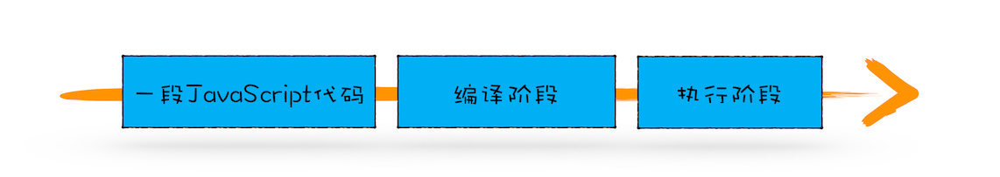
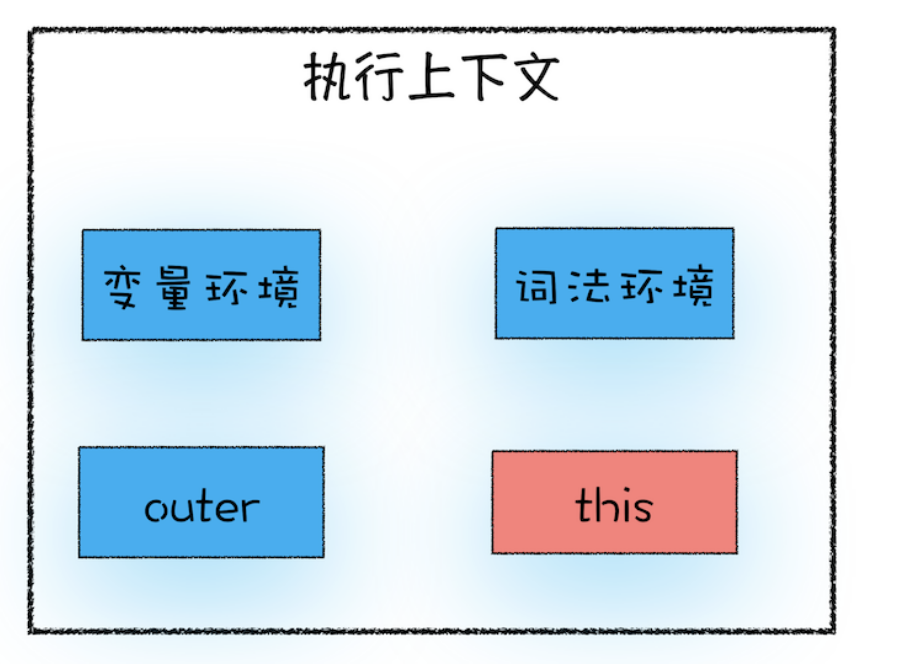

## 执行上下文与变量提升

### 执行上下文简介

执行上下文是 JavaScript 执行一段代码时的运行环境，全局环境(<script></script>标签内以及一个js文件内)和函数在执行时都会创建它们对应的执行上下文.

执行上下文中主要有两个"区域",变量环境和词法环境,用来存储全局或函数在执行期间用到的诸如 this、变量、对象以及函数等.

### 变量提升

#### 声明变量的关键字

JS中, 用于声明变量的关键字主要有`var`、`let`、`const`、`function`,前三个可用于声明任何类型的变量, 而`function`专用于声明函数.这几个用于声明变量的关键字有着不同的特性.

>这里的变量是包含函数在内的一切类型的变量,函数本质上也是变量

#### JS代码执行流程

一段 JavaScript 代码在执行之前需要被 JavaScript 引擎编译，编译完成之后，才会进入执行阶段。



#### 变量提升的过程

**变量的声明**会在特定的时间点被 JavaScript 引擎放入执行上下文中, 这就是所谓的变量提升.

>变量在执行上下文中的声明周期:创建->初始化(被赋予初始值undefinded)->赋值->销毁
>
>"放入"其实包含两个阶段,创建和初始化,即变量在被提升时会在执行上下文中被创建然后被初始化.

##### var

用`var`关键字声明的变量会在代码**编译阶段**被提升至其声明所在执行上下文的变量环境中中,在代码执行阶段声明语句中的变量声明将不会执行.

>声明语句=变量声明+变量赋值
>
>一个变量声明语句可以拆分为:
>
>```js
>var a = undefined; //变量声明 
>a = 10;            //变量赋值
>```

###### 引发的特性

- 变量在声明语句之前就可被访问,但是值为`undefined`

- 变量覆盖: 在代码执行阶段执行到此变量的赋值语句(声明语句=变量声明+变量赋值)时会用新的值覆盖此变量在变量环境中原本的值,**但是undefined不能替换其它值**
- 可重复声明: 变量声明都相当于是变量赋值.

##### let和const

用`var`关键字声明的变量会在

###### 块级作用域


## this

### JS中this的概念

`this`是一个只能指向对象(这里的对象指的是普通对象,而非函数对象或数组对象)的指针,并且和执行上下文绑定,即每一个执行上下文都有一个指向某对象的`this`指针.



执行上下文有三种:全局执行上下文、函数执行上下文和eval函数执行上下文,它们都有对应的`this`指针,并且都有默认的指向(以下简称"指向"):

### 1.全局执行上下文的`this`指针

全局执行上下文的`this`指向全局对象window

在全局环境下输入`console.log(this)`并输出即可查看全局执行上下文的`this`指向:


### 2.函数执行上下文的`this`指针

函数执行上下文的`this`指针指向直接调用此函数的对象:

- 直接在全局环境中调用函数

   在全局环境中直接调用函数相当于`window.test1()`,所以直接调用函数的对象为window,则此时test1函数执行上下文的`this`指向全局对象window

- 通过对象调用其方法

  

  通过对象调用其方法相当于`window.objectTest1.funcTest1()`,直接调用函数的对象为objectTest1,所以此时函数funcTest1函数执行上下文的`this`指向objectTest1对象

- 将对象的方法赋值给全局变量,并通过此变量来调用对象的方法

  

  此时`temp`和`objectTest1.funcTest1`指向的是同一个函数,通过`temp`调用这个函数相当于`window.temp()`,直接调用次函数的对象是window,所以此时函数`objectTest1.funcTest1`也即`temp`执行上下文的`this`指向window对象


### 注意:**嵌套函数中的 this 不会从外层函数中继承**

​	

如图:在showThis 方法里面添加了一个 bar 函数，然后接着在 showThis 方法中调用了 bar 函数,如图所示,showThis函数执行上下文的this指向直接调用它的myObj对象,而bar函数执行上下文的this则指向了window对象.

>猜测:不管在什么环境下,只要是直接调用而非通过自定义对象调用的函数执行上下文的`this`都指向window,通过自定义对象调用的函数执行上下文的`this`则指向直接调用次函数的对象

#### 使嵌套函数的this变为可继承的方法

##### 1.用一个变量保存外层函数的this

比如在 showThis 函数中声明一个变量 self 用来保存 this，然后在 bar 函数中使用 self代替bar函数的this，代码如下所示：

```js
var myObj = {
        name: " 极客时间 ",
        showThis: function () {
          console.log(this);
          var self = this;
          function bar() {
            self.name = " 极客邦 ";
              console.log(self);
          }
          bar();
        },
      };
      myObj.showThis();
      console.log(myObj.name);
      console.log(window.name);


//输出结果:
{name: ' 极客时间 ', showThis: ƒ}
{name: ' 极客邦 ', showThis: ƒ}
极客邦 
```

最终 myObj 中的 name 属性值变成了“极客邦”。其实，这个方法的的本质是利用变量的作用域机制将外层函数的this值传递给内层函数

##### 2.使用 ES6 中的箭头函数

箭头函数并不会创建其自身的执行上下文，所以所以它会继承调用函数中的 this

```js
var myObj = {
        name: " 极客时间 ",
        showThis: function () {
          console.log(this);
          var bar = () => {
            this.name = " 极客邦 ";
            console.log(this);
          };
          bar();
        },
      };
      myObj.showThis();
      console.log(myObj.name);
      console.log(window.name);

//输出结果:
{name: ' 极客时间 ', showThis: ƒ}
{name: ' 极客邦 ', showThis: ƒ}
极客邦 
```


### 改变执行上下文的`this`的指向

