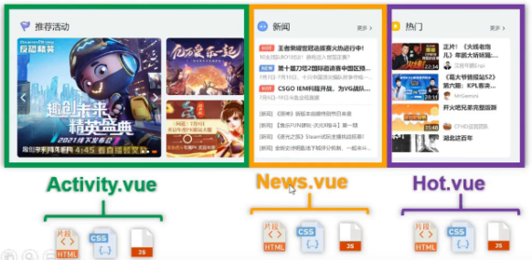
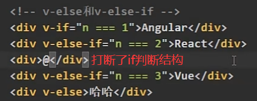
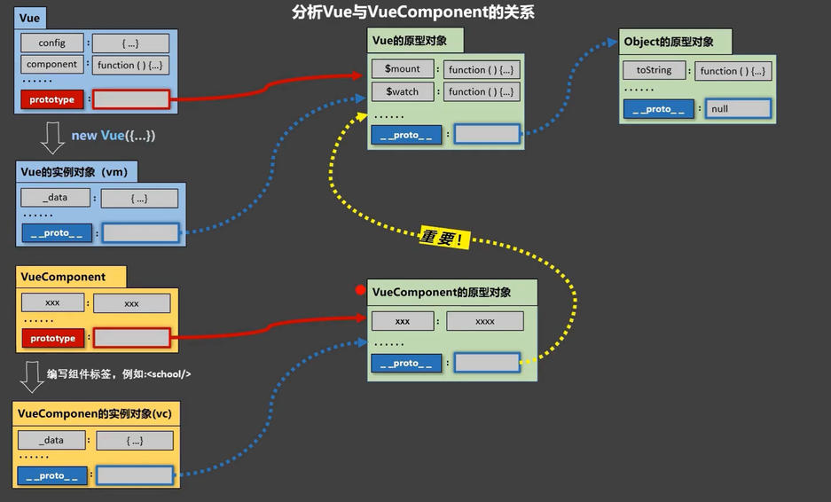
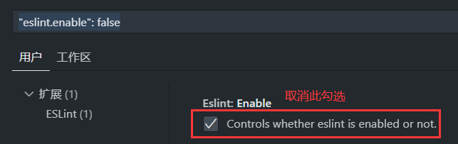
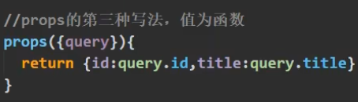

### Vue 简介

#### 官网

● [英文官网](https://vuejs.org/)

● [中文官网](https://cn.vuejs.org/)

#### 介绍与描述

●Vue 是一套用来==动态====构建用户界面==的==渐进式==JavaScript框架

​	○构建用户界面：把数据通过某种办法变成用户界面

​	○渐进式：Vue可以自底向上逐层的应用，简单应用只需要一个轻量小巧的核心库，复杂应用可以引入各式各样的Vue插件

● 作者：尤雨溪


####  Vue 的特点

1. 遵循MVVM模式 

2. 编码简洁，体积小，运行效率高，适合移动/PC端开发 

3. 它本身只关注 UI，可以引入其它第三方库开发项目

4. 采用==组件化==模式，提高代码复用率、且让代码更好维护

   

5. ==声明式==编码，让编码人员无需直接操作DOM，提高开发效率

6. 使用虚拟DOM 和 Diff算法，尽量复用DOM节点


#### 与其他 JS 框架的关联

●借鉴 angular 的 模板 和 数据绑定 技术

●借鉴 react 的 组件化 和 虚拟DOM 技术

####  Vue 周边库

●vue-cli：vue 脚手架

●vue-resource(axios)：ajax 请求

●vue-router：路由

●vuex：状态管理（它是 vue 的插件但是没有用 vue-xxx 的命名规则）

●vue-lazyload：图片懒加载

●vue-scroller：页面滑动相关

●mint-ui：基于 vue 的 UI 组件库（移动端）

●element-ui：基于 vue 的 UI 组件库（PC 端）

### 初识 Vue

#### 搭建Vue开发环境

1. **下载并引入Vue包**

下载Vue原码,原码有两种,一种是开发版本的,一种是生产/发布版本的


- 开发版本对应的原码:<a href="https://v2.cn.vuejs.org/js/vue.js">vue.js</a>
- 生产版本对应的原码:<a href="https://v2.cn.vuejs.org/js/vue.min.js">vue.min.js</a>

将开发版本的原码下载到本地,然后利用外链式在html文档中引入**vue.js**文件

2. 阻止vue在启动时生成生产提示

在原码中搜索`productionTip`,并将原值`true`改为`false`

也可以通过在`<script></script>`标签中写入`Vue.config.productionTip = false;`来阻止

3. 给浏览器安装 [Vue Devtools](https://cn.vuejs.org/v2/guide/installation.html#Vue-Devtools) 插件

在浏览器的扩展商店中搜索**Vue Devtools**然后安装,并在扩展设置中将"允许访问文件URL"选项勾选


#### 初识Vue

在html文件中引入`vue`后,此文件中其它所有`<script></script>`标签中的js代码中默认会有一个名为`Vue`的构造函数,用来创建Vue实例.

```html
<!DOCTYPE html>
<html>
	<head>
		<meta charset="UTF-8" />
		<title>初识Vue</title>
		<!-- 引入Vue -->
		<script type="text/javascript" src="../js/vue.js"></script>
	</head>
	<body>
		<!--
			初识Vue：
				1.想让Vue工作，就必须创建一个Vue实例，且要传入一个配置对象；
				2.root容器里的代码依然符合html规范，只不过混入了一些特殊的Vue语法；
				3.root容器里的代码被称为【Vue模板】；
				4.Vue实例和容器是一一对应的；
				5.真实开发中只有一个Vue实例，并且会配合着组件一起使用；
				6.{{xxx}}中的xxx要写js表达式，且xxx可以自动读取到data中的所有属性；
				7.一旦data中的数据发生改变，那么页面中用到该数据的地方也会自动更新；

				注意区分：js表达式 和 js代码(语句)
						1.表达式：一个表达式会产生一个值，可以放在任何一个需要值的地方：
									(1). a
									(2). a+b
									(3). demo(1)
									(4). x === y ? 'a' : 'b'

						2.js代码(语句)
									(1). if(){}
									(2). for(){}
		-->

		<!-- 准备好一个容器 -->
		<div id="demo">
			<h1>Hello，{{name.toUpperCase()}}，{{address}}</h1>
		</div>

		<script type="text/javascript" >
			Vue.config.productionTip = false //阻止 vue 在启动时生成生产提示。

			//创建Vue实例
			new Vue({ //{...}就是配置对象
				el:'#demo', //el用于指定当前Vue实例为哪个容器服务，值通常为css选择器字符串。
				data:{ //data中用于存储数据，数据供el所指定的容器去使用，值我们暂时先写成一个对象。
					name:'atguigu',
					address:'北京'
				}
			})

		</script>
	</body>
</html>
```


### 核心语法

#### 模板语法

Vue模板语法包括两大类

- 插值语法

功能：用于解析标签体内容

写法：`{{xxx}}`，xxx 是 js 表达式(调用函数的话需要有())

- 指令语法 

功能：用于解析标签（包括：标签属性、标签体内容、绑定事件…）

举例：`<a v-bind:href="xxx">`或简写为`<a :href="xxx">`(只有特定的"v-xxx"语法可以简写)，xxx 是 js 语句(调用函数可以不加())

>如果属性没有加v-xxx指令，那么属性中""里的值就是普通字符串，如果加了v-xxx指令，就会把""里的内容当做表达式,常给属性前加":"来转为表达式.
>
>标签属性是不能直接用模板字符串的,需要写在""中

备注：Vue中有很多的指令，且形式都是 v-xxx，此处只是拿v-bind举例

```html
<!DOCTYPE html>
<html>
  <head>
    <meta charset="UTF-8" />
    <title>模板语法</title>
    <!-- 引入Vue -->
    <script type="text/javascript" src="../js/vue.js"></script>
  </head>
  <body>

    <div id="root">
      <h2>插值语法</h2>
      <h4>你好，{{ name }}</h4>
      <hr />
      <h2>指令语法</h2>
      <a v-bind:href="tencent.url.toUpperCase()" x="hello">点我去看{{ tencent.name }}1</a> //bind是绑定的意思
      <a :href="tencent.url" x="hello">点我去看{{ tencent.name }}2</a>
    </div>
  </body>

  <script type="text/javascript">
    Vue.config.productionTip = false //阻止 vue 在启动时生成生产提示。

    new Vue({
      el: '#root',
      data: {
        name: 'jack',
        tencent: {
          name: '开端',
          url: 'https://v.qq.com/x/cover/mzc00200mp8vo9b/n0041aa087e.html',
        }
      }
    })
  </script>
</html>
```


#### 数据绑定

Vue中有2种数据绑定的方式

- 单向绑定v-bind: 数据只能从 data 流向页面

- 双向绑定v-model: 数据不仅能从 data 流向页面，还可以从页面流向 data

> 注意:
>
> v-model:value可以简写为v-model，因为v-model默认收集的就是value值
>
> v-model 只能应用在表单类元素（输入类元素）上 ，如 <input><select><textarea>等
>
> v-model的属性值最好不要是props传入的属性,因为规定props只读

```html
<!DOCTYPE html>
<html>
  <head>
    <meta charset="UTF-8" />
    <title>数据绑定</title>
    <!-- 引入Vue -->
    <script type="text/javascript" src="../js/vue.js"></script>
  </head>
  <body>
    
    <div id="root">
      <!-- 普通写法 -->
      <!-- 单向数据绑定：<input type="text" v-bind:value="name"><br/> -->
			<!-- 双向数据绑定：<input type="text" v-model:value="name"><br/> -->

      <!-- 简写 -->
      单向数据绑定：<input type="text" :value="name"><br/>
      双向数据绑定：<input type="text" v-model="name"><br/>

      <!-- 如下代码是错误的，因为 v-model 只能应用在表单类元素（输入类元素）上 -->
      <!-- <h2 v-model:x="name">你好啊</h2> -->
    </div>
    
      <script type="text/javascript">
    Vue.config.productionTip = false // 阻止 vue 在启动时生成生产提示。

    new Vue({
      el: '#root',
      data: {
        name: 'cess'
      }
    })
  </script>
  </body>
</html>
```


#### el与data的两种写法

   el有2种写法
- 创建Vue实例对象的时候配置el属性

- 先创建Vue实例，随后再通过vm.$mount('#root')指定el的值

  

  data有2种写法

- 对象式：data： { }

- 函数式：data() { return {属性...} }
如何选择：目前哪种写法都可以，以后到组件时，data必须使用函数式，否则会报错
>两个重要的原则:
>
>- 所有被Vue管理的函数，最好写成普通函数而不是==箭头函数==，这样 this 的指向才是vm或组件实例对象
>- 所有不被Vue所管理的函数（定时器的回调函数、ajax 的回调函数等、Promise 的回调函数），最好写成==箭头函数==，这样 this 的指向才是vm或组件实例对象

```html
<!DOCTYPE html>
<html>
  <head>
    <meta charset="UTF-8" />
    <title>el与data的两种写法</title>
    <!-- 引入Vue -->
    <script type="text/javascript" src="../js/vue.js"></script>
  </head>
  
  <body>
    <div id="root">
      <h1>你好，{{name}}</h1>
    </div>
  </body>

  <script type="text/javascript">
    Vue.config.productionTip = false //阻止 vue 在启动时生成生产提示。

    // el的两种写法
    // const v = new Vue({
    // 	//el:'#root', // 第一种写法
    // 	data: {
    // 		name:'cess'
    // 	}
    // })
    // 
    // v.$mount('#root') // 第二种写法,使用第二种写法时必须将创建的Vue实例赋值给一个变量

    // data的两种写法
    new Vue({
      el: '#root',
      // data的第一种写法：对象式
      // data:{
      // 	name:'cess'
      // }

      //data的第二种写法：函数式
      data() {
        console.log('@@@', this) // 此处的this是Vue实例对象
        return {
          name: 'cess'
        }
      }
    })
  </script>
</html>
```

#### MVVM 模型


MVVM模型

●M：模型 Model，`data`中的数据

●V：视图 View，模板代码

●VM：视图模型 ViewModel，`Vue`实例

观察发现

●data中所有的属性，最后都成为了在了vm(Vue实例)的属性


●vm身上所有的属性及Vue原型对象身上所有的属性，在 Vue模板中都可以直接使用

```html
<!DOCTYPE html>
<html>
	<head>
		<meta charset="UTF-8" />
		<title>理解MVVM</title>
		<!-- 引入Vue -->
		<script type="text/javascript" src="../js/vue.js"></script>
	</head>
	<body>
		<!-- 准备好一个容器-->
		<div id="root">
			<h1>学校名称：{{name}}</h1>
			<h1>学校地址：{{address}}</h1>
			<!-- <h1>测试一下1：{{1+1}}</h1>
			<h1>测试一下2：{{$options}}</h1> //Vue实例自带的属性
			<h1>测试一下3：{{$emit}}</h1> //Vue原型对象的属性-->
		</div>
	</body>

	<script type="text/javascript">
		Vue.config.productionTip = false //阻止 vue 在启动时生成生产提示。

		const vm = new Vue({
			el:'#root',
			data:{
				name:'尚硅谷',
				address:'北京',
			}
		})
		console.log(vm)
	</script>
</html>
```

#### 数据代理

**Object.defineproperty方法**

方法详解:[Object.defineProperty() - JavaScript | MDN (mozilla.org)](https://developer.mozilla.org/zh-CN/docs/Web/JavaScript/Reference/Global_Objects/Object/defineProperty)

```js

let number = 18
let person = {
  name: '张三',
  sex: '男',
}

Object.defineProperty(person, 'age', {
  // value:18,
  // enumerable:true,		// 控制属性是否可以枚举，默认值是false
  // writable:true,			// 控制属性是否可以被赋值式修改，默认值是false
  // configurable:true	// 控制属性是否可以被删除，默认值是false

  // 当有人读取person的age属性时，get函数(getter)就会被调用
  get() {
    console.log('有人读取age属性了')
    return number
  },

  // 当有人修改person的age属性时，set函数(setter)就会被调用，且会收到修改的具体值
  set(value) {
    console.log('有人修改了age属性，且值是', value)
    number = value
  }

})
// console.log(Object.keys(person))
console.log(person)
```


**数据代理**：通过一个对象代理对另一个对象中属性的操作（读/写）

实现方法: 通过`defineProperty()`方法给一个对象中添加另一个对象的属性的getter和setter

关于数据描述符:[数据描述符](https://developer.mozilla.org/zh-CN/docs/Web/JavaScript/Reference/Global_Objects/Object/defineProperty#:~:text=%E4%BF%AE%E6%94%B9%EF%BC%88immutable%EF%BC%89%E7%9A%84%E3%80%82-,%E5%AF%B9%E8%B1%A1,-%E9%87%8C%E7%9B%AE%E5%89%8D%E5%AD%98%E5%9C%A8)

```js
let obj = { x: 100 }
let obj2 = { y: 200 }

//用obj2中的x(本质上是getter,描述符为存取描述符)属性代理obj中的x属性(描述符为数据描述符)
Object.defineProperty(obj2, 'x', {
  get() {
    return obj.x
  },
  set(value) {
    obj.x = value
  } 
})
```

**Vue中的数据代理**

1. Vue中的数据代理: 通过vm对象来代理`_data`对象中属性的操作（读/写）

2. Vue中数据代理的目的：为了更加方便的操作data中的数据

3. 基本原理: 给vm中添加`_data`中属性的同名getter和setter


`_data`对象是对代码中data对象的数据劫持,通过数据代理，用vm里的geter/setter操作`_data`中的属性.

```html
<!DOCTYPE html>
<html>
	<head>
		<meta charset="UTF-8" />
		<title>Vue中的数据代理</title>
		<!-- 引入Vue -->
		<script type="text/javascript" src="../js/vue.js"></script>
	</head>
	<body>
		<!-- 
				1.Vue中的数据代理：
							通过vm对象来代理data对象中属性的操作（读/写）
				2.Vue中数据代理的好处：
							更加方便的操作data中的数据
				3.基本原理：
							通过Object.defineProperty()把data对象中所有属性添加到vm上。
							为每一个添加到vm上的属性，都指定一个getter/setter。
							在getter/setter内部去操作（读/写）data中对应的属性。
		 -->
		<!-- 准备好一个容器-->
		<div id="root">
			<h2>学校名称：{{name}}</h2>
			<h2>学校地址：{{address}}</h2>
		</div>
	</body>

	<script type="text/javascript">
		Vue.config.productionTip = false //阻止 vue 在启动时生成生产提示。
		
		const vm = new Vue({
			el:'#root',
			data:{
				name:'LittlerXu',
				address:'Xian'
			}
		})
	</script>
</html>
```

#### 事件处理

##### 事件的基本使用

1.使用`v-on:xxx `或 `@xxx`绑定事件，其中xxx是事件名；

2.事件的回调需要配置在methods对象中，最终会成为vm的方法, 但并不是数据代理；

3.**`@click="监听函数" `和 `@click="@click="监听函数()"`的区别:**

`@click="监听函数" `会在调用监听函数的时候自动将事件对象event作为参数传入监听函数中,但此时不能传入其它参数,而`@click="@click="监听函数()"`,在调用监听函数时,不会自动将事件对象传入,如需用到事件对象,则必须手动传入,此时还可以传入其它参数:`@click="监听函数(其它参数,$event)"`, $event是vue将DOM中事件对象重新封装过的一个代表事件对象的关键词。

>==提示==
>
>- methods中配置的函数，都是被Vue所管理的函数，this的指向是vm 或 组件实例对象；
>- 如果回调的操作很简单,可以直接写成`@click="操作语句"`,在methods中不用写监听函数

```html
<!DOCTYPE html>
<html>
	<head>
		<meta charset="UTF-8" />
		<title>事件的基本使用</title>
		<!-- 引入Vue -->
		<script type="text/javascript" src="../js/vue.js"></script>
	</head>
	<body>
		<!-- 准备好一个容器-->
		<div id="root">
			<h2>欢迎来到{{name}}学习</h2>
			<!-- <button v-on:click="showInfo">点我提示信息</button> -->
			<button @click="showInfo1">点我提示信息1（不传参）</button>
			<button @click="showInfo2($event,66)">点我提示信息2（传参）</button>
		</div>
	</body>

	<script type="text/javascript">
		Vue.config.productionTip = false //阻止 vue 在启动时生成生产提示。

		const vm = new Vue({
			el:'#root',
			data:{
				name:'尚硅谷',
			},
			methods:{
				showInfo1(event){
					// console.log(event.target.innerText)
					// console.log(this) //此处的this是vm
					alert('同学你好！')
				},
				showInfo2(event,number){
					console.log(event,number)
					// console.log(event.target.innerText)
					// console.log(this) //此处的this是vm
					alert('同学你好！！')
				}
			}
		})
	</script>
</html>
```

##### 事件修饰符

Vue中的事件修饰符
1. **prevent**	阻止默认事件（常用）

2. **stop**	   阻止事件冒泡（常用）

3. **once**	   事件只触发一次（常用）

4. capture	使用事件的捕获模式(默认为冒泡模式)

5. self	   只有event.target是当前操作的元素时才触发事件

6. passive	事件的默认行为立即执行，无需等待事件回调执行完毕

  可以指定多个修饰符,写法为：`@click.prevent.stop="showInfo"`,即阻止了冒泡,又阻止了默认行为

```html
<!DOCTYPE html>
<html>
  <head>
    <meta charset="UTF-8" />
    <title>事件修饰符</title>
    <!-- 引入Vue -->
    <script type="text/javascript" src="../js/vue.js"></script>
    <style>
      * {margin-top: 20px;}
      .demo1 {height: 50px;background-color: skyblue;}
      .box1 {padding: 5px;background-color: skyblue;}
      .box2 {padding: 5px;background-color: white;}
      .list {width: 200px;height: 200px;background-color: skyblue;overflow: auto;}
      li {height: 100px;}
    </style>
  </head>
  <body>

    <div id="root">
      <h2>欢迎来到{{ name }}学习</h2>
      <!-- 阻止默认事件（常用） -->
      <a href="http://www.atguigu.com" @click.prevent="showInfo">点我提示信息</a>

      <!-- 阻止事件冒泡（常用） -->
      <div class="demo1" @click="showInfo">
        <button @click.stop="showInfo">点我提示信息</button>
        <!-- 修饰符可以连续写 -->
        <!-- <a href="http://www.qq.com" @click.prevent.stop="showInfo">点我提示</a> -->
      </div>

      <!-- 事件只触发一次（常用） -->
      <button @click.once="showInfo">点我提示信息</button>

      <!-- 使用事件的捕获模式 -->
      <div class="box1" @click.capture="showMsg(1)">
        div1
        <div class="box2" @click="showMsg(2)">
          div2
        </div>
      </div>

      <!-- 只有event.target是当前操作的元素时才触发事件； -->
      <div class="demo1" @click.self="showInfo">
        <button @click="showInfo">点我提示信息</button>
      </div>

      <!-- 事件的默认行为立即执行，无需等待事件回调执行完毕； -->
      <!-- scroll是滚动条滚动，passsive没有影响 -->
      <!-- wheel是鼠标滚轮滚动，passive有影响 -->
      <ul @wheel.passive="demo" class="list">
        <li>1</li>
        <li>2</li>
        <li>3</li>
        <li>4</li>
      </ul>
    </div>

    <script type="text/javascript">
      Vue.config.productionTip = false

      new Vue({
        el: '#root',
        data: {
          name: '尚硅谷'
        },
        methods: {
          showInfo(e) {
            alert('同学你好！')
            // console.log(e.target)
          },
          showMsg(msg) {
            console.log(msg)
          },
          demo() {
            for (let i = 0; i < 100000; i++) {
              console.log('#')
            }
            console.log('累坏了')
          }
        }
      })
    </script>
  </body>
</html>
```

##### 键盘事件

1.Vue中常用的按键别名：

​     回车 => enter

​     删除/退格 => delete (捕获删除"Delete"或退格"Backspace"键)

​     退出 => esc

​     空格 => space

​     换行 => tab (特殊，只能)修饰keydown而不能修饰keyup)

​     上 => up

​     下 => down

​     左 => left

​     右 => right

==按键别名可以作为键盘事件的修饰符,则会在此修饰符对应的按键被按时触发键盘事件==

2.Vue未提供别名的按键，可以使用按键原始的key属性值去绑定，但注意多单词名称要转为kebab-case（小写短横线命名）

```js
@keyup.caps-lock = '...' //切换大小写按键的key属性值:CapsLock
```

3.系统修饰键（用法特殊）：ctrl、alt、shift、meta(win键)

  (1).修饰keydown：按下系统修饰键的同时，再按下其他键，随后释放其他键，事件才被触发, 只按系统修饰键事件不会触发.

  (2).修饰keyup：正常触发事件。

组合按键:示例:`@keyup.ctrl.y`,`@keydown.ctrl.y`

>也可以使用keyCode去指定具体的按键（不推荐）
>
>```js
>@keyup.13 = '...' //用回车键修饰keyup事件
>```
>
>`Vue.config.keyCodes.自定义键名 = 键码`，可以去自定义按键别名(一般不用)
>
>```js
>Vue.config.keyCodes.huiche = 13 //定义了一个别名按键
>```


```html
<!DOCTYPE html>
<html>
	<head>
		<meta charset="UTF-8" />
		<title>键盘事件</title>
		<!-- 引入Vue -->
		<script type="text/javascript" src="../js/vue.js"></script>
	</head>
	<body>
		<!--
				1.Vue中常用的按键别名：
							回车 => enter
							删除 => delete (捕获“删除”和“退格”键)
							退出 => esc
							空格 => space
							换行 => tab (特殊，必须配合keydown去使用)
							上 => up
							下 => down
							左 => left
							右 => right

				2.Vue未提供别名的按键，可以使用按键原始的key值去绑定，但注意要转为kebab-case（短横线命名）

				3.系统修饰键（用法特殊）：ctrl、alt、shift、meta
							(1).配合keyup使用：按下修饰键的同时，再按下其他键，随后释放其他键，事件才被触发。
							(2).配合keydown使用：正常触发事件。

				4.也可以使用keyCode去指定具体的按键（不推荐）

				5.Vue.config.keyCodes.自定义键名 = 键码，可以去定制按键别名
		-->
		<!-- 准备好一个容器-->
		<div id="root">
			<h2>欢迎来到{{name}}学习</h2>
			<input type="text" placeholder="按下回车提示输入" @keydown.huiche="showInfo">
		</div>
	</body>

	<script type="text/javascript">
		Vue.config.productionTip = false //阻止 vue 在启动时生成生产提示。
		Vue.config.keyCodes.huiche = 13 //定义了一个别名按键

		new Vue({
			el:'#root',
			data:{
				name:'尚硅谷'
			},
			methods: {
				showInfo(e){
					// console.log(e.key,e.keyCode)
					console.log(e.target.value)
				}
			},
		})
	</script>
</html>
```

#### 计算属性

**定义**：

要用的属性需要通过已有属性(data中的属性和计算属性皆可)计算得来

>要用的属性需要通过已有属性计算得来,用差值语法和methods都可以实现,但计算属性有其优势
>
>**示例:**
>
>
>
>**差值语法实现**
>
>```html
><!DOCTYPE html>
><html>
>	<head>
>		<meta charset="UTF-8" />
>		<title>姓名案例_插值语法实现</title>
>		<!-- 引入Vue -->
>		<script type="text/javascript" src="../js/vue.js"></script>
>	</head>
>	<body>
>		<!-- 准备好一个容器-->
>		<div id="root">
>			姓：<input type="text" v-model="firstName"> <br/><br/>
>			名：<input type="text" v-model="lastName"> <br/><br/>
>			全名：<span>{{firstName}}-{{lastName}}</span>
>		</div>
>	</body>
>
>	<script type="text/javascript">
>		Vue.config.productionTip = false //阻止 vue 在启动时生成生产提示。
>
>		new Vue({
>			el:'#root',
>			data:{
>				firstName:'张',
>				lastName:'三'
>			}
>		})
>	</script>
></html>
>```
>
>**methods实现**
>
>```html
><!DOCTYPE html>
><html>
>	<head>
>		<meta charset="UTF-8" />
>		<title>姓名案例_methods实现</title>
>		<!-- 引入Vue -->
>		<script type="text/javascript" src="../js/vue.js"></script>
>	</head>
>	<body>
>		<!-- 准备好一个容器-->
>		<div id="root">
>			姓：<input type="text" v-model="firstName"> <br/><br/>
>			名：<input type="text" v-model="lastName"> <br/><br/>
>			全名：<span>{{fullName()}}</span>
>		</div>
>	</body>
>
>	<script type="text/javascript">
>		Vue.config.productionTip = false //阻止 vue 在启动时生成生产提示。
>
>		new Vue({
>			el:'#root',
>			data:{
>				firstName:'张',
>				lastName:'三'
>			},
>			methods: {
>				fullName(){
>					console.log('@---fullName')
>					return this.firstName + '-' + this.lastName
>				}
>			},
>		})
>	</script>
></html>
>```
>
>**计算属性实现**
>
>```html
><!DOCTYPE html>
><html>
>  <head>
>    <meta charset="UTF-8" />
>    <title>姓名案例_计算属性实现</title>
>    <!-- 引入Vue -->
>    <script type="text/javascript" src="../js/vue.js"></script>
>  </head>
>  <body>
>    <!-- 准备好一个容器-->
>    <div id="root">
>      姓：<input type="text" v-model="firstName" /> <br /><br />
>      名：<input type="text" v-model="lastName" /> <br /><br />
>      测试：<input type="text" v-model="x" /> <br /><br />
>      全名：<span>{{fullName}}</span> <br /><br />
>      <!-- 全名：<span>{{fullName}}</span> <br/><br/>
>			全名：<span>{{fullName}}</span> <br/><br/>
>			全名：<span>{{fullName}}</span> -->
>    </div>
>  </body>
>
>  <script type="text/javascript">
>    Vue.config.productionTip = false; //阻止 vue 在启动时生成生产提示。
>
>    const vm = new Vue({
>      el: "#root",
>      data: {
>        firstName: "张",
>        lastName: "三",
>        x: "你好",
>      },
>      methods: {
>        demo() {},
>      },
>      computed: {
>        fullName: {
>          //get有什么作用？当有人读取fullName时，get就会被调用，且返回值就作为fullName的值
>          //get什么时候调用？1.初次读取fullName时。2.所依赖的数据发生变化时。
>          get() {
>            console.log("get被调用了");
>            // console.log(this) //此处的this是vm
>            return this.firstName + "-" + this.lastName;
>          },
>          //set什么时候调用? 当fullName被修改时。
>          set(value) {
>            console.log("set", value);
>            const arr = value.split("-");
>            this.firstName = arr[0];
>            this.lastName = arr[1];
>          },
>        },
>      },
>    });
>  </script>
></html>
>```

**原理：**

底层借助了Objcet.defineproperty()方法提供的getter和setter

get函数什么时候执行？
a. 初次读取时会执行一次
b. 当依赖的数据发生改变时会被再次调用

set什么时候调用? 

当计算属性被修改时

**优势：**

与methods实现相比，内部有缓存机制（复用），效率更高，调试方便 

**备注**

a. get和set函数的this的指向做了修改,都指向vm

b. ==计算属性最终会成为vm的虚拟属性(因为并没有在data中显式声明)==，直接读取使用即可

c. 如果计算属性要被修改，那必须写set函数去响应修改，set()函数的参数value为此计算属性被修改

d. 如果计算属性确定不考虑修改，可以使用计算属性的简写形式

##### 计算属性简写

写法:将计算属性直接写成一个函数,此函数的函数名作为计算属性的属性名,函数体作为此计算属性的getter

*条件:计算属性不需要setter,即计算属性不会被赋值式修改*

```js
computed: {
    fullName() {
        console.log("get被调用了");
        return this.firstName + "-" + this.lastName;
    }
}
```

>**注意**
>
>计算属性的简写虽然是一个函数的形式,但本质上还是一个属性,所以在差值语法中要用`{{fullName}}`而不是`{{fullName()}}`

#### 监听(侦听)属性

`watch`是Vue中配置对象中的一个属性,主要用来监听属性的变化并执行对应的监听函数

##### 语法

```js
watch: {
    被监听属性: {
        handler(newValue,oldValue){...}, //handler函数,所监视属性发生改变时会自动调用
		......                           //其它配置项                 
    }
}
```

>注意:
>
>1. 当被监视的属性变化时，回调函数自动调用，进行相关操作
>
>2. 属性从无到有(props或vuex)或者属性值的改变都会被watch监听到

##### watch的监听范围

watch可以监听的属性有:

data中的属性

computed中的属性

props中的属性

vuex传入组件的属性

>watch还可以监听$route, 当目前路由组件的路由信息(通常为params参数或者query参数)变化时对改变做出响应
>
>当路由信息发生变化后,\$route会更新为一个新的\$route,所以每次路由信息变化前后都是不同的\$route, 因此监听$route的属性是不需要开启深度监听的

##### immediate配置项

`immediate`配置项的值为布尔值, 值为`true`时会在侦听器创建时立即触发回调。默认值为`false.`

当值第一次绑定的时候，默认不会执行监听函数，只有当值发生改变时才会执行。开启immediate属性后则会在第一次绑定时也调用对应的监听函数,这是属性从无到有的过程,所以此次调用的旧值是 `undefined`.

比如，当父组件向子组件动态传值时，子组件props首次获取到父组件传来的默认值时，就需要执行函数，此时就需要将[immediate](https://so.csdn.net/so/search?q=immediate&spm=1001.2101.3001.7020)属性设置为true，结合handler方法使用。


##### 深度监听(deep配置项)

1. 当监听的属性是对象(包括数组,数组是特殊的对象,数组的索引即为键名,元素即为键值)时,Vue中的watch默认不监测对象内部值的改变（一层）

2. 在watch中配置`deep:true`可以监测对象内部值的改变（多层）

对象内部值的改变是否会让此对象触发handler函数,可以用deep配置项来设置:

`deep`属性的值为布尔值,值为`true`时,对象内部值的改变也会让此对象(**注意是此对象而不是对象中发生变化的属性**)触发handler函数,称作**深度监听**,值为`false`时不会触发,只有当此属性的值发生改变时才会触发handler函数,默认值为`false`

>当一个变量的类型为对象时,此变量存放的是对象的地址, 此变量(对象)的值发生改变有两种情况:
>
>- 此变量的类型改变,即变量的值变为存放基本数据类型
>- 此变量(对象)指向另一个对象,如下图:
>- 只修改此对象某属性的值,导致此对象局部发生改变, 此时不能称为"此对象的值发生改变"
>
>
>
>如果只需要监听对象中的某一个属性值时，也可以之间监听这个属性而非整个对象
>
>
>
>当被监听的属性是一个数组(一维和多维都可)时, 数组元素的删除与增加或者元素值的改变都会被监听到,此时不用加`deep:true`
>
>但是当数组(一维和多维都可)中有元素类型为对象,并且需要监听此对象的属性, 则此时必须给数组的监听添加`deep:true`


##### 监视的两种写法

监视有两种写法:

1. 创建Vue时传入`watch: {}`配置
2. 通过`vm.$watch()`监视,使用此方法时必须有变量接收Vue实例

**使用原则**

1. 如果在创建 Vue 实例的时候，就知道要监视什么属性，就直接使用 watch 配置项

2. 创建实例的时候不知道监测谁，后续根据用户的行为发现需要监视某个属性，就使用 `vm.$watch() `

```html
<title>天气案例_监视属性</title>
<script type="text/javascript" src="../js/vue.js"></script>

<div id="root">
  <h2>今天天气很{{info}}</h2>
  <!-- 绑定事件的时候：@xxx="yyy" yyy可以写一些简单的语句 -->
  <!-- <button @click="isHot = !isHot">切换天气</button> -->
  <button @click="changeWeather">切换天气</button>
</div>

<script type="text/javascript">
  Vue.config.productionTip = false
  const vm = new Vue({
    el: '#root',
    data: {
      isHot: true,
    },
    computed: {
      info() {
        return this.isHot ? '炎热' : '凉爽'
      }
    },
    methods: {
      changeWeather() {
        this.isHot = !this.isHot
      }
    },
    // 方式一
    /* watch:{		
			isHot:{
				immediate:true,
				handler(newValue,oldValue){
					console.log('isHot被修改了',newValue,oldValue)
				}
			}
		} */
  })
  // 方式二
  vm.$watch('isHot', {		
    immediate: true, // 初始化时让handler调用一下
    //handler什么时候调用？当isHot发生改变时
    handler(newValue, oldValue) {
      console.log('isHot被修改了', newValue, oldValue)
    }
  })
</script>
```

##### 监视的简写

如果监视属性除了`handler()`没有其他配置项的话，可以进行简写

```html
<title>天气案例_监视属性_简写</title>
<script type="text/javascript" src="../js/vue.js"></script>

<div id="root">
  <h3>今天天气很{{ info }}</h3>
  <button @click="changeWeather">切换天气</button>
</div>

<script type="text/javascript">
  Vue.config.productionTip = false
  const vm = new Vue({
    el: '#root',
    data: {isHot: true,},
    computed: {info() {return this.isHot ? '炎热' : '凉爽'}},
    methods: {changeWeather() {this.isHot = !this.isHot}},
    watch: {
      // 正常写法
      // isHot: {
      // 	// immediate:true, //初始化时让handler调用一下
      // 	// deep:true,	//深度监视
      // 	handler(newValue, oldValue) {
      // 		console.log('isHot被修改了', newValue, oldValue)
      // 	}
      // },

      //简写
      isHot(newValue, oldValue) {
        console.log('isHot被修改了', newValue, oldValue, this)
      }
    }
  })

  //正常写法
  // vm.$watch('isHot', {
  // 	immediate: true, //初始化时让handler调用一下
  // 	deep: true,//深度监视
  // 	handler(newValue, oldValue) {
  // 		console.log('isHot被修改了', newValue, oldValue)
  // 	}
  // })l

  //简写
  // vm.$watch('isHot', function(newValue, oldValue) {
  // 	console.log('isHot被修改了', newValue, oldValue, this)
  // })
</script>
```

##### 监听属性vs计算属性

- computed能完成的功能，watch都可以完成, 但有些情况下computed优于watch,例如双向数据绑定(此时watch需要依赖一个已经存在的属性)

>**双向数据绑定案例:**
>
>computed实现:
>
>```html
><!DOCTYPE html>
><html>
>	<head>
>		<meta charset="UTF-8" />
>		<title>姓名案例_计算属性实现</title>
>		<!-- 引入Vue -->
>		<script type="text/javascript" src="../js/vue.js"></script>
>	</head>
>	<body>
>		<!-- 准备好一个容器-->
>		<div id="root">
>			姓：<input type="text" v-model="firstName"> <br/><br/>
>			名：<input type="text" v-model="lastName"> <br/><br/>
>			全名：<span>{{fullName}}</span> <br/><br/>
>		</div>
>	</body>
>
>	<script type="text/javascript">
>		Vue.config.productionTip = false //阻止 vue 在启动时生成生产提示。
>
>		const vm = new Vue({
>			el:'#root',
>			data:{
>				firstName:'张',
>				lastName:'三',
>			},
>			computed:{
>				
>				fullName(){
>					console.log('get被调用了')
>					return this.firstName + '-' + this.lastName
>				}
>			}
>		})
>	</script>
></html>
>```
>
>watch实现:
>
>```html
><!DOCTYPE html>
><html>
>	<head>
>		<meta charset="UTF-8" />
>		<title>姓名案例_watch实现</title>
>		<!-- 引入Vue -->
>		<script type="text/javascript" src="../js/vue.js"></script>
>	</head>
>	<body>
>		<!-- 准备好一个容器-->
>		<div id="root">
>			姓：<input type="text" v-model="firstName"> <br/><br/>
>			名：<input type="text" v-model="lastName"> <br/><br/>
>			全名：<span>{{fullName}}</span> <br/><br/>
>		</div>
>	</body>
>
>	<script type="text/javascript">
>		Vue.config.productionTip = false //阻止 vue 在启动时生成生产提示。
>
>		const vm = new Vue({
>			el:'#root',
>			data:{
>				firstName:'张',
>				lastName:'三',
>				fullName:'张-三'
>			},
>			watch:{
>				firstName(val){
>					this.fullName = val + '-' + this.lastName
>				},
>				lastName(val){
>					this.fullName = this.firstName + '-' + val
>				}
>			}
>		})
>	</script>
></html>
>```

- watch能完成的功能，computed不一定能完成，例如watch可以进行异步操作(因为其不依赖函数的返回值)

```html
<!DOCTYPE html>
<html>
	<head>
		<meta charset="UTF-8" />
		<title>姓名案例_watch实现</title>
		<!-- 引入Vue -->
		<script type="text/javascript" src="../js/vue.js"></script>
	</head>
	<body>
		<!-- 
				computed和watch之间的区别：
						1.computed能完成的功能，watch都可以完成。
						2.watch能完成的功能，computed不一定能完成，例如：watch可以进行异步操作。
				两个重要的小原则：
							1.所被Vue管理的函数，最好写成普通函数，这样this的指向才是vm 或 组件实例对象。
							2.所有不被Vue所管理的函数（定时器的回调函数、ajax的回调函数等、Promise的回调函数），最好写成箭头函数，
								这样this的指向才是vm 或 组件实例对象。
		-->
		<!-- 准备好一个容器-->
		<div id="root">
			姓：<input type="text" v-model="firstName"> <br/><br/>
			名：<input type="text" v-model="lastName"> <br/><br/>
			全名：<span>{{fullName}}</span> <br/><br/>
		</div>
	</body>

	<script type="text/javascript">
		Vue.config.productionTip = false //阻止 vue 在启动时生成生产提示。

		const vm = new Vue({
			el:'#root',
			data:{
				firstName:'张',
				lastName:'三',
				fullName:'张-三'
			},
			watch:{
				firstName(val){
                    //异步任务:改变firstName后隔1秒钟再刷新fullName
					setTimeout(()=>{
						console.log(this) //this指向Vue示例对象,因为箭头函数向外层找this,firstName函数的this指向Vue
						this.fullName = val + '-' + this.lastName
					},1000);
				},
				lastName(val){
					this.fullName = this.firstName + '-' + val
				}
			}
		})
	</script>
</html>
```

>两个重要的原则:
>
>- 所有被Vue管理的函数，最好写成普通函数而不是==箭头函数==，这样 this 的指向才是vm或组件实例对象
>- 所有不被Vue所管理的函数（定时器的回调函数、ajax 的回调函数等、Promise 的回调函数），最好写成==箭头函数==，这样 this 的指向才是vm或组件实例对象

- computed依赖函数的返回值(本质是getter和setter),watch不依赖返回值(本质是回调函数)


#### 绑定样式

##### 通过:class绑定

原生js操作样式有一种方法是通过操作类名来操作改变样式,但是这种方法是静态的,每次改变都必须操作一次类名,Vue提供了动态操作类名从而快捷地修改样式.

**语法**

在html标签中添加属性`:class='xxx'`,xxx可以是属性、数组、对象.

当`xxx`生效时会为元素**追加**`xxx`类名.

- 字符串写法适用于：类名只有一个,但名字不确定，要动态获取 

>```html
><!DOCTYPE html>
><html lang="en">
>  <head>
>    <meta charset="UTF-8" />
>    <meta http-equiv="X-UA-Compatible" content="IE=edge" />
>    <meta name="viewport" content="width=device-width, initial-scale=1.0" />
>    <title>Document</title>
>    <script src="../js/vue.js"></script>
>    <style>
>      .basic {
>				width: 400px;
>				height: 100px;
>				border: 1px solid black;
>			}
>      .red {
>        background-color: red;
>      }
>    </style>
>  </head>
>  <body>
>    <div id="root">
>      <div class="basic" :class="test"></div>
>    </div>
>    <script>
>      new Vue({
>        el: "#root",
>        data: {
>          test: "red",
>        },
>      });
>    </script>
>  </body>
></html>
>```
>
>
>
>点击变换样式案例:
>
>```html
><!DOCTYPE html>
><html>
>	<head>
>		<meta charset="UTF-8" />
>		<title>绑定样式</title>
>		<style>
>			.basic{
>				width: 400px;
>				height: 100px;
>				border: 1px solid black;
>			}
>
>			.happy{
>				border: 4px solid red;;
>				background-color: rgba(255, 255, 0, 0.644);
>				background: linear-gradient(30deg,yellow,pink,orange,yellow);
>			}
>			.sad{
>				border: 4px dashed rgb(2, 197, 2);
>				background-color: gray;
>			}
>			.normal{
>				background-color: skyblue;
>			}
>		</style>
>		<script type="text/javascript" src="../js/vue.js"></script>
>	</head>
>	<body>
>		<!-- 准备好一个容器-->
>		<div id="root">
>			<div class="basic" :class="mood" @click="changeMood">{{name}}</div> <br/><br/>
>		</div>
>	</body>
>
>	<script type="text/javascript">
>		Vue.config.productionTip = false
>
>		const vm = new Vue({
>			el:'#root',
>			data:{
>				name:'尚硅谷',
>				mood:'normal',
>			},
>			methods: {
>				changeMood(){
>					const arr = ['happy','sad','normal']
>					const index = Math.floor(Math.random()*3)
>					this.mood = arr[index]
>				}
>			},
>		})
>	</script>
>
></html>
>```
>
>

- 数组写法适用于：要绑定多个样式，个数不确定，名字也不确定 

>```html
><!DOCTYPE html>
><html lang="en">
>  <head>
>    <meta charset="UTF-8" />
>    <meta http-equiv="X-UA-Compatible" content="IE=edge" />
>    <meta name="viewport" content="width=device-width, initial-scale=1.0" />
>    <title>Document</title>
>    <script src="../js/vue.js"></script>
>    <style>
>      .basic {
>				width: 400px;
>				height: 100px;
>				border: 1px solid black;
>        font-size: 40px;
>			}
>      .red {
>        background-color: red;
>      }
>      .fontBlue {
>        color: aqua;
>      }
>    </style>
>  </head>
>  <body>
>    <div id="root">
>      <div class="basic" :class="classArr">测试文字</div>
>    </div>
>    <script>
>      new Vue({
>        el: "#root",
>        data: {
>          classArr: ['red','fontBlue'],
>        },
>      });
>    </script>
>  </body>
></html>
>
>```
>
>

- 对象写法适用于：要绑定多个样式，个数确定，名字也确定，但不确定用不用 

对象里属性的写法:

`{`

`类名: true/false, //true表示启用此样式,false表示不用此样式`

`}`

>可以利用表达式或函数动态改变类名的true或false, 从而达到动态决定一个(组)样式的使用或取消

>```html
><!DOCTYPE html>
><html>
>  <head>
>    <meta charset="UTF-8" />
>    <title>绑定样式</title>
>    <style>
>      .basic {
>        width: 400px;
>        height: 100px;
>        border: 1px solid black;
>      }
>      .red {
>        background-color: red;
>      }
>      .blue {
>        background-color: blue;
>      }
>      .green {
>        background-color: green;
>      }
>    </style>
>    <script type="text/javascript" src="../js/vue.js"></script>
>  </head>
>  <body>
>    <!-- 准备好一个容器-->
>    <div id="root">
>      <!-- 绑定class样式--对象写法，适用于：要绑定的样式个数确定、名字也确定，但要动态决定用不用 -->
>      <div class="basic" :class="classObj">{{name}}</div>
>      <br /><br />
>    </div>
>  </body>
>
>  <script type="text/javascript">
>    Vue.config.productionTip = false;
>
>    const vm = new Vue({
>      el: "#root",
>      data: {
>        name: "LittlerXu",
>        mood: "normal",
>        classObj: {
>          red: true,
>          blue: false,
>          green: false,
>        },
>      },
>    });
>  </script>
></html>
>
>```
>
>

##### 通过:style绑定

通过html标签的style属性为元素添加样式

**语法**

在标签中添加`:style="xxx"`属性,xxx是属性,属性值可以是规则集或者由规则集组成的数组

>注意: 规则集里的样式属性名要用"小驼峰命名法"，属性值要写成字符串形式

```html
<!DOCTYPE html>
<html>
	<head>
		<meta charset="UTF-8" />
		<title>绑定样式</title>
		<style>
			.basic{
				width: 400px;
				height: 100px;
				border: 1px solid black;
			}
		</style>
		<script type="text/javascript" src="../js/vue.js"></script>
	</head>
	<body>
		<!-- 准备好一个容器-->
		<div id="root">
			<!-- 绑定style样式--对象写法 -->
			<div class="basic" :style="styleObj">{{name}}</div> <br/><br/>
			<!-- 绑定style样式--数组写法 -->
			<div class="basic" :style="styleArr">{{name}}</div>
		</div>
	</body>

	<script type="text/javascript">
		Vue.config.productionTip = false

		const vm = new Vue({
			el:'#root',
			data:{
				name:'尚硅谷',
				mood:'normal',
				styleObj:{
					fontSize: '40px', //小驼峰命名法
					color:'red',
				},
				styleObj2:{
					backgroundColor:'orange'
				},
				styleArr:[
					{
						fontSize: '40px', 
						color:'blue',
					},
					{
						backgroundColor:'gray'
					}
				]
			},
		})
	</script>

</html>
```

#### 条件渲染

Vue可以通过指令来控制元素的显示与隐藏,主要有两种方式:`v-show`和`v-if`

##### v-show

**语法**:`v-show="xxx"`,xxx的最终结果必须是布尔值

值为true,元素正常显示; 值为false,元素隐藏.

**原理:**通过控制`display:none;`来显示或隐藏元素.

>```html
><!DOCTYPE html>
><html>
>	<head>
>		<meta charset="UTF-8" />
>		<title>条件渲染</title>
>		<script type="text/javascript" src="../js/vue.js"></script>
>	</head>
>	<body>
>		<!-- 准备好一个容器-->
>		<div id="root">
>
>			<h2 v-show="true">{{name}}1</h2>
>			<h2 v-show="1 === 0">{{name}}2</h2>
>
>		</div>
>	</body>
>	<script type="text/javascript">
>		Vue.config.productionTip = false
>
>		const vm = new Vue({
>			el:'#root',
>			data:{
>        name: "v-show"
>			}
>		})
>	</script>
></html>
>```
>
>

##### v-if

**语法:**`v-if="xxx"`,xxx的最终结果必须是布尔值

值为true,元素正常显示; 值为false,元素隐藏.

**原理:**通过在DOM树中删除或增加元素来显示或隐藏元素.

>```html
><!DOCTYPE html>
><html>
>	<head>
>		<meta charset="UTF-8" />
>		<title>条件渲染</title>
>		<script type="text/javascript" src="../js/vue.js"></script>
>	</head>
>	<body>
>		<!-- 准备好一个容器-->
>		<div id="root">
>
>			<h2 v-if="true">{{name}}1</h2>
>			<h2 v-if="1 === 0">{{name}}2</h2>
>
>		</div>
>	</body>
>	<script type="text/javascript">
>		Vue.config.productionTip = false
>
>		const vm = new Vue({
>			el:'#root',
>			data:{
>        name: "v-if"
>			}
>		})
>	</script>
></html>
>```
>
>
>
>

**v-else-if和v-else指令**

v-if可以和v-else-ifv-else一起使用，但要求结构不能被打断

结构被打断举例:



>注意:`v-else`指令只需声明,没有值

```html
<!DOCTYPE html>
<html>
	<head>
		<meta charset="UTF-8" />
		<title>条件渲染</title>
		<script type="text/javascript" src="../js/vue.js"></script>
	</head>
	<body>
		<!-- 准备好一个容器-->
		<div id="root">
			<h2>当前的n值是:{{n}}</h2>
			<button @click="n++">点我n+1</button>

			<!-- v-else和v-else-if -->
			<div v-if="n === 1">Angular</div>
			<div v-else-if="n === 2">React</div>
			<div v-else-if="n === 3">Vue</div>
			<div v-else>哈哈</div>


		</div>
	</body>

	<script type="text/javascript">
		Vue.config.productionTip = false

		const vm = new Vue({
			el:'#root',
			data:{
				name:'尚硅谷',
				n:0
			}
		})
	</script>
</html>
```


**v-if和template标签配合使用**

有时几个连续的元素是同时显示或隐藏的,这时候可以用一个标签将这几个元素包裹起来,并且用`v-if`指令控制外层元素的显示与隐藏即可实现,但增添一个外层标签,有可能会破坏结构,这时候就可以用`<template></template>`标签作为外层标签,此标签不会在DOM树中显示,所以不会破坏结构.

>`<template></template>`标签只能配合v-if，不能配合v-show


**v-show与v-if对比**

v-show效率高,因为不涉及元素的删除,但v-if功能多,可以一次控制多个元素的显示与隐藏


#### 列表渲染v-for

##### 基本列表

v-for指令
●用于展示列表数据

●语法：<li v-for="(item, index) of items" :key="index">，这里key可以是index，更好的是遍历对象的唯一标识id

>v-for可以用于渲染多个元素, 也可以渲染多个组件,将v-for用在组件标签上即可
>
>()中的参数在这个元素以及其所有后代元素中都可使用,如果后代元素也有v-for,并且()中有同名的参数,则会覆盖其祖先元素的同名参数

●可遍历：数组、对象、字符串（用的少）、指定次数（用的少）

>```html
><title>基本列表</title>
><script type="text/javascript" src="../js/vue.js"></script>
>
><div id="root">
><!-- 遍历数组 -->
><h3>人员列表（遍历数组）</h3>
><ul>
><li v-for="(p,index) of persons" :key="index">{{ p.name }}-{{ p.age }}</li>
></ul>
>
><!-- 遍历对象 -->
><h3>汽车信息（遍历对象）</h3>
><ul>
><li v-for="(value,k) of car" :key="k">{{ k }}-{{ value }}</li>
></ul>
>
><!-- 遍历字符串 -->
><h3>测试遍历字符串（用得少）</h3>
><ul>
><li v-for="(char,index) of str" :key="index">{{ char }}-{{ index }}</li>
></ul>
>
><!-- 遍历number数字:遍历从1到目标数字,可用v-if来限定数字范围 -->
><h3>测试遍历数字</h3>
><ul>
><li v-for="(number,index) of 5" :key="index">{{ index }}-{{ number }}</li>
></ul>
></div>
>
><script type="text/javascript">
>Vue.config.productionTip = false
>new Vue({
>el: '#root',
>data: {
> persons: [
>   { id: '001', name: '张三', age: 18 },
>   { id: '002', name: '李四', age: 19 },
>   { id: '003', name: '王五', age: 20 }
> ],
> car: {
>   name: '奥迪A8',
>   price: '70万',
>   color: '黑色'
> },
> str: 'hello'
>}
>})
></script>
>```
>
>

##### Vue中key值原理

<a href="https://www.bilibili.com/video/BV1Zy4y1K7SH?p=30">key详解</a>

1. key的作用：

key是虚拟DOM中对象的唯一标识，当数据发生变化时，Vue会根据新数据生成新的虚拟DOM，随后Vue进行新虚拟DOM与旧虚拟DOM的差异比较，比较规则如下:

2. 对比规则:
    a. 旧虚拟DOM中找到了与新虚拟DOM相同的key:
      ⅰ. 若虚拟DOM中内容没变, 直接使用之前的真实DOM
      ⅱ. 若虚拟DOM中内容变了, 则生成新的真实DOM，随后替换掉页面中之前的真实DOM
    b. 旧虚拟DOM中未找到与新虚拟DOM相同的key:
     创建新的真实DOM，随后渲染到到页面

3. 用index作为key可能会引发的问题
    a. 若对数据进行逆序添加、逆序删除等破坏顺序操作，会产生没有必要的真实DOM更新 ==> 界面效果没问题，但效率低
    b. 若结构中还包含输入类的DOM：会产生错误DOM更新 ==> 界面有问题

4. 开发中如何选择key？
    a. 最好使用每条数据的唯一标识作为key，比如 id、手机号、身份证号、学号等唯一值
    b. 如果不存在对数据的逆序添加、逆序删除等破坏顺序的操作，仅用于渲染列表，使用index作为key是没有问题的


##### 列表过滤

```html
<!DOCTYPE html>
<html lang="en">
  <head>
    <meta charset="UTF-8" />
    <meta http-equiv="X-UA-Compatible" content="IE=edge" />
    <meta name="viewport" content="width=device-width, initial-scale=1.0" />
    <script src="../js/vue.js"></script>
    <title>Document</title>
  </head>
  <body>
    <div id="root">
      <h2>人员列表</h2>
      <input type="text" placeholder="请输入名字" v-model="keyWord" />
      <ul>
        <li v-for="(p,index) in filPersons" :key="p.id">
          {{p.name}}-{{p.age}}-{{p.sex}}
        </li>
      </ul>
    </div>

    <!-- watch实现
    <script>
      new Vue({
        el: "#root",
        data: {
          keyWord: "",
          persons: [
            { id: "001", name: "马冬梅", age: 19, sex: "女" },
            { id: "002", name: "周冬雨", age: 20, sex: "女" },
            { id: "003", name: "周杰伦", age: 21, sex: "男" },
            { id: "004", name: "温兆伦", age: 22, sex: "男" },
          ],
          filPersons: [],
        },
        watch: {
          keyWord: {
            immediate: true, //初始化时调用一次,val为空字符串,每个字符串都包含空字符串且在第0位
            handler(val) {
              this.filPersons = this.persons.filter((item) => {
                return item.name.indexOf(val) !== -1;
              });
            },
          },
        },
      });
    </script> -->

    
    <!-- computed实现 -->
    <script>
      new Vue({
        el: "#root",
        data: {
          keyWord: "",
          persons: [
            { id: "001", name: "马冬梅", age: 19, sex: "女" },
            { id: "002", name: "周冬雨", age: 20, sex: "女" },
            { id: "003", name: "周杰伦", age: 21, sex: "男" },
            { id: "004", name: "温兆伦", age: 22, sex: "男" },
          ],
        },
        computed: {
          filPersons() {
            return this.persons.filter((item) => {
              return item.name.indexOf(this.keyWord) !== -1;
            });
          },
        },
      });
    </script>
  </body>
</html>

```

##### v-for中的v-if

v-for 的优先级大于v-if 所以可以先遍历在根据条件筛选

可以用于遍历1~num的数字时限定显示的数字的范围

**遍历表格时需要注意的地方**

遍历表格的行时, 可能有些单元格是需要合并的, 即某些单元格需要横跨或竖跨.

当需要横跨时,直接给需要横跨的td添加`:rowspan="xxx" `属性即可

需要竖跨时可以利用`v-if`+`:rowspan="xxx" `的方式来实现单元格的合并,将被竖跨的td隐藏起来,只显示竖跨时的第一个td, 这仅适用于从第一行就开始竖跨,如果不是从第一行开始竖跨,则"xxx"应为:`index==[开始竖跨的td所在行数-1]?[竖跨的行数]:1`

```html
 <tbody>
            <tr v-for="(cart, index) in order.orderDetailList" :key="cart.id">
              <td width="60%">
                <div class="typographic">
                  
                  <a href="#" class="block-text">{{ cart.skuName }}</a>
                  <span>x{{ cart.skuNum }}</span>
                  <a href="#" class="service">售后申请</a>
                </div>
              </td>
              <template v-if="index==0">
                <td :rowspan="order.orderDetailList.length" width="8%" class="center">{{ order.consignee }}</td>
                <td :rowspan="order.orderDetailList.length" width="13%" class="center">
                  <ul class="unstyled">
                    <li>总金额¥{{ order.totalAmount }}</li>
                    <li>在线支付</li>
                  </ul>
                </td>
                <td :rowspan="order.orderDetailList.length" width="8%" class="center">
                  <a href="#" class="btn">{{ order.orderStatusName }} </a>
                </td>
                <td :rowspan="order.orderDetailList.length" width="13%" class="center">
                  <ul class="unstyled">
                    <li>
                      <a href="mycomment.html" target="_blank">评价|晒单</a>
                    </li>
                  </ul>
                </td>
              </template>
            </tr>
          </tbody>
```

可以实现这种效果:


##### 列表排序

```html
<!DOCTYPE html>
<html lang="en">
  <head>
    <meta charset="UTF-8" />
    <meta http-equiv="X-UA-Compatible" content="IE=edge" />
    <meta name="viewport" content="width=device-width, initial-scale=1.0" />
    <script src="../js/vue.js"></script>
    <title>Document</title>
  </head>
  <body>
    <div id="root">
      <h2>人员列表</h2>
      <input type="text" placeholder="请输入名字" v-model="keyWord" />
      <button @click="sortType=2">年龄升序</button>
      <button @click="sortType=1">年龄降序</button>
      <button @click="sortType=0">原顺序</button>
      <ul>
        <li v-for="(p,index) in filPersons" :key="p.id">
          {{p.name}}-{{p.age}}-{{p.sex}}
        </li>
      </ul>
    </div>
    <script>
      new Vue({
        el: "#root",
        data: {
          keyWord: "",
          sortType: 0,
          persons: [
            { id: "001", name: "马冬梅", age: 30, sex: "女" },
            { id: "002", name: "周冬雨", age: 31, sex: "女" },
            { id: "003", name: "周杰伦", age: 19, sex: "男" },
            { id: "004", name: "温兆伦", age: 18, sex: "男" },
          ],
        },
        computed: {
          filPersons() {
            const arr = this.persons.filter((item) => {
              return item.name.indexOf(this.keyWord) !== -1;
            });

            //判断是否需要重新排序
            if (this.sortType) {
              arr.sort((p1, p2) => {
                return this.sortType === 1 ? p2.age - p1.age : p1.age - p2.age;
              });
            }
            return arr;
          },
        },
      });
    </script>
  </body>
</html>
```

#### 数据监视

Vue监视数据的原理：

​        1. vue会监视data中所有层次的数据。

​        2. 如何监测对象中的数据？

​           通过setter实现监视(从data的属性开始,只要是对象的属性就会有其对应的getter和setter)，且要在new Vue时就传入要监测的数据。

​              (1).对象中后追加的属性，Vue默认不做响应式处理

​              (2).如需给后添加的属性做响应式，请使用如下API：

​                  Vue.set(target，propertyName/index，value) 或

​                  vm.$set(target，propertyName/index，value)

>Vue.set()和vm.$set()都是给data中现有对象修改或添加属性的:无则添加,有则修改
>
>**特别注意**：Vue.set() 和 vm.$set() 不能给 vm 或 vm的根数据对象(data) 添加属性！！！

​        3. 如何监测数组中的数据？

​           通过包装数组更新元素的方法实现，本质就是做了两件事：

​              (1).调用原生对应的方法对数组进行更新。

​              (2).重新解析模板，进而更新页面。

​		意思就是通过JS提供的包装过的修改数组的方法来修改数组能被Vue监视到

>存储数组地址的属性被修改或者数组中的对象元素中的属性被修改,Vue都能监视到,唯有修改数组的元素时需要使用JS提供的方法或set()方法,
>
>可以使用set()方法的原因是数组本质上还是对象,只是属性名为数字,所以使用set()方法修改数组时第二个参数要是数字才可.

​        4.在Vue修改数组中的某个元素一定要用如下方法：

​            (1) 使用这些API:push()、pop()、shift()、unshift()、splice()、sort()、reverse()

​            (2) Vue.set() 或 vm.$set()

​            注:使用filter()等返回新数组的方法时可以将返回值赋给原来的变量

综合案例:https://www.bilibili.com/video/BV1Zy4y1K7SH?p=37, 完善版在"Road-of-Web"

#### 收集表单数据

>收集到的表单数据除了个别是布尔值之外,其它的如果未加以限制或处理则最终都是字符串类型, 即使在data中设置的属性默认值为其它类型,在输入后这个值也会转变为字符串

收集表单数据:

● 若<input type="text/password"/>，则v-model收集的是value值，用户输入的内容就是value值

● 若<input type="radio"/>，则v-model收集的是value值，同一组单选框的'v-model'属性值须一致

​	*设置默认勾选某选项的方法:将data中对应属性的值改为默认勾选选项的value值*

● 若<input type="checkbox"/> 

​	○ 没有配置value属性，那么收集的是checked属性值（勾选 or 未勾选，是布尔值）,如果赋予checkd属性的值为非布尔值,则会自动转化为布尔值

​	○ 配置了value属性(同一组复选框的'v-model'属性值须一致):

​		■ v-model的初始值是非数组，那么收集的就是checked属性值（勾选 or 未勾选，是布尔值）

​		■ v-model的初始值是数组(正确用法)，那么收集的就是value属性值组成的数组

v-model的三个修饰符

- lazy    失去焦点后再统一收集数据
- trim	过滤首尾空格

- number  输入字符串转为有效的数字

>常与number输入框配合使用,保证输入的是数字:`<input type="number" v-model.number="userInfo.age">`
>
>`<input type="number">`限制输入框只能输入数字,但是data中对应属性的值有可能是字符串类型,`v-model.number`会将此属性的值转化为对应的数值,从而方便操作

● 将收集到的表单数据转化为JSON格式

  将表单数据对应的属性都放在一个大的对象中(例如"userInfo"),然后`JSON.stringify(this.userInfo)`

```html
<!DOCTYPE html>
<html>
	<head>
		<meta charset="UTF-8" />
		<title>收集表单数据</title>
		<script type="text/javascript" src="../js/vue.js"></script>
	</head>
	<body>
		<!-- 准备好一个容器-->
		<div id="root">
			<form @submit.prevent="demo"> 
				账号：<input type="text" v-model.trim="userInfo.account"> <br/><br/>
				密码：<input type="password" v-model="userInfo.password"> <br/><br/>
				年龄：<input type="number" v-model.number="userInfo.age"> <br/><br/>
				性别：
				男<input type="radio" name="sex" v-model="userInfo.sex" value="male">
				女<input type="radio" name="sex" v-model="userInfo.sex" value="female"> <br/><br/>
				爱好：
				学习<input type="checkbox" v-model="userInfo.hobby" value="study">
				打游戏<input type="checkbox" v-model="userInfo.hobby" value="game">
				吃饭<input type="checkbox" v-model="userInfo.hobby" value="eat">
				<br/><br/>
				所属校区
				<select v-model="userInfo.city">
					<option value="">请选择校区</option>
					<option value="beijing">北京</option>
					<option value="shanghai">上海</option>
					<option value="shenzhen">深圳</option>
					<option value="wuhan">武汉</option>
				</select>
				<br/><br/>
				其他信息：
				<textarea v-model.lazy="userInfo.other"></textarea> <br/><br/>
				<input type="checkbox" v-model="userInfo.agree">阅读并接受<a href="http://www.atguigu.com">《用户协议》</a>
                <!--form表单中的button按钮type默认值为submit,阻止默认的跳转行为可以将按钮的type值改为"button"-->
				<button>提交</button> 
			</form>
		</div>
	</body>

	<script type="text/javascript">
		Vue.config.productionTip = false

		new Vue({
			el:'#root',
			data:{
				userInfo:{
					account:'',
					password:'',
					age:18,
					sex:'female', //设置female为单选按钮中默认勾选的选项
					hobby:[],
					city:'beijing', //设置"beijing"为下拉选项中的默认选项
					other:'',
					agree:''
				}
			},
			methods: {
				demo(){
					console.log(JSON.stringify(this.userInfo))
				}
			}
		})
	</script>
</html>
```

#### ~~过滤器~~(Vue3已删除)

**定义**：对要显示的数据进行特定格式化后再显示（适用于一些简单逻辑的处理）

**注册过滤器**：
- 全局过滤器: Vue.filter(name, callback)

- 局部过滤器: new Vue {filters: {过滤器函数}} 
  **使用过滤器**：{{ xxx | 过滤器名}} 或 v-bind:属性 = "xxx | 过滤器名" 
  **备注**：
  a. 过滤器可以接收额外参数，多个过滤器也可以串联
  b. 并没有改变原本的数据，而是将处理后的数据展示到页面上

```html
<!DOCTYPE html>
<html>
	<head>
		<meta charset="UTF-8" />
		<title>过滤器</title>
		<script type="text/javascript" src="../js/vue.js"></script>
		<script type="text/javascript" src="../js/dayjs.min.js"></script>
	</head>
	<body>
		<!-- 准备好一个容器-->
		<div id="root">
			<h2>显示格式化后的时间</h2>
			<!-- 计算属性实现 -->
			<h3>现在是：{{fmtTime}}</h3>
			<!-- methods实现 -->
			<h3>现在是：{{getFmtTime()}}</h3>
			<!-- 过滤器实现 -->
			<h3>现在是：{{time | timeFormater}}</h3>
			<!-- 过滤器实现（传参） -->
			<h3>现在是：{{time | timeFormater('YYYY_MM_DD') | mySlice}}</h3>
			<h3 :x="msg | mySlice">尚硅谷</h3>
		</div>

		<div id="root2">
			<h2>{{msg | mySlice}}</h2>
		</div>
	</body>

	<script type="text/javascript">
		Vue.config.productionTip = false
		//全局过滤器
		Vue.filter('mySlice',function(value){
			return value.slice(0,4)
		})
		
		new Vue({
			el:'#root',
			data:{
				time:1621561377603, //时间戳
				msg:'你好，尚硅谷'
			},
			computed: {
				fmtTime(){
					return dayjs(this.time).format('YYYY年MM月DD日 HH:mm:ss')
				}
			},
			methods: {
				getFmtTime(){
					return dayjs(this.time).format('YYYY年MM月DD日 HH:mm:ss')
				}
			},
			//局部过滤器
			filters:{
				timeFormater(value,str='YYYY年MM月DD日 HH:mm:ss'){
					// console.log('@',value)
					return dayjs(value).format(str) //dayjs是处理时间的js库
				}
			}
		})

		new Vue({
			el:'#root2',
			data:{
				msg:'hello,atguigu!'
			}
		})
	</script>
</html>
```


#### Vue指令

##### 内置指令

之前学过的指令： 

 v-bind	 单向绑定解析表达式，可简写为":"
 v-model	双向数据绑定
 v-for	  遍历数组 / 对象 / 字符串
 v-on	   绑定事件监听，可简写为"@"
 v-show	 条件渲染 (动态控制节点是否展示)
 v-if	   条件渲染（动态控制节点是否存存在）
 v-else-if  条件渲染（动态控制节点是否存存在）
 v-else	 条件渲染（动态控制节点是否存存在）

###### v-text

作用：向其所在的节点中渲染文本内容 

与插值语法的区别：v-text属性值会**完全替换**掉节点中所有的内容，{{xxx}}则不会，更灵活

```html
<title>v-text指令</title>
<script type="text/javascript" src="../js/vue.js"></script>

<div id="root">
  <div>你好，{{name}}</div>
  <div v-text="name">你好</div>
  <div v-text="str"></div>
</div>

<script type="text/javascript">
  Vue.config.productionTip = false
  new Vue({
    el:'#root',
    data:{
      name:'cess',
      str:'<h3>你好啊！</h3>'
    }
  })
</script>
```

###### v-html

作用：向指定节点中渲染包含html结构的内容 

与插值语法的区别： 
	v-html会**完全替换**掉节点中所有的内容，{{xxx}}则不会

与v-text的区别:

​	v-html可以识别并渲染html结构,v-text不可以

严重注意v-html有安全性问题！！！ 
  ⅰ. 在网站上动态渲染任意html是非常危险的，容易导致 XSS 攻击
  ⅱ. 一定要在可信的内容上使用v-html，永远不要用在用户提交的内容上！！！

```html
<!DOCTYPE html>
<html>
	<head>
		<meta charset="UTF-8" />
		<title>v-html指令</title>
		<!-- 引入Vue -->
		<script type="text/javascript" src="../js/vue.js"></script>
	</head>
	<body>
		<!-- 准备好一个容器-->
		<div id="root">
			<div>你好，{{name}}</div>
			<div v-html="str"></div>
			<div v-html="str2"></div>
		</div>
	</body>

	<script type="text/javascript">
		Vue.config.productionTip = false //阻止 vue 在启动时生成生产提示。

		new Vue({
			el:'#root',
			data:{
				name:'尚硅谷',
				str:'<h3>你好啊！</h3>',
				str2:'<a href=javascript:location.href="http://www.baidu.com?"+document.cookie>兄弟我找到你想要的资源了，快来！</a>',
			}
		})
	</script>
</html>
```

###### v-cloak

本质是一个特殊属性，Vue实例创建完毕并接管容器后，会删掉v-cloak属性

作用: 

配合css使用,可以解决网速慢时页面展示出{{xxx}}(未经渲染的差值语法)的问题

**用法:**

```html
<title>v-cloak指令</title>

<style>
  [v-cloak] {
    display:none;
  }
</style>

<div id="root">
  <h2 v-cloak>{{ name }}</h2>
</div>

// 够延迟5秒收到vue.js
<script type="text/javascript" src="http://localhost:8080/resource/5s/vue.js"></script>

<script type="text/javascript">
  console.log(1)
  Vue.config.productionTip = false
  new Vue({
    el:'#root',
    data:{name:'cess'}
  })
</script>
```

###### v-once

声明了v-once指令的节点在初次动态渲染后，就视为静态内容了 

作用:

以后数据的改变不会引起v-once所在结构的更新，可以用于优化性能

```html
<title>v-once指令</title>
<script type="text/javascript" src="../js/vue.js"></script>

<div id="root">
  <h2 v-once>初始化的n值是: {{n}}</h2>
  <h2>当前的n值是: {{n}}</h2>
  <button @click="n++">点我n+1</button>
</div>

<script type="text/javascript">
  Vue.config.productionTip = false
  new Vue({ el: '#root', data: {n:1} })
</script>
```

###### v-pre

跳过v-pre所在节点的编译过程

作用:

可利用它跳过：没有使用指令语法、没有使用插值语法的节点，会加快编译

```html
<title>v-pre指令</title>
<script type="text/javascript" src="../js/vue.js"></script>

<div id="root">
  <h2 v-pre>Vue其实很简单</h2>
  <h2 >当前的n值是:{{n}}</h2>
  <button @click="n++">点我n+1</button>
</div>

<script type="text/javascript">
  Vue.config.productionTip = false
  new Vue({ el:'#root', data:{n:1} })
</script>
```

##### 自定义指令

- 局部指令:

```js
new Vue({															
  directives:{ 
    指令名:配置对象 
  }   
})

//简写形式:
new Vue({															
  directives:{ 
    指令名:回调函数 //或者使用对象方法的简写形式: 指令名(){} 
  }   
})
```

- 全局指令:

```js
Vue.directive('指令名', 配置对象)

//简写形式:
Vue.directive('指令名', 回调函数)
```

- 配置对象:

```js
{
    // 指令与元素成功绑定时（在内存中）调用
    bind(element, binding) {	
      element.value = binding.value
    },
    // 指令所在元素被插入页面时调用
    inserted(element, binding) {
      element.focus()
    },
    // 指令所在的模板被重新解析时调用
    update(element, binding) {
      element.value = binding.value
    }
}
```

配置对象中是一系列的回调函数,最常用的是以上三个,

其中bind()函数和update()函数是相同的,**简写形式中的函数即为bind和update函数,并忽略了inserted函数**


三个函数的形参:

element就是DOM元素，binding就是要绑定的对象,其最主要的属性是value,是给自定义指令所绑定的值


>**注意**
>
>三个回调函数的this都指向windows而不是vm,因为这些函数是要直接操作DOM的


备注: 

  a. 指令定义时不加v-，但使用时要加v-
  b. 指令名如果是多个单词，要使用kebab-case命名方式，不要用camelCase命名  

```html
<!--
需求1：定义一个v-big指令，和v-text功能类似，但会把绑定的数值放大10倍。
需求2：定义一个v-fbind指令，和v-bind功能类似，但可以让其所绑定的input元素默认获取焦点。
-->

<title>自定义指令</title>
<script type="text/javascript" src="../js/vue.js"></script>

<div id="root">
  <h2>当前的n值是：<span v-text="n"></span> </h2>
  <h2>放大10倍后的n值是：<span v-big="n"></span> </h2>
  <button @click="n++">点我n+1</button>
  <hr />
  <input type="text" v-fbind:value="n">
</div>

<script type="text/javascript">
  new Vue({
    el: '#root',
    data: {
      n: 1
    },
    directives: {
      // big函数何时会被调用？
      // 1.指令与元素成功绑定时（一上来） 2.指令所在的模板被重新解析时
      big(element, binding) {
        console.log('big', this) // 🔴注意此处的 this 是 window
        // console.log('big')
        element.innerText = binding.value * 10
      },
      fbind: {
        // 指令与元素成功绑定时（一上来）
        bind(element, binding) {
          element.value = binding.value
        },
        // 指令所在元素被插入页面时
        inserted(element, binding) {
          element.focus()
        },
        // 指令所在的模板被重新解析时
        update(element, binding) {
          element.value = binding.value
        }
      }
    }
  })
</script>
```

#### 生命周期

"生命周期"是一种简称, 全称为生命周期回调函数、生命周期函数、生命周期钩子

是什么：Vue在关键时刻帮我们调用的一些特殊名称的函数

生命周期函数的名字不可更改，但函数的具体内容是程序员根据需求编写的

生命周期函数中的 this 指向是vm或组件实例对象,所以声明周期钩子可以在vm或者组件实例对象中使用.


##### 组件的声明周期顺序

一个组件的生命周期：

- 挂载（初始化相关属性）
  1. beforeCreate
  2. created
  3. beforeMount
  4. mounted
- 更新（元素或组件的变更操作）
  1. beforeUpdate
  2. updated
- 销毁（销毁相关属性）
  - beforeDestroy
  - destroyed

##### 父子组件的声明周期顺序

一个完整的父子组件生命周期：

**父beforeCreate -> 父created -> 父beforeMount -> 子beforeCreate -> 子created -> 子beforeMount -> 子mounted -> 父mounted->父beforeUpdate->子beforeUpdate->子updated->父updated->父beforeDestroy->子beforeDestroy->子destroyed->父destroyed**


vue中还有三个声明周期钩子没有在图中体现出来:

- this.$nextTick()
- activated()
- deactivated()

**常用的生命周期钩子:**
  mounted: 发送网络请求、启动定时器、绑定自定义事件、订阅消息等初始化操作 
  beforeDestroy: 清除定时器、解绑自定义事件、取消订阅消息等收尾工作 

**关于销毁Vue实例vm或者组件示例对象**

- 主动销毁方法: 在需要销毁的vm或者vc中的函数中调用API: `this.$destroy()`

- 销毁vm或vc后其子组件也会被销毁

- 销毁后组件的自定义事件会失效，但原生DOM事件依然有效

- 销毁后借助Vue开发者工具看不到任何信息

- 一般不会在beforeDestroy操作数据，因为即便操作数据，也不会再触发更新流程了

### 组件化编程

#### 模块与组件、模块化与组件化


**模块**

a. 理解：向外提供特定功能的 js 程序，一般就是一个 js 文件

b. 为什么：js 文件很多很复杂

c. 作用：复用、简化 js 的编写，提高 js 运行效率

**组件**

a. 定义：用来实现局部功能的代码和资源的集合（html/css/js/image…）

b. 为什么：一个界面的功能很复杂

c. 作用：复用编码，简化项目编码，提高运行效率

**模块化**

当应用中的 js 都以模块来编写的，那这个应用就是一个模块化的应用

**组件化**

当应用中的功能都是多组件的方式来编写的，那这个应用就是一个组件化的应用

**分类**

非单文件组件：一个文件中包含有 n 个组件

单文件组件：一个文件中只包含有 1 个组件

#### 非单文件组件使用步骤

Vue中使用组件的三大步骤 :

**1**. 定义/创建组件

使用`const 变量名 = Vue.extend(options)`创建，其中options和new Vue(options)时传入的options几乎一样，但也有点区别:

 a. el不要写，因为最终所有的组件都要经过一个vm的管理，由vm中的el才决定服务哪个容器

 b. data必须写成函数(`data(){return{属性...}}`)，避免组件被复用时，**数据存在引用关系(重要)**

 c. 组件的模板要写在`template`属性(值为字符串)中

```js
		//第一步：创建组件
			
		//学校组件
		const s = Vue.extend({  //创建的组件必须用变量接收,因为要传入vm中,这里的变量名可以随便起,但最好与components里的组件名保持一致,因为key和value一致时可以简写
			template: //模板写法
            `
				<div class="demo">
					<h2>学校名称：{{schoolName}}</h2>
					<h2>学校地址：{{address}}</h2>
					<button @click="showName">点我提示学校名</button>	
				</div>
			`,
			// el:'#root', //组件定义时，一定不要写el配置项，因为最终所有的组件都要被一个vm管理，由vm决定服务于哪个容器。
			data(){ //data要写成函数形式
				return {
					schoolName:'尚硅谷',
					address:'北京昌平'
				}
			},
			methods: {
				showName(){
					alert(this.schoolName)
				}
			},
		})
        //学生组件
        const student = Vue.extend({
			template:`
				<div>
					<h2>学生姓名：{{studentName}}</h2>
					<h2>学生年龄：{{age}}</h2>
				</div>
			`,
			data(){
				return {
					studentName:'张三',
					age:18
				}
			}
		})
        //hello组件
        const hello = Vue.extend({
			template:`
				<div>	
					<h2>你好啊！{{name}}</h2>
				</div>
			`,
			data(){
				return {
					name:'Tom'
				}
			}
		})
```


**2**. 注册组件

 a. 局部注册：new Vue()的时候options传入components选项

 b. 全局注册：Vue.component('组件名',组件),全局注册的组件在所有模板中都可以使用

```js
		//第二步：注册组件

		//全局注册
		Vue.component('hello',hello) //Vue.component()方法的两个参数:('组件名',接收组件的变量)

		new Vue({
			el:'#root',
			data:{
				msg:'你好啊！'
			},
		//局部注册
			components:{   //components是一个对象,里面的属性为:"组件名: 接收组件的变量"
				school: s, 
				student    //当组件名与接收组件的变量同名时可以用对象属性的简写形式
			}
		})

		new Vue({
			el:'#root2',
		})
```


**3**. 使用组件

在html文档里编写组件标签如 <school></school> ,标签名为对应组件名,组件会替换组件便签

局部组件只能在其所在Vue实例对应的模板中使用,全局组件可以在任意模板中使用

```html
<!-- 准备好一个容器-->
		<div id="root">
			<hello></hello>
			<hr>
			<h1>{{msg}}</h1>
			<hr>
			<!-- 第三步：编写组件标签 -->
			<school></school>
			<hr>
			<student></student>
		</div>
```

综合案例:

```html
<title>基本使用</title>
<script type="text/javascript" src="../js/vue.js"></script>

<div id="root">
  <h2>{{msg}}</h2><hr>
  <!-- 第三步：编写组件标签 -->
  <school></school><hr>
  <student></student><hr>
  <hello></hello><hr>
</div>

<div id="root2">
  <hello></hello>
</div>

<script type="text/javascript">
  Vue.config.productionTip = false

  //第一步：创建school组件
  const school = Vue.extend({
    // el:'#root', //组件定义时，一定不要写el配置项，
    // 因为最终所有的组件都要被一个vm管理，由vm决定服务于哪个容器
    template: `
				<div class="demo">
					<h3>学校名称：{{schoolName}}</h3>
					<h3>学校地址：{{address}}</h3>
					<button @click="showName">点我提示学校名</button>
  			</div>
			`,
    data() {
      return {
        schoolName: '尚硅谷',
        address: '北京昌平'
      }
    },
    methods: {
      showName() {
        alert(this.schoolName)
      }
    },
  })

  //第一步：创建student组件
  const student = Vue.extend({
    template: `
				<div>
					<h3>学生姓名：{{studentName}}</h3>
					<h3>学生年龄：{{age}}</h3>
  			</div>
			`,
    data() {
      return {
        studentName: '张三',
        age: 18
      }
    }
  })

  //第一步：创建hello组件
  const hello = Vue.extend({
    template: `
				<div>
					<h3>你好啊！{{name}}</h3>
  			</div>
			`,
    data() {
      return {
        name: 'cess'
      }
    }
  })

  //第二步：全局注册组件
  Vue.component('hello', hello)

  //创建vm
  new Vue({
    el: '#root',
    data: {
      msg: '你好啊！'
    },
    //第二步：注册组件（局部注册）
    components: {
      school,
      student
    }
  })

  new Vue({
    el: '#root2',
  })
</script>
```

#### 组件注意事项

创建组件时可以简写:

一个简写方式：const school = Vue.extend(options)可简写为const school = [options]，因为父组件components引入的时候会自动创建


>**注意: ** 组件里template中的模板会整体(必须有一个根标签)直接替换组件标签(<School></School>等)或容器(<div id="app"></div>),dom结构也替换
>
>所以在template中书写模板时:当模板中最高级别的标签只有一个时不用div包裹所有标签,因为这个标签可以直接当做根标签
>
>eg:
>
>`template:'<app></app>'`
>
>template:`<h1>{{msg}}</h1>`


关于组件名

● 一个单词组成

  ○ 第一种写法（首字母小写）：school

  ○ 第二种写法（首字母大写）：School(首选)

● 多个单词组成

  ○ 第一种写法（kebab-case 命名）：my-school

  ○ 第二种写法（CamelCase 命名）：MySchool（需要Vue脚手架支持）(首选)

● 备注

  ○ 组件名尽可能回避HTML中已有的元素名称，例如：h2、H2都不行

  ○ 可以使用name配置项指定组件在开发者工具中呈现的名字

```js
const school = Vue.extend({
		name: 'atguigu', // 组件给自己起个名字，用于在浏览器开发工具上显示
		template: `
				<div>
					<h3>学校名称：{{name}}</h3>	
					<h3>学校地址：{{address}}</h3>	
				</div>
			`,
		data() {
			return {
				name: '电子科技大学',
				address: '成都'
			}
		}
	})
```

关于组件标签 

● 第一种写法：<school></school>

● 第二种写法：<school/>（需要Vue脚手架支持）

● 备注：不使用脚手架时，<school/>会导致后续组件不能渲染

#### 组件嵌套


每个组件都可以有`components`属性,用于在此组件内注册其它组件,所在的组件为"父组件",所注册的组件称为"子组件"

在父组件中注册子组件后,要将子组件的组件标签编写在父组件的template中


app组件的使用:

在开发中,为了方便管理组件,会创建一个app组件,使其称为所有组件的最顶层组件(将所有组件都注册在app组件中),然后将app组件注册在Vue实例中,使其成为一人(vm)之下,万人(其它所有组件)之上的组件

```html
<title>组件的嵌套</title>
<script type="text/javascript" src="../js/vue.js"></script>

<div id="root"></div>

<script type="text/javascript">
  Vue.config.productionTip = false

  //定义student组件
  const student = Vue.extend({
    name: 'student',
    template: `
				<div>
					<h4>学生姓名：{{name}}</h4>	
					<h4>学生年龄：{{age}}</h4>	
  			</div>
			`,
    data() {return {name: '尚硅谷',age: 18}}
  })

  //定义school组件
  const school = Vue.extend({
    name: 'school',
    template: `
				<div>
					<h3>学校名称：{{name}}</h3>	
					<h3>学校地址：{{address}}</h3>	
					<student></student>
 			  </div>
			`,
    data() {return {name: '尚硅谷',address: '北京'}},
    //注册组件（局部）
    components: { student }
  })

  //定义hello组件
  const hello = Vue.extend({
    template: `<h3>{{msg}}</h3>`,
    data() {return {msg: '欢迎来到尚硅谷学习！'}}
  })

  //定义app组件
  const app = Vue.extend({
    template: `
				<div>	
					<hello></hello>
					<school></school>
  			</div>
			`,
    components: { school, hello }
  })

  //创建vm
  new Vue({
    el: '#root',
    template: '<app></app>',
    //注册组件（局部）
    components: { app }
  })
</script>
```

#### VueComponent

关于 VueComponent:

a.`VueComponent`是组件实例对象的构造函数, 且不是程序员定义的，而是由 Vue.extend(<options>)` 生成的 

b. 在创建组件时,即`const newComponentFunction = Vue.extend(<options>)`或者`export default {}`其实就是在调用`Vue.extend(<options>)`生成目标组件的构造函数, 然后,在父组件中写好子组件的组件标签时,Vue会自动执行`new VueComponent() `来创建组件的实例对象

```js
//创建组件实例对象的完整过程为:
const newComponentFunction = Vue.extend(<options>); //生成组件对象的构造函数
const newComponent = new newComponentFunction(); //调用组件对象构造函数生成组件实例, 书写组件标签后Vue会自动执行,不需要手动调用
```


c. **每次调用Vue.extend()，返回的都是一个全新的VueComponent，即不同组件实例对象是不同构造函数的实例,只是它们的构造函数的名称相同都是VueComponent而已**


d. 关于 this 指向 

  ⅰ. 组件配置中data函数、methods中的函数、watch中的函数、computed中的函数以及声明周期钩子 它们的 this 均是 VueComponent实例对象

  ⅱ. new Vue(options)配置中：data函数、methods中的函数、watch中的函数、computed中的函数以及声明周期钩子 它们的 this 均是 Vue实例对象

e. VueComponent的实例对象，以后简称vc（组件实例对象）,Vue的实例对象，以后简称vm(Vue实例对象),一个vm管理多个vc

f. 被嵌套的组件会成为其父组件的`$children`数组中的一个元素


#### 重要内置关系



1. 一个重要的内置关系：`VueComponent.prototype.__proto__ === Vue.prototype`

2. 为什么要有这个关系：让组件实例对象vc可以访问到 Vue原型上的属性、方法
3. vm与vc的主要区别:
   - vc的data必须写成函数形式,vm两种都可
   - vm可以通过el配置项指定为哪个模板服务,vc没有el配置项,其必须由vm引导

#### 单文件组件

将各个组件和入口文件`main.js`分别放在单独的文件中,并通过模块化最终组合在一起

一般来说需要以下文件:

index.html  网页的页面文件

main.js     入口文件

App.vue     统领其它组件的顶层组件

其它组件      需要用到的组件

这些文件并不能直接在浏览器中运行,需要借助脚手架

>index.html
>
>```html
><!DOCTYPE html>
><html lang="en">
><head>
><meta charset="UTF-8">
><title>单文件组件</title>
></head>
><body>
><!-- 准备好一个容器 -->
><div id="root"></div>
>
><!-- 引入vue源码文件和main.js入口文件,使用脚手架时不需要这一步-->
><script src="../js/vue.js"></script>
><script src="./main.js"></script>
></body>
></html>
>```
>
>main.js
>
>```js
>//main.js最重要的作用是创建Vue实例,指明为哪个容器服务
>
>//1. 导入App组件
>import App from './App.vue'
>//使用脚手架时还需要导入Vue包
>//import Vue form 'vue'
>
>new Vue({
>el: '#root',
>//使用脚手架时下面两行用render函数代替
>template: `<App></App>`,
>components: {App}
>});
>```
>
>App.vue
>
>```vue
><template>
><!-- 编写组件标签 -->
><div>
><School></School>
><Student></Student>
></div>
></template>
>
><script>
>//导包
>import School from './School.vue'
>import Student from './Student.vue'
>
>export default {
>name: 'App',
>//注册组件
>components: {
>   School,
>   Student
>}
>}
></script>
>
><style>
>
></style>
>```
>
>其它组件:School
>
>```vue
><template>
><div class="demo">
><h2>学校名称:{{ name }}</h2>
><h2>学校地址:{{ address }}</h2>
><button @click="alertSchoolName">点我提示学校名称</button>
></div>
></template>
>
><script>
>export default {
>name: "School",
>data() {
>   return {
>       name: '贵州大学',
>       address: '花溪区'
>   }
>},
>methods: {
>   alertSchoolName() {
>       alert(this.name)
>   }
>}
>}
></script>
>
><style>
>.demo {
>   background-color: orange;
>}
></style>
>```
>
>其它组件: Student
>
>```vue
><template>
><div>
><h2>学生姓名: {{ name }}</h2>
><h2>学生年龄: {{ age }}</h2>
></div>
></template>
>
><script>
>export default {
>name: 'Student',
>data() {
>   return {
>       name: 'LittlerXu',
>       age: 20
>   }
>}
>}
></script>
>```

#### 全局组件

项目中需要多次复用的组件可以注册为全局组件,在使用时直接在template中添加组件标签即可,不用在组件中注册.

**注册全局组件的方法**

在`main.js`中:

```js
// 省略其他
// 引入组件
import <组件名> from '@/components/xxx'
// 注册为全局组件
Vue.component('组件名',组件名)
```

全局组件一般存放在:

 在`src/components`文件夹下新建 xxx文件夹，xxx文件夹下新建`index.vue`

### 脚手架

 Vue脚手架是Vue官方提供的标准化开发工具（开发平台）,官方文档:[Home | Vue CLI (vuejs.org)](https://cli.vuejs.org/zh/)


#### 脚手架的安装和相关命令

**安装**

利用npm全局安装@vue/cli:`npm install -g @vue/cli`

*如果下载缓慢请配置npm淘宝镜像:`npm config set registry http://registry.npm.taobao.org`*

**相关命令**

创建项目:`vue create [项目名称]`,*创建项目时要将命令行工具(cmd)切换到要创建项目的目录*

启动项目:`npm run serve`

打包项目:`npm run build`

暂停项目:`Ctrl+C`,再次`Ctrl+C`

下载第三方库: `npm i/install <第三方库名称>`

>在vue项目中下载的第三方库都会放在`node_modules`文件夹里,并且引用此文件夹里的文件时直接使用文件夹名称即可,例如`import 'bootstrap/dist/css/bootstrap.css' //引用bootstrap的样式'`目标文件夹之前不用添加路径:`../node_modules/bootstrap`
>
>还有,使用import方式引入第三方样式库时,脚手架会做很严格的检查,如果库中依赖的文件在本地不存在,则会报错,一种解决办法是在public文件夹中新建一个css文件夹,将此第三方样式库的文件放在css文件夹中并在index.html文件中使用link方式引入.https://www.bilibili.com/video/BV1Zy4y1K7SH?t=238.3&p=98

#### 脚手架文件结构


>node_modules: 项目依赖文件夹 
>public: 一般放置一些静态资源，打包上线的时候，public文件夹里面资源原封不动打包到dist文件夹中 
>	favicon.ico: 页签图标
>	index.html: 主页面
>src: 程序员源代码文件夹 
>    assets：一般也是放置静态资源(一般放置多个组件共用的静态资源)，assets文件夹里面的静态资源在打包时会被当作一个模块打包到JS文件中 
>    components文件夹: 一般放置非路由组件和全局组件 
>    App.vue 唯一的根组件 
>	main.js 程序入口文件,也是整个程序中最先执行的文件
>babel.config.js: babel的配置文件 package.json：看到项目描述、项目依赖、项目运行指令 
>package-lock.json：包版本控制文件
>package.json: 相当于项目的"身份证",记录着项目名称、项目依赖、项目运行方式等, 
>README.md:项目说明文件

#### 引用文件的路径问题

在项目中引入文件或组件时可以利用'@/.../...'的绝对路径代替相对路径,@代表src文件夹,在利用脚手架创建项目时已自动在`jsconfig.json`文件中配置好,@不仅可以在js标签中使用,还可以在css标签中使用,不过要在前面加上~,即`~@/...`


利用npm导入的包存在于项目的``node_moduls`文件夹中,在项目中引入`node_moduls`中的文件时可以直接使用`"文件名称"`,而不用使用路径,eg:`import axios from 'axios'`


在引入模块时,如果引模块所在文件名称是`index.<文件后缀>`,则路径可以简写为`index.<文件后缀>`文件所在文件夹的路径,会自动匹配文件夹中的`index.<文件后缀>`文件

```js
//完整路径
import Home from '@/components/Home/index.vue'
//路径简写
import Home from '@/components/Home'
```


#### 关不同版本的Vue

为了应对不同的情况,vue有好多个版本:


1. vue.js与vue.runtime.xxx.js的区别：

   1. vue.js是完整版的Vue，包含：核心功能 + 模板解析器。
   2. vue.runtime.xxx.js是运行版的Vue，只包含：核心功能；没有模板解析器。

2. 用脚手架创建的vue项目用的是`vue.runtime.esm.js`,

   因为vue.runtime.xxx.js没有模板解析器，所以项目中的`main.js`(入口文件)中不能使用template来编写模板，需要使用render函数来替代`template`和`components`完成将App组件放入容器中的任务.

   

#### vue.config.js配置文件

1. Vue脚手架隐藏了所有webpack相关的配置, 使用`vue inspect > output.js`可以查看到Vue脚手架的默认配置,当此配置是仅读文件,修改无效.

2. 对vue脚手架的配置进行修改的方法: 在 `vue.config.js`文件中添加修改后的配置项:

   

*常修改的配置项:*

*lintOnSave: false 	// 关闭eslint语法检查* ,语法检查会频繁报错,有些情况下不需要

devServer: {...}      //设置代理服务器

pages: {

​	index: {

​		entry: 'src_xxx/main.js'

​	}

}         //修改项目的入口文件夹

> 学习vue时的小技巧:
> 在学习或开发过程中,有时需要创建多个"src_xxx"文件夹,在运行项目的时候需要将目标"src_xxx"改为"src"才能顺利运行,因为脚手架会自动在src文件夹中寻找所需文件,这样需要频繁更改很麻烦,可以在"vue.config.js"中添加配置项:"pages: {index: {entry: 'src_xxx/main.js'}}",这样脚手架就会自动在"src_xxx"中寻找所需文件,就不用每次都更改文件夹名称.   

==对vue.config.js文件的修改需要重启项目才会生效== 

#### 关闭eslint语法检查

eslint是js语法检查工具,没关闭的话会在运行项目时会因语法错误而报错,在IDE中安装"Eslint"插件后,此插件会在书写代码时调用项目中的`eslint`从而报语法错误,但有时需要关闭此工具,关闭方法如下:

1.在vscode的设置中搜索:`"eslint.enable": false`,然后取消勾选,*此选项的意思是:无论是否关闭eslint都进行语法检查*



2.在项目中的`vue.config.js`文件中添加属性:`lintOnSave:false`


#### 对于`main.js`和`index.html`文件内容的说明

main.js:

```js
// 该文件是整个项目的入口文件

import Vue from 'vue'				// 引入Vue
import App from './App.vue'	        // 引入App组件，它是所有组件的父组件
									
Vue.config.productionTip = false    //关闭Vue生产提示

new Vue({
	el:'#app',
  	render: h => h(App),	// render函数完成了这个功能：将App组件放入容器中
})// .$mount('#app')    //与 el:'#app' 作用相同,用一个即可

//render函数完整写法
// render(createElement){
//   return createElement(App)
// }
```

index.html:

```html
<!DOCTYPE html>
<html lang="">
    <head>
        <meta charset="UTF-8">
      
        <!-- 针对IE浏览器的特殊配置，含义是让IE浏览器以最高渲染级别渲染页面 -->
        <meta http-equiv="X-UA-Compatible" content="IE=edge">
      
        <!-- 开启移动端的理想视口 -->
        <meta name="viewport" content="width=device-width, initial-scale=1.0">
      
        <!-- 配置页签图标 <%= BASE_URL %>是public所在路径-->
        <link rel="icon" href="<%= BASE_URL %>favicon.ico">
      
        <!-- 配置网页标题 -->
        <title><%= htmlWebpackPlugin.options.title %></title>
    </head>
    <body>
      
      	<!-- 当浏览器不支持js时，noscript中的元素就会被渲染 -->
      	<noscript>
      		<strong>We're sorry but <%= htmlWebpackPlugin.options.title %> doesn't work properly without JavaScript enabled. Please enable it to continue.</strong>
    		</noscript>
          
        <!-- 容器 -->
        <div id="app"></div>
    </body>
</html>
```


### 组件间通讯

#### ref属性

`ref`被用来给元素或子组件注册引用信息（id的替代者）

● 应用在html标签上获取的是真实DOM元素，应用在组件标签上获取的是组件实例对象vc
● 使用方式 :

1. 打标识：普通标签: <h1 ref="xxx"></h1>或 组件标签: <School ref="xxx"></School>
2. 获取：`this.$refs.[ref属性值]`

*组件的`$ref`属性是一个数组,其中的元素为有ref属性的DOM元素和组件示例对象vc*

>```vue
><template>
>  <div>
>    <h1 v-text="msg" ref="title"></h1>
>    <button ref="btn" @click="showDOM">点我输出上方的DOM元素</button>
>    <School ref="sch"/>
>  </div>
></template>
>
><script>
>  import School from './components/School'
>
>  export default {
>    name:'App',
>    components:{ School },
>    data() {
>      return {
>        msg:'欢迎学习Vue！'
>      }
>    },
>    methods: {
>      showDOM(){
>        console.log(this.$refs.title)	// 真实DOM元素
>        console.log(this.$refs.btn)		// 真实DOM元素
>        console.log(this.$refs.sch)		// School组件的实例对象（vc）
>      }
>    },
>  }
></script>
>```
>
>

#### props配置项

props配置项是用来从父组件给子组件传递数据用的:

在组件中的子组件标签中的所有属性都可以在子组件中引用,就类似于函数的形参和实参.这种用法是通过props配置项来实现的.

传递数据：`<Demo name="xxx" :age="18"/>`*给属性前面加":"可以使传入的"18"为数字类型而非字符串类型,因为此时""中的内容视为表达式*

==传值的时候,属性值前都要加":",只有当值类型为字符串时才不用加":"==

接收数据：

**(最常用)**第一种方式（只接收）：`props:['name','age']`(注意:变量名外有'')

第二种方式（限制类型）：`props:{name:String, age:Number}`

第三种方式（限制类型、限制必要性、指定默认值）：

```js
props:{
	name:{
	type:String, //类型
    //必要性和默认值不同时出现,因为如果必须有传入值的话则不必有默认值
	required:true, //必要性
	default() {
        return //默认值
      }
	},
    //其它props
}
```

>提示:
>
>给props设置默认值还有一种方法,在传入数据的时候设置默认值:
>
>```js
><Zoom :skuImageList="skuInfo.skuImageList || [{}]" /> //[{}]即为默认值
>```
>
>当正常的默认值写法失效时可以试一试这种写法(原因未知)

> 备注：
>
> - 在props中的属性最后会成为vc(组件实例对象的属性)的属性,所以要使用props中的属性或直接使用`this.[属性名]`
> - 如果data和props中的属性同名的话,props中的属性会覆盖data中同名的属性
> - props也可以传递函数,与data中的属性同理
> - 父组件传给子组件的props中的属性,子组件也可以传给其子组件
>
> - props是只读的，Vue底层会监测你对props的修改，如果进行了修改，就会发出警告(修改props传入的对象里的属性值不会警告,因为此时此对象的值并未改变,但最好不要修改此对象的属性)，这也是props中属性与data中属性最大的区别,  若业务需求确实需要修改，那么请复制props的内容到data中一份，然后去修改data中的数据。[详情](https://www.bilibili.com/video/BV1Zy4y1K7SH?t=1361.1&p=66)

#### 自定义事件

**作用**: 用于从子组件向父组件传递数据的一种组件间通讯方式

##### 用法

1) 在父组件中设定自定义事件的名称和注册对应的监听函数

   有两种方式来实现:

   >1. 第一种方式: 在父组件中的子组件标签中添加属性:`v-on:<自定义事件名称> = "<监听函数名称>"`,然后将监听函数写在methods中
   >
   >  >v-on可以简写为@，即v-on:demo与@demo等价
   >
   >  
   >
   >2. 第二种方式: 
   >
   >  1)通过 `ref` 属性为父组件中的子组件赋予一个 ID 引用，通过this.$refs.xxx，就可以拿到子组件的实例对象
   >
   >  2)在父组件中的mounted钩子中为子组件设定自定义事件名称和注册监听函数:`this.$refs.<ref属性值>.$on('<自定义事件名称>',<监听函数>)`
   >
   >  >==注意==
   >  >
   >  >在这种方法中的监听函数有两种写法:
   >  >
   >  >第一种是将监听函数写在父组件的methods中,然后将`<监听函数>`替换为`this.<监听函数名称>`
   >  >
   >  >第二种是直接用一个匿名函数传入`$on()`中,==当匿名函数不为箭头函数时this指向对应的子组件,当匿名函数为箭头函数时this指向父组件==
   >  >
   >  >开发中常用第一种,因为在这种写法下可以将子组件传过来的数据用在其它地方而不是只能在监听函数中使用
   >
   >  
   >
   >3. 两种方法的比较:第一种方法相对于第二种方法来说语法更为简单,但第二种方法功能更强大,比如可以在mounted钩子中利用定时器使自定义事件延迟触发:
   >
   >  
   >
   >>**提示**
   >>
   >>- 自定义事件名和监听函数名可以相同
   >>- vue设定子组件的自定义事件监听函数的this指向子组件实例对象,但又设定在methods中书写的函数的this指向其所在的vc,所以当子组件的自定义事件监听函数写在父组件的methods中时会发生冲突,vue设定此时监听函数的this指向其所在的父组件,当子组件的自定义事件监听函数在方法二中作为匿名函数时,如果不是箭头函数则this指向子组件,是箭头函数的话则this指向父组件.
   >>- 监听函数的参数为子组件中触发自定义事件时传给父组件的参数,当传入参数为多个时,可以选择性使用扩展运算符`...params`将传入的多个参数合并进数组中:[详解](https://www.bilibili.com/video/BV1Zy4y1K7SH?t=1340.0&p=80)
   >>- 限制自定义事件只能触发一次:
   >>  - 对于第一种方法: 在<自定义事件名称>后添加时间修饰符`once`,eg:`<Student @demo.once='getStudentName'></Student>`
   >>  - 对于第二种方法: 将`$on`改为`$once`,eg:`this.$refs.student.$once('demo',this.getStudentName)`
   
   

2. 在子组件中的methods中的函数中触发子组件示例上的自定义事件

   语法:`this.$emit('<自定义事件名>',<要传给父组件的参数/参数列表>)`

   >传给父组件的参数实际上是传给父组件中给自定义事件注册的监听函数,即子组件传给父组件的参数会自动成为父组件中自定义监听函数的参数.

   

##### 其它

###### 解绑自定义事件

在需要解绑的自定义事件对应的子组件中:

```js
this.$soff('<要解绑的自定义事件>') //解绑一个自定义事件
this.$off(['<要解绑的自定义事件1>','<要解绑的自定义事件2>',……]) //解绑多个自定义事件,将多个自定义事件写在数组中
this.$off() //解绑为此组件设定的所有自定义事件
```

注意:

组件销毁时,无论是主动销毁还是自动销毁,它的所有自定义事件都会失效

###### 将子组件传入的数据用在其它地方

子组件会将数据传到父组件中的监听函数中,所以肯定是可以在监听函数中使用,但有时需要将数据用在父组件的其它地方,可以用过以下方法实现:

在父组件中的data中创建一个变量(假设为`demo`,假设子组件传入的变量为`name`),然后在子组件自定义事件监听函数中`this.demo = name`,然后使用`this.demo`就可以间接使用子组件传入的数据.  

==此时匿名的监听函数必须用箭头函数==

>下面的例子将子组件传入的数据展示在页面中.
>
>

###### 组件绑定原生dom事件

组件上也可以绑定原生DOM事件，需要使用native修饰符  @click.native="show", 加了后就将此事件给组件的根元素

###### 在浏览器的vue开发工具中查看自定义事件的触发情况


#### 全局事件总线

1. 一种组件间通信的方式，适用于任意组件间通信。

2. 安装全局事件总线：

   ```js
   new Vue({
   	......
       //在beforeCreate钩子中安装全局事件总线
   	beforeCreate() {
   		Vue.prototype.$bus = this //this就是vm
   	},
       ......
   }) 
   ```

3. 使用事件总线：

   1. 接收数据：A组件想接收数据，则在A组件的mounted钩子中给$bus绑定自定义事件，事件的回调留在A组件自身。

      ```js
      mounted() {
        this.$bus.$on('<自定义事件名称>',<回调函数>) //<回调函数>的使用规则同"自定义事件"
      }
      ```

   2. 提供数据：B组件要传递数据,则在B组件中触发$bus身上的自定义事件:`this.$bus.$emit('<自定义事件名称>',数据)`

   3. 最好在A组件(接收数据的组件)的beforeDestroy钩子中，用off去解绑当前组件所用到的事件,因为不解绑的话会一直占用这个"自定义事件名称".

>- 全局事件总线的使用场景: 全局总线适合于"爷孙"组件和兄弟组件之间的通讯, 父给子传递数据用props合适,子给父传数据用用普通的自定义事件即可.
>- 全局事件总线与普通自定义事件的关系:普通的自定义事件就相当于将用于绑定自定义事件和监听函数的 $bus 改为了 要传递数据的子组件,

#### 消息的订阅与发布

1. 一种组件间通信的方式，适用于任意组件间通信。

2. 使用步骤：

   1. 安装pubsub：`npm i pubsub-js`(实现消息订阅与发布的第三方js库)

   2. 引入: `import pubsub from 'pubsub-js'`,在组件A(订阅消息的组件)和组件B(发布消息的组件)中都得引入

   3. 接收数据：A组件想接收数据，则在A组件中订阅消息，订阅的回调留在A组件自身。

      ```js
      methods: {
        demo(msgName,<数据>){......}  //注意:订阅消息的回调函数的第一个参数固定为消息名称,也可用'_'表示占位
      }
      
      mounted() {
        this.pubId = pubsub.subscribe('<自定义消息名称>',<回调函数>) //<回调函数>的使用规则同"自定义事件"
                                                                 //pubId类似于定时器的ID,用于取消订阅消息.
      }
      ```

   4. 提供数据：B组件要传递数据,则在B组件中发布消息:`pubsub.publish('<自定义消息名称>',<数据>)`

   5. A组件(接收数据的组件)的beforeDestroy钩子中，用`pubsub.unsubscribe(this.pubID)`去取消订阅。

   >消息的订阅与设计的模式与全局事件总线是高度契合的,但原生Vue并不支持,需要引入第三方库,所以用的并不多
   
   ### mixin混入(混合)
   
   #### 1.什么是mixin
   
   **官方解释：**
   
   > 混入 (mixin) 提供了一种非常灵活的方式，来分发 Vue 组件中的可复用功能。一个混入对象可以包含任意组件选项。当组件使用混入对象时，所有混入对象的选项将被“混合”进入该组件本身的选项。
   
   **民间解释：**
   
   将组件的公共逻辑或者配置提取出来，哪个组件需要用到时，直接将提取的这部分混入到组件内部即可。这样既可以减少代码冗余度，也可以让后期维护起来更加容易。
   
   这里需要注意的是：提取的是逻辑或配置，而不是HTML代码和CSS代码。其实大家也可以换一种想法，mixin就是组件中的组件，Vue组件化让我们的代码复用性更高，那么组件与组件之间还有重复部分，我们使用Mixin在抽离一遍。
   
   #### 2. Mixin和Vuex的区别？
   
   上面一点说Mixin就是一个抽离公共部分的作用。在Vue中，Vuex状态管理似乎也是做的这一件事，它也是将组件之间可能共享的数据抽离出来。两者看似一样，实则还是有细微的区别，区别如下：
   
   - Vuex公共状态管理，如果在一个组件中更改了Vuex中的某个数据，那么其它所有引用了Vuex中该数据的组件也会跟着变化。
   - Mixin中的数据和方法都是独立的，组件之间使用后是互相不影响的。
   
   #### 3.如何使用
   
   ##### 3.1 定义mixin对象
   
   mixin本质上跟传入Vue()中的配置对象是一样的，里面可以包含Vue组件中的一些常见配置，如data、methods、生命周期钩子等等
   
   创建一个文件专门存放mixin对象:在项目src目录下创建文件`mixin.js`文件 或者 在项目src目录下新建mixin文件夹，然后新建`index.js`文件,在其中定义mixin对象(一个文件中可以定义多个mixin对象)并暴露.
   
   
   
   ##### 3.2将mixin对象混入组件中
   
   混入分为**局部混入**和**全局混入**:局部混入和组件的按需加载有点类似，就是需要用到mixin中的代码时，我们再在组件中引入它。全局混入的话，则代表mixin对象会混入项目里的所有组件中.
   
   >**注意**
   >
   >请谨慎使用全局混入，因为它会影响每个单独创建的 Vue 实例 (包括第三方组件)。大多数情况下，只应当应用于自定义选项。推荐将其作为[插件](https://link.juejin.cn/?target=https%3A%2F%2Flink.zhihu.com%2F%3Ftarget%3Dhttps%3A%2F%2Fcn.vuejs.org%2Fv2%2Fguide%2Fplugins.html)发布，以避免重复应用混入。
   
   **局部混入**
   
   在需要混入的组建中:
   
   在`<script></script>`标签中全局引入所要混入的mixin对象:`import {hunhe,hunhe2} from '../mixin'`, 
   
   然后在组件的配置对象(`export default {...}`)中创建属性mixins,此属性的值为数组,其中元素为mixin对象:`mixins:[hunhe,hunhe2]`
   
   **全局混入**
   
   在`main.js`中全局引入所要混入的mixin对象:`import {hunhe,hunhe2} from '../mixin'`, 
   
   然后利用`Vue.mixin([mixin对象])`函数全局混入mixin对象:
   
   `Vue.mixin(hunhe)`
   
   `Vue.mixin(hunhe2)`
   
   #### 选项合并
   
   >props>data>mixin
   
   mixin中定义的属性或方法的名称与组件中定义的名称相同,即发生冲突时:
   
   这里的冲突主要分为以下几种情况：
   
   (1) 生命周期函数
   
   确切来说，这种不算冲突，因为生命周期函数的名称都是固定的，默认的合并策略如下：
   
   mixin中的生命周期函数和组件的生命周期函数都会执行,先执行mixin中的,后执行组件的	
   
   (2) data数据
   
   当mixin中的data数据与组件中的data数据冲突时，组件中的data数据会覆盖mixin中数据
   
   (3) 方法冲突
   
   组件中methods里的方法会覆盖mixin中的方法.
   
   ### 插件
   
   #### 对于组件样式的补充
   
   ##### scoped属性
   
   一个组件内书写的样式,最终会和项目中其它组件的样式合并在一起,这时候就有可能会发生样式冲突,给组件中的<style></style>标签添加`scoped`属性,即可让这个组件内的所有样式只在此组件内的元素身上有效,而不会对其它组件的元素产生影响.
   
   但App组件中的样式一般不声明此属性,因为App组件中的样式中一般写对其它组件也起作用的顶层样式
   
   ##### lang属性
   
   `lang`属性的值可以是"css"或者css预编译语言如"less"等,默认值为"css",用来告诉编译器:style标签里的样式是用哪种语言写的
   
   ```html
   <style lang="less"></style>
   ```
   
   快捷键`style`会提示相关信息,可直接生成
   
   

### this.$nextTick

1. 语法：`this.$nextTick(回调函数)`

2. 作用：在下一次 DOM 更新结束后执行其指定的回调。

3. 什么时候用：

   当在 Vue 中更改响应式状态时，最终的 DOM 更新并不是同步生效的，而是由 Vue 将它们(比如v-for渲染的DOM组)缓存在一个队列中，直到下一个“tick”才一起执行。这样是为了确保每个组件无论发生多少状态改变，都仅执行一次更新。

   可知DOM的更新并不是实时的, 所以当要基于更新后的新DOM进行某些操作时，要将操作放在nextTick所指定的回调函数中执行, 确保当操作执行时所需要用到的DOM已经更新完毕.

[详解](https://www.bilibili.com/video/BV1Zy4y1K7SH/?p=90&spm_id_from=pageDriver&vd_source=2338fda5892f8a962e39f2e0fb4667dd)


### Vue过渡与动画

在元素出现和消失时,可以为此过程添加过渡效果或者动画,让用户在视觉和交互上有更好的体验,vue对此过程的过渡和动画进行了封装.

Vue 提供了两个内置组件，可以帮助你制作基于状态变化的过渡和动画：

- `<Transition>` 会在一个元素或组件进入和离开 DOM 时应用动画。
- `<TransitionGroup>` 会在一个 `v-for` 列表中的元素或组件被插入，移动，或移除时应用动画。

#### Transition组件

`<Transition>` 是一个内置组件，这意味着它在任意别的组件中都可以被使用，

无需注册。它可以将进入和离开动画应用到通过默认插槽传递给它的元素或组件上。进入或离开可以由以下的条件之一触发：

- 由 `v-if` 所触发的切换
- 由 `v-show` 所触发的切换
- 由特殊元素 `<component>` 切换的动态组件
- 改变特殊的 `key` 属性

>**注意**
>
>`<Transition>` 仅支持单个元素或组件作为其插槽内容。如果内容是一个组件，这个组件必须仅有一个根元素。

当一个 `<Transition>` 组件中的元素被插入或移除时，会发生下面这些事情：

1. Vue 会自动检测目标元素是否应用了 CSS 过渡或动画。如果是，则一些 [CSS 过渡 class](https://cn.vuejs.org/guide/built-ins/transition.html#transition-classes) 会在适当的时机被添加和移除。
2. 如果有作为监听器的 [JavaScript 钩子](https://cn.vuejs.org/guide/built-ins/transition.html#javascript-hooks)，这些钩子函数会在适当时机被调用。
3. 如果没有探测到 CSS 过渡或动画、也没有提供 JavaScript 钩子，那么 DOM 的插入、删除操作将在浏览器的下一个动画帧后执行。

#### TransitionGroup组件

[TransitionGroup组件详情]([TransitionGroup | Vue.js (vuejs.org)](https://cn.vuejs.org/guide/built-ins/transition-group.html))

`<TransitionGroup>` 是一个内置组件，用于对 `v-for` 列表中的元素或组件的插入、移除和顺序改变添加动画效果。

`<TransitionGroup>` 支持和 `<Transition>` 基本相同的 props、CSS 过渡 class 和 JavaScript 钩子监听器，但有以下几点区别：

- 默认情况下，它不会渲染一个容器元素。但你可以通过传入 `tag` prop 来指定一个元素作为容器元素来渲染。
- [过渡模式](https://cn.vuejs.org/guide/built-ins/transition.html#transition-modes)在这里不可用，因为我们不再是在互斥的元素之间进行切换。
- ===列表中的每个元素都**必须**有一个独一无二的 `key` attribute。==
- CSS 过渡 class 会被应用在列表内的元素上，**而不是**容器元素上。

>当在 [DOM 模板](https://cn.vuejs.org/guide/essentials/component-basics.html#dom-template-parsing-caveats)中使用时，组件名需要写为 `<transition-group>`。

示例:

```vue
<TransitionGroup name="list" tag="ul">
  <li v-for="item in items" :key="item">
    {{ item }}
  </li>
</TransitionGroup>
```

```css
.list-enter-active,
.list-leave-active {
  transition: all 0.5s ease;
}
.list-enter-from,
.list-leave-to {
  opacity: 0;
  transform: translateX(30px);
}
```

[效果演示](https://cn.vuejs.org/guide/built-ins/transition-group.html#enter-leave-transitions)

#### CSS过渡class

一共有 6 个应用于进入与离开过渡效果的 CSS class。


1. `v-enter-from`：进入动画的起始状态。在元素插入之前添加，在元素插入完成后的下一帧移除。
2. `v-enter-to`：进入动画的结束状态。在元素插入完成后的下一帧被添加 (也就是 `v-enter-from` 被移除的同时)，在过渡或动画完成之后移除。
3. `v-enter-active`：进入动画的生效状态。应用于整个进入动画阶段。在元素被插入之前添加，在过渡或动画完成之后移除。这个 class 可以被用来定义进入动画的持续时间、延迟与速度曲线类型。
4. `v-leave-from`：离开动画的起始状态。在离开过渡效果被触发时立即添加，在一帧后被移除。
5. `v-leave-to`：离开动画的结束状态。在一个离开动画被触发后的下一帧被添加 (也就是 `v-leave-from` 被移除的同时)，在过渡或动画完成之后移除。
6. `v-leave-active`：离开动画的生效状态。应用于整个离开动画阶段。在离开过渡效果被触发时立即添加，在过渡或动画完成之后移除。这个 class 可以被用来定义离开动画的持续时间、延迟与速度曲线类型。


`v-enter-active` 和 `v-leave-active` 给我们提供了为进入和离开动画指定不同速度曲线的能力.

#### 为过渡效果命名

我们可以给 `<Transition>` 组件传一个 `name` prop 来声明一个过渡效果名, 以标识不同的过渡或动画组件

```html
<Transition name="fade">
  ...
</Transition>
```

对于一个有名字的过渡效果，对它起作用的过渡 class 会以其名字而不是 `v` 作为前缀。比如，上方例子中被应用的 class 将会是 `fade-enter-active` 而不是 `v-enter-active`。这个“fade”过渡的 class 应该是这样：

```css
.fade-enter-active,
.fade-leave-active {
  transition: opacity 0.5s ease;
}

.fade-enter-from,
.fade-leave-to {
  opacity: 0;
}
```

#### 添加过渡或动画

使用"css过渡class"作为选择器并在规则集中使用css的过渡或动画属性来为元素的出现和消失设置过渡或动画:

`.*-enter-active`和`.*-leave-active`分别用来指定出现和消失的过渡或动画

`.*-enter-from`和`.*-leave-to`经常一起使用来组成并集选择器, 指定元素出现动画的起始位置和消失动画的结束位置

>在开发中遇到的问题:`.*-enter-from`有时会失效,失效时用`*-enter`代替`.*-enter-from`后有效果

`.*-enter-to`和`.*-leave-from`很少使用

##### 过渡示例

```html
<Transition name="slide-fade">
  <p v-if="show">hello</p>
</Transition>
```

```css
/*
  进入和离开动画可以使用不同
  持续时间和速度曲线。
*/
.slide-fade-enter-active {
  transition: all 0.3s ease-out;
}

.slide-fade-leave-active {
  transition: all 0.8s cubic-bezier(1, 0.5, 0.8, 1);
}

.slide-fade-enter-from,
.slide-fade-leave-to {
  transform: translateX(20px);
  opacity: 0;
}
```

效果:[Vue SFC Playground (vuejs.org)](https://play.vuejs.org/#eNqFkc1uwjAMgF/F6wk0SmHTJNQFtF32AuOwQy+hdSFamkSJ08EQ776EbMAkJKTIf7I/O/Y+ezVm3HvMyoy52gpDi0rh1mhL0GDLvSTYVwqg4cQHw2QDWCRv1Z8H4Db6qwSyHlPkEFUQ4bHixA0OYWckJ4wesZUn0gpeainqz3mVRQzM4S7qKlss9XotEd6laBDu4Y03yIpUE+oB2NJy5QSJwFC8w0iIuXkbMkN9moUZ6HPR/uJDeINSalaYxCjOkBBgxeWEijnayWiOz+AcFaHNeU2ix7QCOiFK4FLCZPzoALnDXHt6Pq7hP0Ii7/EGYuag9itR5yv8FmgH01EIPkUxG8F0eA2bJmut7kbX+pG+6NVq28WTBTN+92PwMDHbSAXQhteCdiVMUpNwwuMassMP8kfAJQ==)

##### 动画示例

动画和过渡有一点不同: 那就是 `*-enter-from` 不是在元素插入后立即移除，而是在一个 `animationend` 事件触发时被移除。

对于大多数的 CSS 动画，我们可以简单地在 `*-enter-active` 和 `*-leave-active` class 下声明它们。下面是一个示例：

```html
<Transition name="bounce">
  <p v-if="show" style="text-align: center;">
    Hello here is some bouncy text!
  </p>
</Transition>
```

```css
.bounce-enter-active {
  animation: bounce-in 0.5s;
}
.bounce-leave-active {
  animation: bounce-in 0.5s reverse;
}
@keyframes bounce-in {
  0% {
    transform: scale(0);
  }
  50% {
    transform: scale(1.25);
  }
  100% {
    transform: scale(1);
  }
}
```

效果:[Vue SFC Playground (vuejs.org)](https://play.vuejs.org/#eNqNUs2OwiAQfpWxySZ66I8mXioa97YP4LEXrNNKpEBg2tUY330pqOvJmBBgyPczP1yTb2OyocekTJirrTC0qRSejbYEB2x4LwmulQI4cOLTWbwDWKTeqkcE4I76twSyPcaX23j4zS+WP3V9QNgZyQnHiNi+J9IKtrUU9WldJaMMrGEynlWy2em2lcjyCPMUALazXDlBwtMU79CT9rpXNXp4tGYGhlQ0d7UqAUcXOeI6bluhUtKmhEVhzisgPFPKpWhVCTUqQrt6ygD8oJQajmgRhAOnO4RgdQm8yd0tNzGv/D8x/8Dy10IVCzn4axaTTYNZymsSA8YuciU6PrLL6IKpUFBkS7cKXXwQJfIBPyP6IQ1oHUaB7QkvjfUdcy+wIFB8PeZIYwmNtl0JruYSp8XMk+/TXL7BzbPF8gU6L95hn8D4OUJnktsfM1vavg==)


#### 出现时过渡

如果你想在某个节点初次渲染时应用一个过渡效果，你可以添加 `appear` prop：

```vue
<Transition appear>
  ...
</Transition>
```

#### 元素间过渡

除了通过 `v-if` / `v-show` 切换一个元素，我们也可以通过 `v-if` / `v-else` / `v-else-if` 在几个组件间进行切换，只要确保任一时刻只会有一个元素被渲染即可：

```vue
<Transition>
  <button v-if="docState === 'saved'">Edit</button>
  <button v-else-if="docState === 'edited'">Save</button>
  <button v-else-if="docState === 'editing'">Cancel</button>
</Transition>
```

[效果演示](https://play.vuejs.org/#eNqdk8tu2zAQRX9loI0SoLLcFN2ostEi6BekmwLa0NTYJkKRBDkSYhj+9wxJO3ZegBGu+Lhz7syQ3Bd/nJtNIxZN0QbplSMISKNbdkYNznqCPXhcwwHW3g5QsrTsTGekNYGgt/KBBCEsouimDGLCvrztTFtnGGN4QTg4zbK4ojY4YSDQTuOiKwbhN8pUXm221MDd3D11xfJeK/kIZEHupEagrbfjZssxzAgNs5nALIC2VxNILUJg1IpMxWmRUAY9U6IZ2/3zwgRFyhowYoieQaseq9ElDaTRrkYiVkyVWrPiXNdiAcequuIkPo3fMub5Sg4l9oqSevmXZ22dwR8YoQ74kdsL4Go7ZTbR74HT/KJfJlxleGrG8l4YifqNYVuf251vqOYr4llbXz4C06b75+ns1a3BPsb0KrBy14Aymnerlbby8Vc8cTajG35uzFITpu0t5ufzHQdeH6LBsezEO0eJVbB6pBiVVLPTU6jQEPpKyMj8dnmgkQs+HmQcvVTIQK1hPrv7GQAFt9eO9Bk6fZ8Ub52Qiri8eUo+4dbWD02exh79v/nBP+H2PStnwz/jelJ1geKvk/peHJ4BoRZYow==)

#### 过渡模式

在上个例子中，进入和离开的元素都是在同时开始动画的，因此我们不得不将它们设为 `position: absolute` 以避免二者同时存在时出现的布局问题。

然而，很多情况下这可能并不符合需求。我们可能想要先执行离开动画，然后在其完成**之后**再执行元素的进入动画。手动编排这样的动画是非常复杂的，好在我们可以通过向 `<Transition>` 传入一个 `mode` prop 来实现这个行为：

```vue
<Transition mode="out-in">
  ...
</Transition>
```

将之前的例子改为 `mode="out-in"` 后是这样：

[效果演示](https://cn.vuejs.org/guide/built-ins/transition.html#transition-modes)

`<Transition>` 也支持 `mode="in-out"`，虽然这并不常用。

#### 组件间过渡

`<Transition>` 也可以作用于[动态组件](https://cn.vuejs.org/guide/essentials/component-basics.html#dynamic-components)之间的切换：

```vue
<Transition name="fade" mode="out-in">
  <component :is="activeComponent"></component>
</Transition>
```

[效果演示](https://play.vuejs.org/#eNqtks9ugzAMxl/F4tJNamGXXVhWqewVduSSgStFCkkUDFpV9d0XJyn9t8MOkxBg5/Pvi+Mci51z5TxhURdi7LxytG2NGpz1BB92cDvYezvAqqxixNLVjaC5ETRZ0Br8jpIe93LSBMfWAHRBYQ0aGms4Jvw6Q05rFvSS5NNzEgN4pMmbcwQgO1Izsj5CalhFRLDj1RN/wis8olpaCQHh4LQk5IiEll+owy+XCGXcREAHh+9t4WWvbFvAvBlsjzpk7gx5TeqJtdG4LbawY5KoLtR/NGjYoHkw+PTSjIqUNWDkwOK97DHUMjVEdqKNMqE272E5dajV+JvpVlSLJllUF4+QENX1ERox0kHzb8m+m1CEfpOgYYgpqVHOmJNpgLQQa7BOdooO8FK+joByxLc4tlsiX6s7HtnEyvU1vKTCMO+4pWKdBnO+0FfbDk31as5HsvR+Hl9auuozk+J1/hspz+mRdPoBYtonzg==)

#### 动态过渡

`<Transition>` 的 props (比如 `name`) 也可以是动态的！这让我们可以根据状态变化动态地应用不同类型的过渡：

template

```vue
<Transition :name="transitionName">
  <!-- ... -->
</Transition>
```

这个特性的用处是可以提前定义好多组 CSS 过渡或动画的 class，然后在它们之间动态切换。

你也可以根据你的组件的当前状态在 JavaScript 过渡钩子中应用不同的行为。

>创建动态过渡的终极方式还是创建[可复用的过渡组件](https://cn.vuejs.org/guide/built-ins/transition.html#reusable-transitions)，并让这些组件根据动态的 props 来改变过渡的效果。


#### 同时使用 transition 和 animation

Vue 需要附加事件监听器，以便知道过渡何时结束。可以是 `transitionend` 或 `animationend`，这取决于你所应用的 CSS 规则。如果你仅仅使用二者的其中之一，Vue 可以自动探测到正确的类型。

然而在某些场景中，你或许想要在同一个元素上同时使用它们两个。举例来说，Vue 触发了一个 CSS 动画，同时鼠标悬停触发另一个 CSS 过渡。此时你需要显式地传入 `type` prop 来声明，告诉 Vue 需要关心哪种类型，传入的值是 `animation` 或 `transition`：

template

```vue
<Transition type="animation">...</Transition>
```

#### 深层级过渡与显式过渡时长

尽管过渡 class 仅能应用在 `<Transition>` 的直接子元素上，我们还是可以使用深层级的 CSS 选择器，在深层级的元素上触发过渡效果。

```vue
<Transition name="nested">
  <div v-if="show" class="outer">
    <div class="inner">
      Hello
    </div>
  </div>
</Transition>
```

```css
/* 应用于嵌套元素的规则 */
.nested-enter-active .inner,
.nested-leave-active .inner {
  transition: all 0.3s ease-in-out;
}

.nested-enter-from .inner,
.nested-leave-to .inner {
  transform: translateX(30px);
  opacity: 0;
}

/* ... 省略了其他必要的 CSS */
```

我们甚至可以在深层元素上添加一个过渡延迟，从而创建一个带渐进延迟的动画序列：

```css
/* 延迟嵌套元素的进入以获得交错效果 */
.nested-enter-active .inner {
  transition-delay: 0.25s;
}
```

然而，这会带来一个小问题。默认情况下，`<Transition>` 组件会通过监听过渡根元素上的**第一个** `transitionend` 或者 `animationend` 事件来尝试自动判断过渡何时结束。而在嵌套的过渡中，期望的行为应该是等待所有内部元素的过渡完成。

在这种情况下，你可以通过向 `<Transition>` 组件传入 `duration` prop 来显式指定过渡的持续时间 (以毫秒为单位)。总持续时间应该匹配延迟加上内部元素的过渡持续时间：

```vue
<Transition :duration="550">...</Transition>
```

[效果演示](https://play.vuejs.org/#eNqVVMtu2zAQ/JWtekjiRo80cIGoStCil3yADy2gC02tJCIUKZCUncDwv3cpyrbstmgLGxC53J2ZnaW0i772fbIZMMqjwnIjegcW3dA/lUp0vTYOdmCwhj3URndwRalXpSoV18pSaqu38OgTrp0Z8KZURRpQqJ42DrteMoe0AyjWg3NawRcuBX95LKOp+p1/ltHTSjeNxCINaaFkZZiywgkqqwbD/IIKl8usjECxDmmj0DqsqN4XUEklNrCJRT0RUCKXzFra6sGhOSZOqYdDodTpsHT+94xS6mNyStkHjuO6SE8KKVCks45pa92b9MtkpL6FZGSBHR26NeMvjdGDqnJ4j4ifPV7PqkqoJof7rH8dI51QcYuiaV0Od1mI7v0BoU5otAQ4g+Ocz9KCQzEq0hAz7sQGScoUlcg2OEWDMHfsKAcmJWTJvQVkFmOSQo0E5HQBFUr2BiMA6Jq0G6IAlNj55yI9UV+SAJxI4hEmJ5qPSxuwLzX7q3d7ieb0DKnWpsvD0rv/49r7dzMaqHvGhfMEB3CSvkXgTFF7Vs+kQCA4tGBhsDSMQ9RSmDtt7Flrc1en+f4i9ex0mtd/ujzSeJfPJf5NyuVE/9HsPzVCnp9wf2/995n16WK8ge6Z7iaw8XICg28tMSA8fIL10IBQ0DJVyZnR08RmFtkkvHirVligv9KOkrGiZKrXriVFa6O3Fmk62hwpHj7Als4QKMOzBZSWWVgjKqjFK1YjtLdxflWSLLsL9tAHbXyJo/1PJETL1g==)

如果有必要的话，你也可以用对象的形式传入，分开指定进入和离开所需的时间：

```vue
<Transition :duration="{ enter: 500, leave: 800 }">...</Transition>
```

### 配置代理/开发阶段跨域

在开发阶段， `webpack-dev-server` (webpack中提供服务器的工具)会启动一个本地开发服务器，所以我们的应用在开发阶段是独立运行在 `localhost`的一个端口上，而有时候我们需要的后端服务又是运行在另外一个地址上, 这时，由于浏览器同源策略的原因，当本地访问后端就会出现跨域请求的问题,

在使用vue-cli脚手架开发的时候,可以利用`webpack proxy`(webpack提供的代理服务)来解决跨域问题.


**原理**

发送请求的方式有两种:浏览器等客户端向服务器发送请求 和 服务器向服务器发送请求

浏览器等客户端向服务器发送请求时存在跨域限制,而服务器向服务器发送请求不存在跨域限制.

通过设置`webpack proxy`实现代理请求后，相当于浏览器与服务端中添加一个代理服务器, 此代理服务器与本地开发服务器同协议,同域名,同端口,两者是同源的, 所以浏览器在向此代理服务器发送请求时不存在跨域问题.

*也就是说*

*中间服务和前端服务之间由于协议域名端口三者统一不存在跨域问题，可以直接发送请求*

*中间服务和后端服务之间由于并不经过浏览器没有同源策略的限制，可以直接发送请求*


**代理流程**

当浏览器发送请求的时候，代理服务器响应该请求，并将请求转发到目标服务器，目标服务器响应数据后再将数据返回给代理服务器，最终再由代理服务器将数据响应给浏览器


>注意:
>
>这种前端主导的解决跨域的方法只能在开发阶段使用,当项目到达生产阶段时,需要后端做跨域的问题处理


#### 设置代理方法

==注意：vue.config.js的改动如果要生效,需要进行重启服务==

**方法一**

在项目vue-cli配置文件`vue.config.js`中添加如下配置:

```json
devServer: {   //webpack-dev-server的配置
    proxy: {   //代理配置
        '/api': {   //请求路径中的端口号后有'/api'字段的请求会被代理服务器响应并转发至对应的的目标服务器
            target: 'http://www.xxx.com:5000', //目标服务器ip和端口
            pathRewrite: {'^/api':''}, //路径重写,转发请求目标地址中过滤掉'/api',如果路径本身就是以'/api'开头则不需要重写
            ws: true, //用于支持websocket,默认值为true
            changeOrigin: true, //用于控制转发请求时代理服务器的请求头中的host字段,默认值为true
        },
        //可以设置多个代理
    }
}
```

>在设置了跨域之后, 项目中的URL可以省略ip和端口, 直接以"/api"字段开头, 会自动匹配"/api"字段对应的target.
>
>```js
>export const reqGetSearchInfo =(params)=>requests(
>    {url:'/list',
>     method:'post',
>     data:params
>    })
>```

  

**方法二**

在项目vue-cli配置文件`vue.config.js`中添加如下配置:

```js
proxy: 'http://www.xxx.com:5000', //代理目标的基础路径
```

设置好代理后, 在此项目中还是只能向本地开发服务器发送请求,不能向跨域的目标服务器发送请求,但当本地开发服务器中寻找不到目标资源时,该请求会转发给目标服务器寻找同名资源（优先匹配前端资源）


### 插槽(slot)

[插槽详解](https://juejin.cn/post/6844903920037281805)

作用：让父组件可以向子组件指定位置插入**html结构**

slot 通俗的理解就是“占坑”，在子组件模板中占好了位置(用`<slot></slot>`标签表示占位)，当在父组件中使用该子组件的组件标签时，可以在组件标签里写入内容, 里面的内容会对应地自动填坑（替换子组件模板中的`slot`标签）


#### 具名插槽

一个组件里可以有多个插槽,但需要将sort标签和其对应的内容对应起来,做法如下:


`<slot></slot>`标签有一个`name`属性用来标识不同的插槽,成为插槽的名称

```vue
//Son.vue

<div>
  <header>
    <slot name="header"></slot>
  </header>
  
  <main>
    <slot></slot>
  </main>
  
  <footer>
    <slot name="footer"></slot>
  </footer>
</div>
```

如果一个`<slot>`不带`name`属性的话，那么它的`name`属性默认值为`"default"`,这样的插槽也被成为默认插槽


然后就是向每个插槽中传入内容:

在父组件的子组件标签中,将要 传递给各个插槽的数据内容用一个标签包裹起来,并且给这些标签添加一个属性:`v-slot:<对应的slot标签的name属性值>`,因为`<template>`标签不会添加进DOM的特性,通常使用`<template>`标签来包裹内容.

这样,就能将要传入子组件的内容传递给其对应的插槽

```vue
//Father.vue

<Son>
   <template v-slot:header>
    <h1>Here might be a page title</h1>
   </template>

  <p>A paragraph for the main content.</p>
  <p>And another one.</p>

  <template v-slot:footer>
    <p>Here some contact info</p>
  </template>
</Son>
```

任何没有被包裹在带有 `v-slot` 的 `<template>` 中的内容都会被视为默认插槽(没有设置name属性的`<slot></slot>`标签)的内容。

如果希望更明确一点的话，可以把主体内容那个插槽里设置`name="default"`，然后把上面的内容包裹起来

```vue
//Father.vue

<template v-slot:default>
	<p>A paragraph for the main content.</p>
	<p>And another one.</p>
</template>
```


#### 作用域插槽

有时候往子组件中插入的内容需要以子组件中的数据为依据,所以需要将子组件的数据传给父组件以供插槽使用,这时候有便捷的方法来达成:


将子组件要传递的数据作为`<slot></slot>`标签的属性值,`<slot></slot>`标签的所有属性及其属性值会被作为对象的属性整合为一个对象传给父组件中对应的`<template>`元素中,这个对象也被成为"插槽Prop"

```vue
//Son.vue

<div>
    <slot name='slot1' myName='Jack'></slot>
    <slot name='slot2' :age='age'></slot>
</div>

data() {
    return {
      age: 18,
    }
  },
```

然后在父组件中接收传过来的值:

template标签的`v-slot:<插槽名称>`属性值会作为子组件传过来的对象的变量名

```vue
//Father.vue

<Son>
  <template v-slot:slot1='obj1'>
    	{{obj1.myName}}
    </template>
    <template v-slot:slot1='obj2'>
    	{{obj2.age}}
    </template>
</Son>
```


#### 其它事项

##### 插槽默认值

可以给`<slot></slot>`标签里添加内容作为默认内容,当别的组件没有给你内容的时候，那么默认的内容就会被渲染

##### 独占默认插槽的缩写语法

当子组件标签的内容都属于默认插槽时(即子组件中所有标签都不含`v-slot`属性),子组件标签可以被当作插槽的模板来使用, 这样就可以把 `v-slot` 直接用在组件上,并且可以省略`v-slot:`后的`default`

```xml
<div>
  <!-- 可以把 :default 去掉，仅限于默认插槽 -->
  <test v-slot="slotProps">
    {{slotProps.usertext.firstName}}
  </test>
</div>
复制代码
```

==注意： 默认插槽 的缩写语法不能和 具名插槽 混用，因为它会导致作用域不明确==

```xml
<div>
  <!-- 可以把 :default 去掉，仅限于默认插槽 -->
  <test v-slot="slotProps">
    {{slotProps.usertext.firstName}}
    <!-- 无效，会警告 -->
    <template v-slot:other="otherSlotProps">
      slotProps is NOT available here
    </template>
  </test>
</div>
复制代码
```

只要出现**多个插槽**，始终要为所有的插槽使用完整的基于`<template>`的语法：

```xml
<test>
  <template v-slot:default="slotProps">
    {{ slotProps.user.firstName }}
  </template>

  <template v-slot:other="otherSlotProps">
    ...
  </template>
</test>
```


##### 解构插槽Prop

因为插槽Prop本质上是一个对象,所以可以利用解构赋值简化后续对解构Prop里值的引用操作

>本来是这样写的：
>
>```xml
><div>
>  <test v-slot="slotProps">
>    {{slotProps.usertext.firstName}}
>  </test>
></div>
>```
>
>利用解构赋值：
>
>```xml
><div>
>  <test v-slot={usertext}>
>    {{usertext.firstName}}
>  </test>
></div>
>```


#### 具名插槽的缩写

跟 `v-on` 和 `v-bind` 一样，`v-slot` 也有缩写，即把参数之前的所有内容 `(v-slot:)` 替换为字符 `#`。例如 `v-slot:header` 可以被重写为 `#header`：

原来是这样写的：

```less
<div>
   <template v-slot:header>
    <h1>Here might be a page title</h1>
   </template>

  <p>A paragraph for the main content.</p>
  <p>And another one.</p>

  <template v-slot:footer>
    <p>Here some contact info</p>
  </template>
</div>  
复制代码
```

现在可以这样写：

```less
<div>
   <template #header>
    <h1>Here might be a page title</h1>
   </template>

  <p>A paragraph for the main content.</p>
  <p>And another one.</p>

  <template #footer>
    <p>Here some contact info</p>
  </template>
</div>
复制代码
```

**注：该指令和其他指令一样，只在其有参数的时候才可用**

下面的书写形式是错误的：

```bash
<test #="{ usertext }">
  {{ usertext.firstName }}
</test>
复制代码
```

如果希望使用缩写的话，**必须始终以明确插槽名取而代之**：

```bash
<test #default="{ usertext }">
  {{ usertext.firstName }}
</test>
```


### Vuex

#### 概念

在Vue中实现集中式状态（数据）管理的一个Vue插件，对vue应用中多个组件的共享数据进行集中式的管理（读/写），也是一种组件间通信的方式，且适用于任意组件间通信。

简单来说就是存放公共数据的一个仓库,里面存放着各种需要共享的数据,所有组件都可以拿到读写里面的数据.

>并不是全部项目都需要Vuex，如果项目很小，完全不需要Vuex，
>
>一般在项目很大，组件很多、数据很多，数据维护很费劲时使用

#### 运行原理


vuex主要由以下几部分构成:

1.state: 存放公共数据

2.actions: 处理业务逻辑,如网络请求、异步任务、定时器等

3.mutations: 操作公共数据

4.getters: 类似于计算属性

5.modules: 模块拆分

>actions一般只处理业务逻辑,而不操作数据,因为devtool只能捕捉mutation对数据的操作. 
>
>当操作数据时,直接操作数据的代码很少,而处理相关业务逻辑的代码很多,则可以将业务逻辑的执行放在actions中,在mutation中只保留直接操作数据的内容.
>
>发送网络请求任务只能放在action,因为只能在action中调用后端接口

#### 使用方法

**在项目中安装并应用vuex插件**

1) 安装vuex

```shell
npm i vuex
```

2. 在`src`文件夹中新建`store`文件夹,在此文件夹中新建`index.js`文件,在此文件中:

```js
//要使用vue的use()方法,所以要先引入vue
import Vue from 'vue'
import Vuex from 'vuex'

//应用vuex插件
Vue.use(Vuex)

//准备state——用于存储数据
const state 
	//成员为要共享的数据
}
//准备mutations——用于操作数据（state）
const mutations = {
	//成员为操作state中数据的函数, mutation里的函数名一般全大写
}
//准备actions——用于响应组件中的动作
const actions = {
	//成员为处理相关业务逻辑的函数 
}
//准备getters——类似于计算属性,可以使组件获取仓库数据时更加方便
const getters = {
    //成员为类似于computed的函数
    //eg:
    //bigSum(state){
	//	return state.sum * 10
	//}
}

//创建并暴露store,因为要在vm中注册store
export default new Vuex.Store({
	actions,
	mutations,
	state,
    getters
})
```

>**提示**:
>
>- state中的属性的值也可以是表达式,最终会将表达式的值作为属性的值,eg:`uuid_token: getUUID()`
>
>- actions中的函数也可以派发action,即调用actions中的其它函数
>
>- actions里的函数第一个参数是一个对象(通常命名为'context'),是精简版的store,里面包含了在函数中有可能会用到的store相关接口和数据,主要有以下成员:commit、dispatch、getters、state,可以将要用到的成员解构出来,方便使用,其余的参数为调用时传入的数据
>
>- mutations和getters里的函数第一个参数是仓库的state对象, 对象属性为state里自定义的数据, 开启命名空间后, 这个state对象是其所在子仓库的state对象, 其中不包含其它子仓库的数据, mutations的其余的参数为调用时传入的数据,

3. 在vue实例中导入store

```js
//导入store,因为要注入vm中
import store from './store'

new Vue({
	el:'#app',
	render: h => h(App),
	store, //注入Vue实例
	beforeCreate() {
		Vue.prototype.$bus = this
	}
})
```


**store的基本使用**

>假定store中的state中的公共数据为:
>
>```js
>import Vue from 'vue'
>import Vuex from 'vuex'
>Vue.use(Vuex)
>
>const actions = {
>	plusWait(context,value){  
>		setTimeout(()=>{
>			context.commit('PLUS',value)   //在actions中的函数中调用commit时前缀为context.而不是this.$store.
>		},500)
>	}
>    //在actions中,context对象里最长用的方法是commit,所以可以利用解构赋值来简化:
>    plusWait({commit},value){
>        setTimeout(()=>{
>			commit('PLUS',value)   //使用解构赋值后可以直接调用commit
>		},500)
>    }
>}
>const mutations = {
>	PLUS(context,value){
>		state.sum += value
>	},
>}
>const state = {
>	sum:0
>}
>
>export default new Vuex.Store({
>	actions,
>	mutations,
>	state,
>})
>```

**读取数据**

在任意组件中，通过`this.$store.state.属性名` 来读取store中的公共数据。在组件的模板中,则可以直接省略this而直接写成：`{{$store.state.属性名}}`

```js
this.$store.state.num
```

**操作数据**

在mutations中操作store中的公共数据:`this.$store.commit('<mutations中操作数据的函数名>',<value>)`

```js
this.$store.commit('PLUS',1)
```

**执行相关业务逻辑**

在actions处理与操作数据相关的业务逻辑:`this.$store.dispatch('<actions中操作数据的函数名>',<value>)`

使用了actions,则不用在组件中显式调用commit来操作数据,因为对commit的调用会放在actions里的函数中

```js
this.$store.dispatch('plusWait',1)
```

**getters的使用**

用途: 当state中的数据需要经过加工后再使用时，并且加工过程比较复杂,此时可以使用getters,用法类似于computed而非getter.

1. 在`store`中追加`getters`配置

   ```js
   ......
   
   const getters = {
   	bigSum(state){
   		return state.sum * 10
   	}
   }
   
   //创建并暴露store
   export default new Vuex.Store({
   	......
   	getters
   })
   ```

2. 组件中读取数据：`$store.getters.bigSum`


#### 注意点

- 如果要在router中使用store中的数据,必须现在router中引入:`import store from '@/store'`,引用数据:`store.state.[子仓库名称].[数据名称]`

- vuex中的数据都是短时存储, 由于JS的数据都是保存在浏览器的堆栈内存里面的，刷新浏览器页面，以前堆栈申请的内存被释放，所以vuex中的数据有可能会在刷新页面后被清空, 一般使用将数据存储在sessionStroage中的方法实现,要注意storage中只能存储字符串,所以有可能要先将其它类型数值转为字符串
- vuex无法检测到storage中数据的变化,只能在首次加载或重新加载(刷新页面)时读取storage中的数据,所有如果vuex中引用了storage中的数据,那么**切记在修改或清除storage中数据的同时也要将vuex中对应的数据修改(commit)或置空.**

#### 四个map方法的使用

首先需要在组件中引入map方法:`import {mapState,mapGetters,mapActions,mapMutations} from 'vuex'`,需要 用到哪个map方法就引入哪个

1. **mapState方法：**用于帮助我们映射```state```中的数据为计算属性

   ```js
   computed: {
       //借助mapState生成计算属性：sum、school、subject（对象写法）
        ...mapState({sum:'sum',school:'school',subject:'subject'}),
       //mapState()的参数形式为: {<computed中的属性>,'<state中对应的属性>'}
            
       //当<computed中的属性>和<state中对应的属性>同名时可以采用更为简便的数组写法
       ...mapState(['sum','school','subject']),
   },
   ```

2. <strong>mapGetters方法：</strong>用于帮助我们映射```getters```中的数据为计算属性

   >map方式是不能以"obj.member"的形式传入数据的,如果要使用对象中的某个属性,可以在getter中返回,或者不使用map方法.

   ```js
   computed: {
       //借助mapGetters生成计算属性：bigSum（对象写法）
       ...mapGetters({bigSum:'bigSum'}),
       //mapGetters()的参数形式为: {<computed中的属性>,'<getters中对应的属性>'}
   
       //当<computed中的属性>和<getters中对应的属性>同名时可以采用更为简便的数组写法
       ...mapGetters(['bigSum'])
   },
   ```

3. <strong>mapActions方法：</strong>用于帮助我们生成与```actions```对话的方法，即包含```$store.dispatch(xxx)```的函数

   ```js
   methods:{
       //靠mapActions生成：incrementOdd、incrementWait（对象形式）
       ...mapActions({incrementOdd:'jiaOdd',incrementWait:'jiaWait'})
       //mapActions()的参数形式为: {<调用dispatch的方法>,'<Actions中对应的方法>'}
   
       //当<调用dispatch的方法>和<Actions中对应的方法>同名时可以采用更为简便的数组写法
       ...mapActions(['jiaOdd','jiaWait'])
   }
   ```

4. <strong>mapMutations方法：</strong>用于帮助我们生成与```mutations```对话的方法，即包含```$store.commit(xxx)```的函数

   ```js
   methods:{
       //靠mapActions生成：increment、decrement（对象形式）
       ...mapMutations({increment:'JIA',decrement:'JIAN'}),
       //mapMutations()的参数形式为: {<调用commit的方法>,'<Mutations中对应的方法>'}    
       
       //当<调用commit的方法>和<Mutations中对应的方法>同名时可以采用更为简便的数组写法
       ...mapMutations(['JIA','JIAN']),
   }
   ```

> 注意:
>
> 引入四个方法时要加'{}',因为这四个方法是分别暴露的
>
> mapState和mapGetters是映射在计算属性computed里面的，而mapActions和mapMutations是映射在methods里面的
>
> 提示：mapActions与mapMutations使用时，若需要传递参数：则要在模板中绑定事件时传递好参数，否则传入的参数是事件对象。

#### vuex的模块化+命名空间

1. 目的：让代码更好维护，让多种数据分类更加明确。

   相当于在总仓库中分设小仓库,实现数据的分类存储.

   >**提示**
   >
   >开启命名空间后, mutations、actions和getters里的函数的第一个参数是其所在子仓库的store, 其中不包含其它子仓库的数据

2. 修改```store.js```

   ```javascript
   const count = {
     namespaced:true,//开启命名空间
     state:{x:1},
     mutations: { ... },
     actions: { ... },
     getters: {
       bigSum(state){
          return state.sum * 10
       }
     }
   }
   
   const person = {
     namespaced:true,//开启命名空间
     state:{ ... },
     mutations: { ... },
     actions: { ... }
   }
   
   const store = new Vuex.Store({
     modules: {
       count,
       person
     }
   })
   ```

   也可以将不同的store分文件编写,以提高复用:

   在store文件夹中创建`<子仓库名称>.js`文件,并将store书写在其中并暴露,然后在`index.js中引入各个store`

   >子仓库不采用`<子仓库名称>`文件夹+`index.js`文件夹格式的原因:
   >
   >这种文件夹格式一般用于文件夹除了index文件之外还有其它文件的情况,而子仓库只需要一个文件即可,不需要其它文件.

   >count.js:
   >
   >```js
   >export default {
   >namespaced:true,//开启命名空间
   >  state:{x:1},
   >  mutations: { ... },
   >  actions: { ... },
   >  getters: {
   >  bigSum(state){
   >      return state.sum * 10
   >     }
   >    }
   >  }
   >```
   >
   >person.js:
   >
   >```js
   >export default {
   >namespaced:true,//开启命名空间
   >state:{ ... },
   >  mutations: { ... },
   >  actions: { ... }
   >  }
   >  ```
   >
   >index.js
   >
   >```js
   >//index.js
   >
   >import Vue from 'vue'
   >import Vuex from 'vuex'
   >import count from './count' //引入count仓库
   >import person from './person' //引入person仓库
   >//应用Vuex插件
   >Vue.use(Vuex)
   >
   >//创建并暴露store
   >export default new Vuex.Store({
   >	modules:{
   >		count,
   >		person,
   >	}
   >})
   >```

   

3. 开启命名空间后，组件中读取state数据：

   ```js
   //方式一：自己直接读取
   this.$store.state.person.list
   //方式二：借助mapState读取：
   ...mapState('count',['sum','school','subject']),
   ```

4. 开启命名空间后，组件中读取getters数据：

   ```js
   //方式一：自己直接读取
   this.$store.getters('person/firstPersonName')  //注意:要加上子仓库的路径
   //方式二：借助mapGetters读取：
   ...mapGetters('count',['bigSum'])
   ```

5. 开启命名空间后，组件中调用dispatch

   >**注意**
   >
   >在开启了命名空间后,在组件中的dispatch中要加子仓库的路径:`person/addPersonWang`,但是如果是在仓库中,且要用到的dispathc就在本仓库中,则此时的dispatch不用加

   ```js
   //方式一：自己直接dispatch
   this.$store.dispatch('person/addPersonWang',person)
   //方式二：借助mapActions：
   ...mapActions('count',{incrementOdd:'jiaOdd',incrementWait:'jiaWait'})
   ```

6. 开启命名空间后，组件中调用commit

   ```js
   //方式一：自己直接commit
   this.$store.commit('person/ADD_PERSON',person)
   //方式二：借助mapMutations：
   ...mapMutations('count',{increment:'JIA',decrement:'JIAN'}),
   ```

### 路由

1. 理解： 一个路由（route）就是一组映射关系（key - value）: key是URL(地址栏中的路径)，value是组件
2. 多个路由需要路由器（router）进行管理。

#### 基本使用

1. 安装vue-router，命令：```npm i vue-router```

2. 引入并应用插件

在`main.js`文件夹中:

```js
//引入路由器,因为要在vm中注册
import router from './router'

new Vue({
	render: h => h(App),
    //注册路由
    //注册路由的作用是给每个组件对象添加两个属性:$route和$router
	router // `routes: routes` 的缩写
})
```

3. 编写router配置项:

在`App.vue`同级目录下新建`router`文件夹,并在其中新建`index.js`文件,在`index.js`文件中:

```js
//引入Vue,因为要使用Vue的use()方法
import Vue from 'vue'
//引入VueRouter
import VueRouter from 'vue-router'
//应用插件
Vue.use(VueRouter)

//引入路由组件
import About from './About'
import Home from './Home'

//创建并暴露router实例对象，去管理一组一组的路由规则
export default new VueRouter({
	routes:[
		{
			path:'/about',
			component:About
		},
		{
			path:'/home',
			component:Home
		}
	]
})
```

4. 路由组件存放位置

在src文件夹中创建`pages`/`views`文件夹,路由组件通常存放在```pages```/`views`文件夹，非路由组件和全局组件通常存放在```components```文件夹。

5. 路由跳转(导航):即展示目标URL以及对应的路由组件

   路由导航有两种方式:声明式路由导航和编程式路由导航

6. 指定展示位置

```vue
<router-view></router-view>
```

目标URL对应的路由组件标签会替代此标签

此标签要放在对应路由组件的父组件的响应位置中, 父组件有可能是非路由组件,也有可能是路由组件,

有时候一个`<router-view></router-view>`标签对应着不止一个路由组件,,路由导航至哪个路由组件, 就用哪个路由组件替换此标签.

#### 几个注意点

- 路由的path路径全小写,即使有多个单词, 但引入的路由组件名称一般采用大驼峰写法.

- 通过切换，“隐藏”了的路由组件，默认是被销毁掉的，需要的时候再去挂载。

**路由组件和非路由组件的异同:**

1、路由组件一般放置在views或者pages文件夹中（不排除在其它文件夹中）

   非路由组件一般放置在components文件夹中

2、路由组件一般需要在router文件夹中进行注册（使用的为组件的名字）

   非路由组件在使用的时候，一般都是以标签的形式使用

#### $route和\$router

`Vue.use(VueRouter)`的执行,就是调用**VueRouter**的**install** 方法,install方法中有:

```js
Object.defineProperty(Vue.prototype, '$router', {
  
    get () { return this._routerRoot._router }
  })

  Object.defineProperty(Vue.prototype, '$route', {
    get () { return this._routerRoot._route }
  })
```

使用了**Object.defineProperty()** 方法在Vue.prototype 原型上添加了`$route`和`$router`属性,并为它们设置了getter,然后每个组件身上都会有一个`\_routeRoot_属性,这个对象中有两个属性:\_route和\_router,\_route保存着每个组件的路由信息,\_router其实就是$router,保存着路由器的信息,读取组件的\$route其实是读取组件的\_route, 这就是为什么每个组件都有\$route和\$router属性的原因.

$route：一般获取路由信息（路径、query、params等等）

$router：一般进行编程式路由导航、进行路由挑战（push、replace）

>每个路由组件的route属性是不同的,里面存储着自己的路由信息,每个组件的router属性是相同的,整个应用只有一个router
>
>经测试,当URL对应的页面中没有路由组件时,非路由组件的\$没有使用价值, 当URL对应某个路由组件时,非路由组件的$route等同于URL对应的路由组件的\$route

#### 路由导航

路由导航即改变URL,匹配对应路由组件并加载到`<router-view></router-view>`标签位置的过程.

有两种主导路由导航的方式: 声明式和编程式.

>URL改变后,浏览器会将目标URL添加至页面记录栈的栈顶,有两种添加方式:push和replace,push是直接添加至栈顶, replace是替换当前的栈顶([详情](https://wangdoc.com/javascript/bom/history#historypushstate))
>
>vue路由导航中无论是声明式还是导航式都可以控制使用哪种添加方式.

##### 声明式路由导航

.声明式路由导航利用`<router-link></router-link>`组件及其Props实现.

`<router-link>` 组件支持用户在具有路由功能的应用中 (点击) 导航。 通过 `to` 属性指定目标地址，默认渲染成带有正确链接的 `<a>` 标签，可以通过配置 `tag` 属性生成别的标签.。另外，当目标路由成功激活时，链接元素自动设置一个表示激活的 CSS 类名。

```xml
<router-link to="/">[text]</router-link>
```


**`<router-link>` Props**

to: 用于指定目标地址

- 类型: `string | Location`

- required

  表示目标路由的链接。当被点击后，内部会立刻把 `to` 的值传到 `router.push()`，所以这个值可以是一个字符串或者是描述目标位置的对象。

  此对象的属性如下:

  ``:to="{
  		path:'/demo/welcome', //目标路由的路径,是相对路径还是绝对路径由append属性决定
          name: 'welcome'       //目标路由的名称(前提是其配置了name),作用与path相同,通常与path二选一,不同时设置
  		query:{  		      //query参数,最后会以查询参数的形式合并进目标路由中
  		   id:666,
             title:'你好'
  		},
          params:{
             username: 'Jack'   //params参数,最后会以路径参数的形式合并进目标路由中
          }
  	}"``

  ```html
  //字符串写法(to属性值类型为字符串)
  <router-link to="/demo/welcome/Jack?id=666&title=你好,">跳转</router-link>
  
  //对象写法(to属性值类型为对象)
  <router-link 
  	:to="{
  		path:'/demo/welcome', 
          name: 'welcome'       
  		query:{  		      
  		   id:666,
             title:'你好'
  		},
          params:{
             username: 'Jack'
          }
  	}"
  >跳转</router-link>
  ```

  >**注意：如果提供了 `path`，`params` 会被忽略，所以当to对象中有params参数时, 使用 `name` 或手写完整的带有params参数的 `path`**
  >
  >```js
  >const userId = '123'
  >router.push({ name: 'user', params: { userId }}) // -> /user/123
  >router.push({ path: `/user/${userId}` }) // -> /user/123
  >// 这里的 params 不生效
  >router.push({ path: '/user', params: { userId }}) // -> /user
  >```
  >
  >同样的规则也适用于编程式路由导航中的配置对象.

  replace

- 类型: `boolean`

- 默认值: `false`

  声明式路由导航默认采用push方法, 设置replace属性后采用replace方法.

  ```html
  <router-link :to="{ path: '/abc'}" replace></router-link>
  ```

append: 用于控制导航路径是否使用基地址

- 类型: `boolean`

- 默认值: `false`

  设置 `append` 属性后，则在当前 (相对) 路径前添加基路径。例如，我们从 `/a` 导航到一个相对路径 `b`，如果没有配置 `append`，则路径为 `/b`，如果配了，则为 `/a/b`

  ```html
  <router-link :to="{ path: 'relative/path'}" append></router-link>
  ```

tag: 用于设置<router-link>组件最终转化为的html元素.

- 类型: `string`

- 默认值: `"a"`

  有时候想要 `<router-link>` 渲染成某种标签，例如 `<li>`。 于是我们使用 `tag` prop 类指定何种标签，同样它还是会监听点击，触发导航。

  ```html
  <router-link to="/foo" tag="li">foo</router-link>
  <!-- 渲染结果 -->
  <li>foo</li>
  ```

active-class: 用于设置链接激活时使用的 CSS 类名.

- 类型: `string`

- 默认值: `"router-link-active"`

  默认值可以通过路由的构造选项 `linkActiveClass` 来全局配置。

##### 编程式路由导航

编程式路由导航借助router的实例方法,通过编写代码实现.

`this.$router.push(<与to属性相同的配置对象>)`:使用**push方式**进行路由导航

`this.$router.replace(<与to属性相同的配置对象>)`:使用**replace方式**进行路由导航

前进、后退、跳转:

`this.$router.back()`:后退一步

`this.$router.forward()`:前进一步

`this.$router.go(n)`"n"为正数则前进n步,为负数则后退n步,步数不够则无反应

```js
//$router的两个API
this.$router.push({
	name:'xiangqing',
		params:{
			id:xxx,
			title:xxx
		}
})

this.$router.replace({
	name:'xiangqing',
		params:{
			id:xxx,
			title:xxx
		}
})
this.$router.forward() //前进
this.$router.back() //后退
this.$router.go(n) //前进或后退n步
```

###### 编程式路由导航的NavigationDuplicated错误

Vue Router将路由记录在一个历史堆栈中。每次进行导航时，它会向历史堆栈中添加一条记录，用于记录当前的路由状态。
如果用编程式路由导航到一个已经存在于历史堆栈中的路由，则会触NavigationDuplicated 错误。

push和replace方法的返回值是一个Promise,并且第二个和第三个参数为返回的Promise的onResolve和onReject,所以可以在调用push和replace时传入onResolve和onReject函数来捕获NavigationDuplicated 错误,从而使控制台不报错,但每次调用时都得传入两个函数很麻烦.

可以在`Vue.use(VueRouter)`之后重写VueRouter原型上的push和replace方法,在调用push或replace方法时默认传入空的onResolve和onReject函数,有了onReject方法,则错误会被捕获而不是显示在控制台

```js
import Vue from "vue";
import VueRouter from "vue-router";

//push和replace方法的重写
//1.先把VueRouter原型对象中的push和replace方法备份一份
let originPush = VueRouter.prototype.push;
let originReplace = VueRouter.prototype.replace;
//2.重写push|replace
VueRouter.prototype.push = function (location, onResolve, onReject) {
  //如果调用push或replace方法时传入了onResolve和onReject方法,则将其作为返回的Promise的onResolve和onReject
  if (onResolve && onReject) {
    originPush.call(this, location, onResolve, onReject);
  }
  //如果调用push或replace方法时未传入onResolve和onReject方法,则默认传入空的onResolve和onReject
  else {
    originPush.call(
      this,
      location,
      () => {},
      () => {}
    );
  }
};
VueRouter.prototype.replace = function (location, onResolve, onReject) {
  if (onResolve && onReject) {
    originReplace.call(this, location, onResolve, onReject);
  }
  else {
    originReplace.call(
      this,
      location,
      () => {},
      () => {}
    );
  }
};
```


##### 两种导航方式的联系与区别

联系

声明式路由导航本质上就是编程式路由导航.

区别

声明式路由导航能该做的,编程式路由导航都能做

但是编程式路由导航除了可以进行路由跳转,还可以做一些其它业务,此时不能使用声明式路由导航

>项目中常用编程式路由导航,因为声明式路由导航的`<route-link>`标签有时需要动态生成,一次生成大量的`<route-link>`标签会非常耗能

#### 只有参数改变的路由导航

当路由的路径保持不变,只有params或query参数发生改变时,即在当前路由组件中用不同于目前的query或params参数再次跳转至当前路由时,RUL会发生改变,但是并不会重新加载这个路由组件,而是会复用此组件, 此时可以用watch监听$route路由信息的变化,并对变化做出响应(比如用新的params或query参数重新发起网络请求等)或者使用beforeUpdate路由导航.

#### 多级路由(嵌套路由)

配置路由规则时，使用children配置配置子级路由：

```js
routes:[
	{
		path:'/about',
		component:About,
	},
	{
		path:'/home',
		component:Home,
		children:[ //通过children配置子级路由
			{
				path:'news', //非顶级路由前不能有/
				component:News
			},
			{
				path:'message',//非顶级路由前不能有/
				component:Message
			}
		]
	}
]
```

导航路径要是完整路径:带有父路由的路径

```vue
<router-link to="/home/news">News</router-link>
```

子路由的`<router-link></router-link>`标签要写在父路由组件的模板中.

子路由的文件夹要放在父路由的文件夹中

#### 命名路由

1. 作用：可以简化路由跳转路径的写法。

2. 如何使用

   1. 给路由命名：在需要命名的路由的配置中添加name属性,值为自定义的名称.

      ```js
      {
      	path:'/demo',
      	component:Demo,
      	children:[
      		{
      			path:'test',
      			component:Test,
      			children:[
      				{
                          name:'hello' //给路由命名
      					path:'welcome',
      					component:Hello,
      				}
      			]
      		}
      	]
      }
      ```

   2. 在to属性中用name代替path

      命名路由只能使用to属性的对象写法

      >携带params参数时to属性的对象中必须使用name配置项而不能使用path.

      ```vue
      //字符串写法
      <!--简化前，需要写完整的路径 -->
      <router-link to="/demo/test/welcome">跳转</router-link>
      <!--简化后，直接通过名字跳转 -->
      <router-link :to="{name:'hello'}">跳转</router-link> //使用简化写法时to属性前要加":"
      
      //对象写法
      <router-link 
      	:to="{
      		name:'hello', 
      		query:{
      		   id:666,
                 title:'你好'
      		}
      	}"
      >跳转</router-link>
      ```

#### 路由重定向

路由重定向一般用于默认展示/跳转至某组件(页面)

>路由重定向注册位置一般与重定向目标组件的路由注册位置相同.

默认跳转至某页面:

```js
//重定向:访问网站时默认跳转至home首页
    {
      path: "/", //使用/或*皆可
      redirect: "/home", //注意:重定向要用路径而非组件名称
    },
    {
      path: "/home",
      component: Home,
      //show用于控制是否显示Footer组件
      meta: { show: true },
    },
```

默认展示某子组件:

```js
      path: "/center",
      component: Center,
      name: "center",
      meta: { show: false },
      children: [
        {
          path: "myorder",
          component: MyOrder,
        },
        {
          path: "grouporder",
          component: GroupOrder,
        },
        //重定向: 当进入个人中心页面时默认展示""个人订单页面"
        {
          path: "/center",
          redirect: "/center/myorder",
        },
      ],
    },
```


#### 路由传参

有时候子路由组件中需要使用父路由组件的数据, 这时候就需要路由传参,路由传参有两种方式:

query参数:不属于路径当中的一部分，类似于ajax中的query:`string/home?k=v&kv=`,不需要占位

params参数:属于路径当中的一部分，在配置路由的时候，需要占位

##### 路由的query参数

1. 传递参数

   ```vue
   <!-- 跳转并携带query参数，to的字符串写法 -->
   <router-link :to="/home/message/detail?id=666&title=你好">跳转</router-link>
   				
   <!-- 跳转并携带query参数，to的对象写法 -->
   <router-link 
   	:to="{
   		path:'/home/message/detail',
   		query:{
   		   id:666,
              title:'你好'
   		}
   	}"
   >跳转</router-link>
   ```

2. 接收参数：

   父路由组件传递给子路由组件的数据是保存在子组件路由的`$route`属性的`query`属性中的,所以在子路由组件中获取传递过来的参数的语法为:

   ```js
   $route.query.id
   $route.query.title
   ```

##### 路由的params参数(动态路由匹配)

###### 基本使用

1. 配置路由，声明接收params参数

   ```js
   {
   	path:'/home',
   	component:Home,
   	children:[
   		{
   			path:'news',
   			component:News
   		},
   		{
               path:'message',
   			component:Message,
   			children:[
   				{
   					name:'xiangqing',
   					path:'detail/:id/:title', //在子路由的path中使用占位符声明接收params参数,:后为params参数名
   					component:Detail
   				}
   			]
   		}
   	]
   }
   ```

2. 传递参数

   ```vue
   <!-- 跳转并携带params参数，to的字符串写法 -->
   <router-link :to="/home/message/detail/666/你好">跳转</router-link>
   				
   <!-- 跳转并携带params参数，to的对象写法 -->
   <router-link 
   	:to="{
   		name:'xiangqing',
   		params:{
   		   id:666,
               title:'你好'
   		}
   	}"
   >跳转</router-link>
   ```

   **图示**

   

   >特别注意：路由携带params参数时，配置项中不能使用path配置项，必须使用name配置！

3. 接收参数：

   ```js
   $route.params.id
   $route.params.title
   ```

###### params参数的选择性传递

如果路由要求传递params参数,即在路由配置中的path中声明了params参数的占位符:

```js
{
      path: "/search/:keyword", //:keyword为占位符
      name: "search",
      component: Search,
      meta: { show: true },
    },
```

但是在配置路由导航时并没有设置params参数,则页面会成功跳转,且query参数传递正常,但是URL会错误显示.

**在params参数的占位符后加一个"?",则表示这个params参数可以选择性传入,即使这个占位符没有对应的params参数,路由跳转后URL也不会错误显示.**

```js
{
      path: "/search/:keyword?", //:keyword为占位符
      name: "search",
      component: Search,
      meta: { show: true },
    },
```

要注意, 当params参数有多个时,选择性传递的params参数的占位符要放在path路径的最后,因为params参数和占位符是按照顺序对应的

```js
{
      path: "/search/:keyword/:test?",
      name: "search",
      component: Search,
      meta: { show: true },
    },
        
//params参数:
params: { keyword: this.keyword },
```

###### params参数是空串的问题解决

当params参数值为空字符串时(无论是否为选择性传递的参数),URL都会错误显示:
```js
params: { keyword: this.keyword }, //this.keyword的值为''
```

可以利用或运算的短路运算,当值为空串时将其转换为undefined:

```js
params: { keyword: this.keyword || undefined},
```


###### 动态路由匹配

params参数会作为路径的一部分,所以同一个路由可能映射不同的路径(params参数这部分路径不同),这也被称为路由的动态匹配.

>例如，有一个 `User` 组件，它应该对所有用户进行渲染，但用户 ID 不同,使用params参数接收用户ID:`/users/userID`,则像 `/users/johnny` 和 `/users/jolyne` 这样的 URL 都会映射到同一个路由。

同一个路由中可以设置有多组 *params参数*，它们会映射到 `$route.params` 上的相应字段。例如：

| 匹配模式                       | 匹配路径                 | $route.params                            |
| :----------------------------- | :----------------------- | :--------------------------------------- |
| /users/:username               | /users/eduardo           | `{ username: 'eduardo' }`                |
| /users/:username/posts/:postId | /users/eduardo/posts/123 | `{ username: 'eduardo', postId: '123' }` |

##### 其它参数

路由跳转时除了query和params参数之外还可以携带其它参数,携带其它参数必须使用对象写法,因为其不能包含在URL中,然后将将参数作为对象的属性, 携带的参数最终会成为目标路由组件的属性.

##### 路由的props配置项

作用:让路由组件更方便的收到参数

props配置项有三种写法:

```js
{
	name:'xiangqing',
	path:'detail/:id',
	component:Detail,

	//第一种写法：props值为对象，该对象中所有的key-value的组合最终都会通过props传给Detail组件
	// props:{a:900}

	//第二种写法：props值为布尔值，布尔值为true，则把路由收到的所有params参数通过props传给Detail组件
	// props:true
	
	//第三种写法(最常用)：props值为函数，该函数返回的对象中每一组key-value都会通过props传给Detail组件
	props($route){
		return {
			id:$route.query.id,
			title:$route.query.title
            key:$route.params.keyword,
		}
	}
}
```

>props的第三种写法: props函数有一个参数为"$route",传递参数时会自动传入,所以可以使用对象的解构赋值来简化对象的属性:
>
>
>
>
>
>```js
>//方法的简写形式
>props({query:{id,title},params:{keyword}}) {
>    return {id,title,keyword}
>}
>//id、title、keyword会成为路由组件Detail的props参数
>```
>
>

#### 缓存路由组件

1. 作用：让不展示的路由组件保持挂载，不被销毁。[详情](https://www.bilibili.com/video/BV1Zy4y1K7SH?p=127&spm_id_from=pageDriver&vd_source=2338fda5892f8a962e39f2e0fb4667dd)

2. 具体编码：

   ```vue
   <keep-alive include="News"> //缓存多个组件用数组:include="['News','Messages']"
       <router-view></router-view>
   </keep-alive>
   ```

   include里为要缓存的路由组件的**组件名**,而不是路由名

#### 两个新的生命周期钩子

1. 作用：路由组件所独有的两个钩子，用于捕获路由组件的激活状态。
2. 具体名字：
   1. ```activated()```路由组件被激活时触发。
   2. ```deactivated()```路由组件失活时触发。

可用于被缓存了的路由组件中来代替`mounted()`和`beforeDestroy()`两个钩子,因为缓存了的路由组件切换后是不被销毁的,所以不会触发`mounted()`和`beforeDestroy()`两个钩子,如果将定时器写在这两个钩子里则当路由组件切换后定时器不会停止,

写在`activated()`和`deactivated()`中,当路由组件切换后会停止计时器

```js
activated() {
			console.log('News组件被激活了')
			this.timer = setInterval(() => {
				console.log('@')
				this.opacity -= 0.01
				if(this.opacity <= 0) this.opacity = 1
			},16)
		},
		deactivated() {
			console.log('News组件失活了')
			clearInterval(this.timer)
		},
```

#### 路由元信息

有时，希望将任意信息附加到路由上，如过渡名称、谁可以访问路由等。这些事情可以通过接收属性对象的`meta`属性来实现，并且它可以在路由地址和导航守卫上都被访问到。定义路由的时候你可以这样配置 `meta` 字段：

##### 创建meta

```js
const routes = [
  {
    path: '/posts',
    component: PostsLayout,
    children: [
      {
        path: 'new',
        component: PostsNew,
        // 只有经过身份验证的用户才能创建帖子
        meta: { requiresAuth: true }
      },
      {
        path: ':id',
        component: PostsDetail
        // 任何人都可以阅读文章
        meta: { requiresAuth: false }
      }
    ]
  }
]
```

##### 访问meta

首先，我们称呼 `routes` 配置中的每个路由对象为 **路由记录**。路由记录可以是嵌套的，因此，当一个路由匹配成功后，它可能匹配多个路由记录。

例如，根据上面的路由配置，`/posts/new` 这个 URL 将会匹配父路由记录 (`path: '/posts'`) 以及子路由记录 (`path: 'new'`)。

一个路由匹配到的所有路由记录会暴露为 `$route` 对象(还有在导航守卫中的路由对象)的`$route.matched` 数组。我们需要遍历这个数组来检查路由记录中的 `meta` 字段. 每个路由记录的元信息则保存在`$route.meta`中,利用meta搭配路由守卫可以实现权限控制等.

```js
router.beforeEach((to, from) => {
  // 而不是去检查每条路由记录
  // to.matched.some(record => record.meta.requiresAuth)
  if (to.meta.requiresAuth && !auth.isLoggedIn()) {
    // 此路由需要授权，请检查是否已登录
    // 如果没有，则重定向到登录页面
    return {
      path: '/login',
      // 保存我们所在的位置，以便以后再来
      query: { redirect: to.fullPath },
    }
  }
})
```

#### 导航守卫

"导航"表示路由正在发生改变.

分类：全局守卫、路由独享守卫、组件内守卫

>可以在路由元信息中写入路由导航相关的信息,比如路由是否需要进行权限控制和路由组件对应的标签页标题
>
>```js
>{
>    name: 'luyou'
>    path:'/home',
>	component: Home,
>    meta: {isAuth: true,title:'test'} //路由的元信息
>	children: [...]
>} 
>```

##### 全局前置守卫

使用 `router.beforeEach` 注册一个全局前置守卫：

```js
const router = createRouter({ ... })

router.beforeEach((to, from, next) => {
  // ...
})
```

当有多个全局前置守卫时: 一个导航触发后全局前置守卫按照创建顺序调用。守卫是异步解析执行，此时导航在所有守卫 resolve 完之前一直处于**等待中**。

每个守卫方法接收三个参数：

- **`to: Route`**: 即将要进入的路由对象
- **`from: Route`**: 即将离开的路由对象
- **`next: Function`**: 一定要调用该方法来 **resolve** 这个钩子。执行效果依赖 `next` 方法的调用参数。
  - **`next()`**: 进行管道中的下一个钩子。如果全部钩子执行完了，则导航的状态就是 **confirmed** (确认的)。
  - **`next(false)`**: 中断当前的导航。如果浏览器的 URL 改变了 (可能是用户手动或者浏览器后退按钮)，那么 URL 地址会重置到 `from` 路由对应的地址。
  - **`next('/')` 或者 `next({ path: '/' })`**: 跳转到一个不同的地址。当前的导航被中断，然后进行一个新的导航。你可以向 `next` 传递任意位置对象，且允许设置诸如 `replace: true`、`name: 'home'` 之类的选项以及任何用在 [`router-link` 的 `to` prop](https://v3.router.vuejs.org/zh/api/#to) 或 [`router.push`](https://v3.router.vuejs.org/zh/api/#router-push) 中的选项。
  - **`next(error)`**: (2.4.0+) 如果传入 `next` 的参数是一个 `Error` 实例，则导航会被终止且该错误会被传递给 [`router.onError()`](https://v3.router.vuejs.org/zh/api/#router-onerror) 注册过的回调。

**确保 `next` 函数在任何给定的导航守卫中都被严格调用一次。它可以出现多于一次，但是只能在所有的逻辑路径都不重叠的情况下，否则钩子永远都不会被解析或报错**。这里有一个在用户未能验证身份时重定向到 `/login` 的示例：

```js
// BAD
router.beforeEach((to, from, next) => {
  if (to.name !== 'Login' && !isAuthenticated) next({ name: 'Login' })
  // 如果用户未能验证身份，则 `next` 会被调用两次
  next()
})
// GOOD
router.beforeEach((to, from, next) => {
  if (to.name !== 'Login' && !isAuthenticated) next({ name: 'Login' })
  else next()
})
```

##### 全局后置守卫

和全局前置守卫不同的是，这些钩子不会接受 `next` 函数也不会改变导航本身

>全局后置守卫的主要用途:
>
>分析、更改页面标题、声明页面等辅助功能以及许多其他事情

```js
router.afterEach((to, from) => {
  sendToAnalytics(to.fullPath)
})
```

它们也反映了 [navigation failures](https://router.vuejs.org/zh/guide/advanced/navigation-failures.html) 作为第三个参数：

```js
router.afterEach((to, from, failure) => {
  if (!failure) sendToAnalytics(to.fullPath)
})
```

##### 全局解析守卫

可以用 `router.beforeResolve` 注册一个全局守卫。这和 `router.beforeEach` 类似，因为它在**每次导航**时都会触发，不同的是，解析守卫刚好会在导航被确认之前、**所有组件内守卫和异步路由组件被解析之后**调用。这里有一个例子，确保用户可以访问[自定义 meta](https://router.vuejs.org/zh/guide/advanced/meta.html) 属性 `requiresCamera` 的路由

>全局解析守卫的主要用途:
>
>获取数据或执行任何其他操作（如果用户无法进入页面时你希望避免执行的操作）

```js
router.beforeResolve(async to => {
  if (to.meta.requiresCamera) {
    try {
      await askForCameraPermission()
    } catch (error) {
      if (error instanceof NotAllowedError) {
        // ... 处理错误，然后取消导航
        return false
      } else {
        // 意料之外的错误，取消导航并把错误传给全局处理器
        throw error
      }
    }
  }
})
```

##### 路由独享的守卫

可以直接在路由配置上定义 `beforeEnter` 守卫.

路由独享守卫只有前置守卫, 即只有在即将进入此路由时才会触发,且to永远指向次路由对象.

```js
const routes = [
  {
    path: '/users/:id',
    component: UserDetails,
    beforeEnter: (to, from, next) => {
      // reject the navigation
      return false
    },
  },
]
```

`beforeEnter` 守卫 **只在导航到一个新的路由时才触发**，不会在 `params`、`query` 或 `hash` 改变时触发。例如，从 `/users/2` 进入到 `/users/3` 或者从 `/users/2#info` 进入到 `/users/2#projects`。

也可以将一个函数数组传递给 `beforeEnter`，这样可以为不同的路由重用守卫：

```js
function removeQueryParams(to) {
  if (Object.keys(to.query).length)
    return { path: to.path, query: {}, hash: to.hash }
}

function removeHash(to) {
  if (to.hash) return { path: to.path, query: to.query, hash: '' }
}

const routes = [
  {
    path: '/users/:id',
    component: UserDetails,
    beforeEnter: [removeQueryParams, removeHash],
  },
  {
    path: '/about',
    component: UserDetails,
    beforeEnter: [removeQueryParams],
  },
]
```

>也可以通过使用[路径 meta 字段](https://router.vuejs.org/zh/guide/advanced/meta.html)和[全局导航守卫](https://router.vuejs.org/zh/guide/advanced/navigation-guards.html#global-before-guards)来实现类似的行为。


##### 组件内守卫

可以在路由组件内直接定义路由导航守卫,位置与声明周期钩子相同.

你可以为路由组件添加以下配置：

- `beforeRouteEnter`:进入守卫
- `beforeRouteUpdate`:更新守卫
- `beforeRouteLeave`:离开守卫

```js
const UserDetails = {
  template: `...`,
  beforeRouteEnter(to, from) {
    // 在渲染该组件的对应路由被验证前调用
    // 不能获取组件实例 `this` ！
    // 因为当守卫执行时，组件实例还没被创建！
  },
  beforeRouteUpdate(to, from) {
    // 在当前路由改变，但是该组件被复用时调用
    // 举例来说，对于一个带有动态参数的路径 `/users/:id`，在 `/users/1` 和 `/users/2` 之间跳转的时候，
    // 由于会渲染同样的 `UserDetails` 组件，因此组件实例会被复用。而这个钩子就会在这个情况下被调用。
    // 因为在这种情况发生的时候，组件已经挂载好了，导航守卫可以访问组件实例 `this`
  },
  beforeRouteLeave(to, from) {
    // 在导航离开渲染该组件的对应路由时调用
    // 与 `beforeRouteUpdate` 一样，它可以访问组件实例 `this`
  },
}
```

`beforeRouteEnter` 守卫 **不能** 访问 `this`，因为守卫在导航确认前被调用，因此即将登场的新组件还没被创建。

不过，你可以通过传一个回调给 `next` 来访问组件实例。在导航被确认的时候执行回调，并且把组件实例作为回调方法的参数：

```js
beforeRouteEnter (to, from, next) {
  next(vm => {
    // 通过 `vm` 访问组件实例
  })
}
```

注意 `beforeRouteEnter` 是支持给 `next` 传递回调的唯一守卫。对于 `beforeRouteUpdate` 和 `beforeRouteLeave` 来说，`this` 已经可用了，所以*不支持* 传递回调，因为没有必要了：

```js
beforeRouteUpdate (to, from) {
  // just use `this`
  this.name = to.params.name
}
```

 **离开守卫** 通常用来预防用户在还未保存修改前突然离开。该导航可以通过返回 `false` 来取消。

```js
beforeRouteLeave (to, from) {
  const answer = window.confirm('Do you really want to leave? you have unsaved changes!')
  if (!answer) return false
}
```

>组件内守卫与路由独享守卫不同的地方: 组件内守卫可以调用组件组件里的方法


#### 路由懒加载

当打包构建应用时，JavaScript 包会变得非常大，影响页面加载。如果能把不同路由对应的组件分割成不同的代码块并按需引入，当路由被访问的时候才动态加载对应组件，这样就会更加高效。

实现方法:利用`import()`函数在需要时动态对应的路由组件.

```js
//原本写法:
import Home from "@/pages/Home";
//省略一些必要的代码
{
      path: "/home",
      component: Home,
}

//路由懒加载写法
{
      path: "/home",
      component: ()=>import("@/pages/Home"),
}

//也可以:
const Home = ()=>import("@/pages/Home");
{
      path: "/home",
      component: Home,
}
```

**在实际开发中,一般都用路由懒加载来引入路由组件.**

#### 路由的滚动行为

使用前端路由，当切换到新路由时，想要页面滚到顶部，或者是保持原先的滚动位置，就像重新加载页面那样。 vue-router 能做到，而且更好，它让你可以自定义路由切换时页面如何滚动。

**注意: 这个功能只在支持 history.pushState 的浏览器中可用。**

当创建一个 Router 实例，你可以提供一个 `scrollBehavior` 方法：

```js
const router = createRouter({
  history: createWebHashHistory(),
  routes: [...],
  scrollBehavior (to, from, savedPosition) {
    // return 期望滚动到哪个的位置
  }
})
```

`scrollBehavior` 函数接收 `to`和` from` 路由对象，如 [Navigation Guards](https://router.vuejs.org/zh/guide/advanced/navigation-guards.html)。第三个参数 `savedPosition`，只有当这是一个 `popstate` 导航时才可用（由浏览器的后退/前进按钮触发）。

该函数需返回一个 [`ScrollToOptions`](https://developer.mozilla.org/en-US/docs/Web/API/ScrollToOptions) 位置对象, 如果返回一个 falsy 的值，或者是一个空对象，那么不会发生滚动。


支持三种滚动模式:

##### 滚动到指定位置

```js
const router = createRouter({
  scrollBehavior(to, from, savedPosition) {
    // 始终滚动到顶部
    return { top: 0 }
  },
})
```

>top和left无效时试一下y和x,原因未知

##### 滚动至锚点

你也可以通过 `el` 传递一个 CSS 选择器或一个 DOM 元素。在这种情况下，`top` 和 `left` 将被视为相对于该元素的偏移量。

如果此时的top和left都为0,则可实现滚动至锚点处

```js
const router = createRouter({
  scrollBehavior(to, from, savedPosition) {
    // 始终在元素 #main 上方滚动 10px
    return {
      // 也可以这么写
      // el: document.getElementById('main'),
      el: '#main',
      top: -10,
    }
  },
})
```


##### 保持原先的滚动位置

返回 `savedPosition`，在按下 后退/前进 按钮时，就会滚动到此页面保持原先的滚动位置, 就像浏览器的原生表现那样：

```js
const router = createRouter({
  scrollBehavior(to, from, savedPosition) {
    if (savedPosition) {
      return savedPosition
    } else {
      return { top: 0 }
    }
  },
})
```


如果浏览器支持[滚动行为](https://developer.mozilla.org/en-US/docs/Web/API/ScrollToOptions/behavior)，你可以让它变得更流畅：

```js
const router = createRouter({
  scrollBehavior(to, from, savedPosition) {
    if (to.hash) {
      return {
        el: to.hash,
        behavior: 'smooth',
      }
    }
  }
})
```

##### 延迟滚动

有时候，我们需要在页面中滚动之前稍作等待。例如，当处理过渡时，我们希望等待过渡结束后再滚动。要做到这一点，你可以返回一个 Promise，它可以返回所需的位置描述符。下面是一个例子，我们在滚动前等待 500ms：

```js
const router = createRouter({
  scrollBehavior(to, from, savedPosition) {
    return new Promise((resolve, reject) => {
      setTimeout(() => {
        resolve({ left: 0, top: 0 })
      }, 500)
    })
  },
})
```

#### 路由器的两种工作模式

```js
const router = new VueRouter({
mode:'history', //利用mode配置项设置工作模式,值为'histroy'或者'hash',默认为'hash'
routes:[...]
})

export default router
```

1. 对于一个url来说，什么是hash值？—— #及其后面的内容就是hash值。
2. hash值不会包含在 HTTP 请求中，即：hash值不会带给服务器。
3. hash模式：
   1. 地址中永远带着#号，不美观 。
   2. 若以后将地址通过第三方手机app分享，若app校验严格，则地址会被标记为不合法。
   3. 兼容性较好。
4. history模式：
   1. 地址干净，美观 。
   2. 兼容性和hash模式相比略差。
   3. 应用部署上线时需要后端人员支持，解决刷新页面服务端404的问题。

### UI组件库

#### 常用UI组件库
移动端常用UI组件库
[Vant](https://youzan.github.io/vant)
[Cube UI](https://didi.github.io/cube-ui)
[Mint UI](http://mint-ui.github.io/)
https://nutui.jd.com/#/

PC端常用UI组件库
[Element UI](https://element.eleme.cn/)
[IView UI](https://www.iviewui.com/)


#### element-ui使用

**element-ui完整引入**

安装 element-ui：`npm i element-ui -S`

在`main.js`中:

```js
import Vue from 'vue'
import App from './App.vue'

//完整引入

//引入ElementUI完整组件库
import ElementUI from 'element-ui';
//引入ElementUI全部样式
import 'element-ui/lib/theme-chalk/index.css';
//应用element插件
Vue.use(ElementUI);

Vue.config.productionTip = false
new Vue({
	el:'#app',
	render: h => h(App),
})
```

**element-ui**按需引入

借助 [babel-plugin-component](https://github.com/QingWei-Li/babel-plugin-component)，可以只引入需要的组件，以达到减小项目体积的目的。

安装babel-plugin-component:`npm install babe1-plugin-component -D`-D代表开发依赖

在`main.js`中:

```js
import Vue from 'vue'
import App from './App.vue'

//按需引入

//按需引入ElementUI组件
import { Button,Row,DatePicker } from 'element-ui';
//挨个应用引入的ElementUI组件
Vue.component('atguigu-button', Button);
Vue.component('atguigu-row', Row);
Vue.component('atguigu-date-picker', DatePicker);


Vue.config.productionTip = false
new Vue({
	el:'#app',
	render: h => h(App),
})
```

在`babel.config.js`配置文件中:

```js
module.exports = {
  presets: [
    '@vue/cli-plugin-babel/preset',
		["@babel/preset-env", { "modules": false }],
  ],
	plugins:[
    [
      "component",
      {
        "libraryName": "element-ui",
        "styleLibraryName": "theme-chalk"
      }
    ]
  ]
}
```


### vue相关

#### 有些vue周边库在vue2中要使用低版本

swiper@5.4.5

vuex@3.6.2

vue-lazyload@1.3.3

### 项目相关

#### 防抖和节流

##### 理解

本质上是优化高频率执行代码的一种手段

如：浏览器的 `resize`、`scroll`、`keypress`、`mousemove` 等事件在触发时，会不断地调用绑定在事件上的回调函数，极大地浪费资源，降低前端性能

为了优化体验，需要对这类事件进行调用次数的限制，对此我们就可以采用 **防抖（debounce）** 和 **节流（throttle）** 的方式来减少调用频率

**防抖**:事件触发后,指定延迟时间(假定为n秒)再执行监听函数,当在这n秒内在重复触发了相同事件,则之前的事件会被覆盖,相当于未触发过,直到有一个事件触发后且n秒内没有重复触发,然后这个事件的监听函数才被执行.

**节流**:事件触发后, 在指定延迟时间(假定为n秒)后才能重复触发相同事件, 在n秒内不能被触发, 相当于事件失效.

>防抖就像"回城",在回城的吟唱期间,如果在此点击"回城",则会重新吟唱,直到吟唱期间没有再次点击"回城"才能真正回城
>
>节流就像"技能",释放技能后会有CD,期间不能释放此技能,直到读完CD才能再次释放此技能.

##### 适用场景

防抖一般用于多次触发的事件的事件对象event不完全相同的情况,合适的场景:
- 搜索框搜索输入。只需用户最后一次输入完，再发送请求
- 手机号、邮箱验证输入检测
- 窗口大小resize。只需窗口调整完成后，计算窗口大小。防止重复渲染。

节流一般用于多次触发的事件的事件对象是相同的情况, 合适的场景:
- 滚动加载，加载更多或滚到底部监听
- 搜索框，搜索联想功能
- 防止按钮被频繁点击,设置点击间隔时间

>上述适用场景并非固定, 实际开发中使用防抖还是节流需具体分析


##### lodash库的使用

lodash官网: [Lodash 简介 | Lodash中文文档 | Lodash中文网 (lodashjs.com)](https://www.lodashjs.com/)

使用`lodash`库中的防抖和节流函数, lodash库不需要安装, 项目在创建时已经自动安装

使用方法:

1.引入时使用按需引入库中的防抖和节流函数,别直接引入整个lodash库

https://www.bilibili.com/video/BV1Vf4y1T7bw/?p=23&spm_id_from=pageDriver&vd_source=2338fda5892f8a962e39f2e0fb4667dd

2.将需要防抖或节流的业务写在对应的防抖或节流函数中

#### axios二次封装和接口统一管理

axios二次封装即新建一个Axios实例

二次封装可以修改新建的Axios实例发送请求时的配置项的默认值,比如baseURL和超时时间等

```js
const requests = axios.create({
  baseURL: "api/",
  timeout: 5000,
});
```

还可以为新建的Axios实例设置请求和响应拦截器, 如果给axios设置请求和响应拦截器的话, 会污染axios发起的请求, 所有要设置请求和响应拦截器的话最好新建Axios实例

nprogress加载进度条的开始和结束函数要分别放在请求和响应拦截器中


接口统一管理即把项目中要用到的网络请求分别封装成函数,在需要时只需要引入并调用即可, 封装网络请求函数需要用到二次封装的axios

```js
//获取三级联动菜单数据
//reqCategoryList函数返回的Promise的resolve函数的参数为response.data,即请求体,因为设置了响应拦截器
export const reqCategoryList = () => requests.get("/product/getBaseCategoryList"); //由于在创建requests时设置了baseURL:'/api',所以url可以省去'/api'

//获取banner轮播图图片
export const reqGetBannerList = () => mockRequests.get('/banner'); //设置了baseURL:'/mock'
```

##### API统一引入

还有一种方法可以简化API的使用:

将api中的所有接口在`main.js`中统一引入, 然后全局注册到vm身上,跟$bus操作一致:

```js
//统一引入api文件中的全部接口
import * as API from "@/api";

  beforeCreate() {
    //安装全局事件总线
    Vue.prototype.$bus = this;
    //将api中的全部接口全局注册
    Vue.prototype.$API = API;
  },
```

使用方法:

```js
this.$API.reqSubmitOrder(trade, data);
```

然后将请求到的数据直接存储在组件之中.

这种方式只能在组件内部使用,不能在xuex中使用,因为vuex内部的this的原型链不包含vue的原型对象,即$API所在处.

#### 将派发请求数据放在app组件中

将某些频繁挂载的组件的"派发action向服务器请求数据"放在App组件的mounted中,因为App组件只会挂载一次, 这样可以防止需要频繁挂载和销毁的组件在挂载的时候频繁发起请求,以提高性能,如三级联动的数据


#### mockjs的使用

安装mockjs:`npm i mockjs -D`,mockjs是开发依赖

mockjs用于在开发阶段模拟服务器返回数据,以方便在开发阶段没有接口调用时项目开发的完整度.

webpack中, 图片和json数据是默认对外暴露的


#### swiper和轮播图

安装swiper:`npm i swiper@`

//第一步:引包（swiper.js和swiper.css)

```js
//引入Swiper
import Swiper from 'swiper';
//引入swiper样式
import 'swiper/css/swiper.css'
```

如果多个轮播图都应用swiper,则可以将swiper样式的引入放在`main.js`中, Swiper需要在每个需要用到swiper的组件中都引入.

//第二步:页面中结构务必要有

```html
<!-- Swiper7的默认容器是'.swiper'，Swiper6之前是'.swiper-container'。 -->
<div class="swiper-container">
    <div class="swiper-wrapper">
        <div class="swiper-slide">Slide 1</div>
        <div class="swiper-slide">Slide 2</div>
        <div class="swiper-slide">Slide 3</div>
    </div>
    <!-- 如果需要分页器 -->
    <div class="swiper-pagination"></div>
    
    <!-- 如果需要导航按钮 -->
    <div class="swiper-button-prev"></div>
    <div class="swiper-button-next"></div>
    
    <!-- 如果需要滚动条 -->
    <div class="swiper-scrollbar"></div>
</div>
```

//第三步（页面当中务必要有结构）: new Swiper实例【轮播图添加动态效果】

>**注意**
>
>
>
>当项目中有多个轮播图都应用swiper时,每个new Swiper的`swiperContainer`参数要能区分每一个轮播图,可以用id选择器或者ref担当这个参数,而不能所有参数都使用`.swiper`这个类选择器,不然多个轮播图会发生冲突,导致某些轮播图发生错误

```html
<script>        
  var mySwiper = new Swiper ('.swiper-container', {
    direction: 'vertical', // 垂直切换选项
    loop: true, // 循环模式选项
    
    // 如果需要分页器
    pagination: {
      el: '.swiper-pagination',
    },
    
    // 如果需要前进后退按钮
    navigation: {
      nextEl: '.swiper-button-next',
      prevEl: '.swiper-button-prev',
    },
    
    // 如果需要滚动条
    scrollbar: {
      el: '.swiper-scrollbar',
    },
  })        
  </script>
```


由于在`new Swiper`时页面中录播图的DOM结构必须已经准备好,所以将`new Swiper`写在哪里才能确保是在结构就绪之后执行非常关键:

首页轮播图的数据(录播图的图片)是在组件mounted之后由vuex发送到组件中的, 并且组件在接收到数据后开始用v-for渲染轮播图的DOM, 这两个步骤执行完毕后才代表着**轮播图的DOM结构准备好了**,

解决方案:

最好的解决方案是利用watch+$nextTick(), 

watch确保页面已经接收到了数据,将`new Swiper`放在$nextTick()中可以确保轮播图的结构已经渲染完毕


Floor组件中的轮播图,当Floor组件挂载完毕时,轮播图的DOM结构已经准备完毕了,因为发送数据和接收数据都是在Floor的父组件中进行的,然后将数据传给了Floor组件, 所以可以直接在mountd中new Swiper


#### 将轮播图组件封装为全局组件

由于轮播图多次复用,所以可以将其封装为全局组件, 封装为全局组件时必须要能满足每一处轮播图的使用.

全局组件和非路由组件都放在components文件夹中

#### 默认值

可以通过`[数据] || [默认值]`的方式为数据添加默认值, 防止当数据为undefined或者null时访问它的属性从而报错(假性错误,不影响程序执行)

可以添加默认值的情况:

store中state中的数据

```js
userInfo:
      //给userInfo一个默认值{},防止sessionStorage中userInfo为空时访问它的属性从而报错
      JSON.parse(sessionStorage.getItem("USERINFO")) || {},
```

store中getters的返回值

```js
getters: {
    cartList(state) {
      return state.cartList[0] || {};
    },
  },
```

computed的返回值:

```js
computed: {
    //提交订单时选中的地址信息(address.isDefault=1)
    userFinalAddress() {
      //需要设置一个默认值{},因为如果没有符合条件的元素则find()返回undefined
      return this.addressInfo.find(item => item.isDefault
        == 1) || {}
    },
  },
```

传递给子组件的props:

```js
<Zoom :skuImageList="skuInfo.skuImageList || [{}]" />
```


### 相关报错

#### Cannot read properties of undefined (reading 'xxx')

这种错误产生的原因是因为组件在初次渲染时所要用的数据不存在所导致的

这种错误虽然会打印在控制台,但并不影响程序运行,是"假错误"

解决方法:

方法一:利用链判断运算符和Null判断运算符来为

```js
//产品信息
    skuInfo(state) {
      return state.goodInfo?.skuInfo ?? {};
    },
```

方法二: 为使用了此数据的结构添加'v-if',当数据不存在时不渲染此结构

```js

```

有时还会将此数据的某些属性通过props传递给了子组件使用, 那么还得再子组件中为props中的数据设置默认值

```js
props: {
    skuImageList: {
      default: () => [{}]
    }
  },
```


#### NavigationDuplicated错误

其原因在于Vue-router在3.1之后把push和replace方法改为了Promise。所以假如没有回调函数，错误信息就会交给全局的路由错误处理，因此就会报上述的错误。

解决方案:

重写push和repalce方法,未其添加默认的回调函数:

```js
//在router/index.js中:
//push和replace方法的重写
{
  //1.先把VueRouter原型对象中的push和replace方法备份一份
  let originPush = VueRouter.prototype.push;
  let originReplace = VueRouter.prototype.replace;
  //2.重写push|replace
  VueRouter.prototype.push = function (location, onResolve, onReject) {
    //如果调用push或replace方法时传入了onResolve和onReject方法,则将其作为返回的Promise的onResolve和onReject
    if (onResolve && onReject) {
      originPush.call(this, location, onResolve, onReject);
    }
    //如果调用push或replace方法时未传入onResolve和onReject方法,则默认传入空的onResolve和onReject
    else {
      originPush.call(
        this,
        location,
        () => {},
        () => {}
      );
    }
  };
  VueRouter.prototype.replace = function (location, onResolve, onReject) {
    if (onResolve && onReject) {
      originReplace.call(this, location, onResolve, onReject);
    } else {
      originReplace.call(
        this,
        location,
        () => {},
        () => {}
      );
    }
  };
}
```

还有其它解决方案: [详情请见](https://www.cnblogs.com/rever/p/11577322.html)
