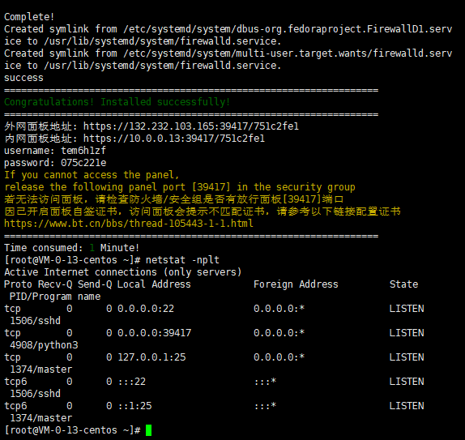
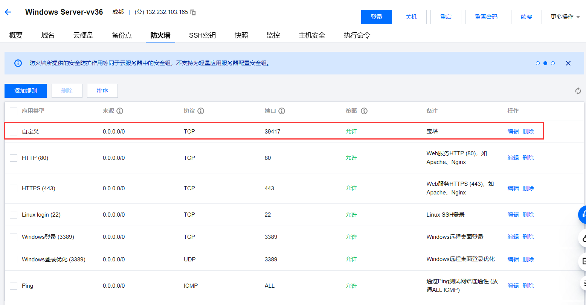
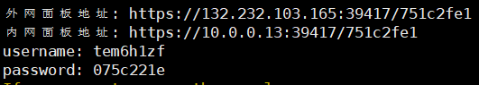

1.购买云服务器

2.服务器的用户名和密码: 用户名通常是root, 也可自行设定, 密码是自定的,这两个是在连接服务器时需要用到的

3.使用服务器连接工具(云服务器厂商自带的或者Xshell)连接云服务器, 常用的登录方式是利用用户名和密码,协议为SSH

连接服务器后出现如下提示信息代表连接成功


4.在服务器中安装宝塔来将部署过程图形化和简单化

```js
yum install -y wget && wget -O install.sh http://download.bt.cn/install/install_6.0.sh && sh install.sh ed8484bec
```

宝塔官网:[宝塔面板 - 简单好用的Linux/Windows服务器运维管理面板 (bt.cn)](https://www.bt.cn/new/index.html)

宝塔使用手册:[序言 · 宝塔面板手册 · 看云 (kancloud.cn)](https://www.kancloud.cn/chudong/bt2017/424204)

提示以下信息代表安装成功



5.在云服务器"安全组"中(轻量应用服务器是在"防火墙"当中)开启入方向的宝塔指定的端口:



6.利用安装宝塔时生成的"外网面板地址"以及用户名和密码来登录宝塔面板



利用nginx解决跨域

通常网页文件与网页请求数据在不同的服务器中(即前端和后端部署在不同的服务器中), 此时由于浏览器的跨域限制网页中的数据不能正常请求, 需要解决此问题.

在开发环境可以利用webpack的serve来解决, 而生产环境中需要使用其它方法, 有一种方式是利用nginx进行请求代理来解决.

在nginx的配置文件中:

```json
//在serve对象中添加:
location ^~ /api/ {
          proxy_pass  http://gmall-h5-api.atguigu.cn; //请求数据目标服务器
      }
```

详情:[使用 Nginx 解决前端开发时的跨域问题 - 知乎 (zhihu.com)](https://zhuanlan.zhihu.com/p/67058832)