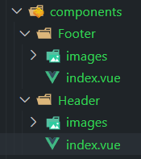

##   1分析路由组件

项目总共有以下几个页面:

Home首页、Search搜索页、login登录页、logup注册页

每个页面可以分为上中下三部分,分别为: Header、Main、Footer

 Header在四个页面中都有,Footer在登录和注册页面是没有的

路由组件: 根据不同页面的URL,Main部分的组件随之变化:总共有四个路由组件:Home、Search、Login、Logup

非路由组件:Header、Footer

 

## 拆分组件

拆分的组件包括以下几个部分:组件结构+组件样式+图片资源


拆分的组件都为其创建一个父文件夹,父文件夹名称为组件名称,在父文件夹中创建`index.vue`存放此组件,创建images文件夹存放图片资源



在引入组件时,路径可以直接到组件对应的父文件夹:

```js
import Header from "./components/Header/index.vue";
//等价于
import Header from "./components/Header";
```

### 安装less-loader包

项目采用的样式是less,要安装less-loader包

`npm install less less-loader@6 -D`

>less是开发环境依赖,所以安装时要用`-D`或`--save-dev'`

安装less-loader后想要生效,要给组件中的style标签添加`lang="less"`属性

### 清除默认样式

清除默认样式的css文件放在public文件夹中,然后在`index.html`中引入此文件:

```html
<link rel="stylesheet" href="<%= BASE_URL %>reset.css">
```


## 拆分组件

拆分组件包括三部分: html css 静态资源, 这三部分一个也不能少,

将html和css写入组件中时,引用的静态资源路径可能需要更正

### 全局组件

在项目中多次复用的组件可以注册为全局组件,可以直接在其它组建中不用注册而直接使用组件标签. 

项目中的三级联动组件可以注册为全局组件


## 非路由组件的使用

Headre和Footer是非路由组件,

>注意:在vue2中,template标签中必须有唯一的根标签,包括App组件的template标签


## 路由组件的搭建

### 安装vue-router

```js
npm install vue-router@3.5.3 
```

在路由器中添加路由配置,并将点击后会发生页面跳转的链接或按钮改为`<router-link></routerlink>`标签或者为其绑定点击事件的监听函数,在监听函数中利用编程式路由导航指定跳转的路径和路由组件

Footer非路由组件在登录和注册页面是不显示的,利用路由元信息和v-if来实现.

## axios二次封装和接口统一管理

axios二次封装即新建一个Axios实例

二次封装可以修改新建的Axios实例发送请求时的配置项的默认值,比如baseURL和超时时间等

```js
const requests = axios.create({
  baseURL: "api/",
  timeout: 5000,
});
```

还可以为新建的Axios实例设置请求和响应拦截器, 如果给axios设置请求和响应拦截器的话, 会污染axios发起的请求, 所有要设置请求和响应拦截器的话最好新建Axios实例

nprogress加载进度条的开始和结束函数要分别放在请求和响应拦截器中


接口统一管理即把项目中要用到的网络请求分别封装成函数,在需要时只需要引入并调用即可, 封装网络请求函数需要用到二次封装的axios

```js
//获取三级联动菜单数据
//reqCategoryList函数返回的Promise的resolve函数的参数为response.data,即请求体,因为设置了响应拦截器
export const reqCategoryList = () => requests.get("/product/getBaseCategoryList"); //由于在创建requests时设置了baseURL:'/api',所以url可以省去'/api'

//获取banner轮播图图片
export const reqGetBannerList = () => mockRequests.get('/banner'); //设置了baseURL:'/mock'
```


### API统一引入

还有一种方法可以简化API的使用:

将api中的所有接口在`main.js`中统一引入, 然后全局注册到vm身上,跟$bus操作一致:

```js
//统一引入api文件中的全部接口
import * as API from "@/api";

  beforeCreate() {
    //安装全局事件总线
    Vue.prototype.$bus = this;
    //将api中的全部接口全局注册
    Vue.prototype.$API = API;
  },
```

使用方法:

```js
this.$API.reqSubmitOrder(trade, data);
```

然后将请求到的数据直接存储在组件之中.

这种方式只能在组件内部使用,不能在xuex中使用,因为vuex内部的this的原型链不包含vue的原型对象,即$API所在处.

### nprogress进度条的使用

导包:

```shell
npm i nprogress -S
```

在`request.js`文件中引入:

```js
//引入进度条
import nProgress from 'nprogress'
//引入进度条样式
import 'nprogress/nprogress.css'

//nProgress.start():进度条开始
//nProgress.done():进度条结束

//请求拦截器中
requests.interceptors.request.use((config) => {
  //进度条开始动
  nProgress.start();
  return config;
});

//响应拦截器中
requests.interceptors.response.use(
  (res) => {
    //进度条结束
    nProgress.done();
    return res.data;
  },
  (error) => {
    return Promise.reject(error);
  }
);
```


## vuex的使用

### 仓库模块化

用模块化和命名空间,可以使数据分类明确,便于管理

将从后端请求到的数据存储到相关的小仓库中

### state中的数据初始值别乱写

state中数据的初始值不能乱写,要以请求到的数据为准,请求到的数据是数组,则初始值为[],请求到的是对象,则初始值为{}


## 防抖和节流

使用`lodash`库中的防抖和节流函数, lodash库不需要安装, 项目在创建时已经自动安装

引入时使用按需引入库中的防抖和节流函数,别直接引入整个lodash库

https://www.bilibili.com/video/BV1Vf4y1T7bw/?p=23&spm_id_from=pageDriver&vd_source=2338fda5892f8a962e39f2e0fb4667dd


## 将请求数据放在app组件中

将"派发action向服务器请求数据"放在App组件的mounted中,因为App组件只会挂载一次, 这样可以防止需要频繁挂载和销毁的组件在挂载的时候频繁发起请求,以提高性能,如三级联动的数据


## mockjs的使用

安装mockjs:`npm i mockjs -D`,mockjs是开发依赖

mockjs用于在开发阶段模拟服务器返回数据,以方便在开发阶段没有接口调用时项目开发的完整度.

webpack中, 图片和json数据是默认对外暴露的


## swiper和轮播图

安装swiper:`npm i swiper@`

//第一步:引包（swiper.js和swiper.css)

```js
//引入Swiper
import Swiper from 'swiper';
//引入swiper样式
import 'swiper/css/swiper.css'
```

如果多个轮播图都应用swiper,则可以将swiper样式的引入放在`main.js`中, Swiper需要在每个需要用到swiper的组件中都引入.

//第二步:页面中结构务必要有

```html
<!-- Swiper7的默认容器是'.swiper'，Swiper6之前是'.swiper-container'。 -->
<div class="swiper-container">
    <div class="swiper-wrapper">
        <div class="swiper-slide">Slide 1</div>
        <div class="swiper-slide">Slide 2</div>
        <div class="swiper-slide">Slide 3</div>
    </div>
    <!-- 如果需要分页器 -->
    <div class="swiper-pagination"></div>
    
    <!-- 如果需要导航按钮 -->
    <div class="swiper-button-prev"></div>
    <div class="swiper-button-next"></div>
    
    <!-- 如果需要滚动条 -->
    <div class="swiper-scrollbar"></div>
</div>
```

//第三步（页面当中务必要有结构）: new Swiper实例【轮播图添加动态效果】

>**注意**
>
>
>
>当项目中有多个轮播图都应用swiper时,每个new Swiper的`swiperContainer`参数要能区分每一个轮播图,可以用id选择器或者ref担当这个参数,而不能所有参数都使用`.swiper`这个类选择器,不然多个轮播图会发生冲突,导致某些轮播图发生错误

```html
<script>        
  var mySwiper = new Swiper ('.swiper-container', {
    direction: 'vertical', // 垂直切换选项
    loop: true, // 循环模式选项
    
    // 如果需要分页器
    pagination: {
      el: '.swiper-pagination',
    },
    
    // 如果需要前进后退按钮
    navigation: {
      nextEl: '.swiper-button-next',
      prevEl: '.swiper-button-prev',
    },
    
    // 如果需要滚动条
    scrollbar: {
      el: '.swiper-scrollbar',
    },
  })        
  </script>
```


由于在`new Swiper`时页面中录播图的DOM结构必须已经准备好,所以将`new Swiper`写在哪里才能确保是在结构就绪之后执行非常关键:

首页轮播图的数据(录播图的图片)是在组件mounted之后由vuex发送到组件中的, 并且组件在接收到数据后开始用v-for渲染轮播图的DOM, 这两个步骤执行完毕后才代表着**轮播图的DOM结构准备好了**,

解决方案:

最好的解决方案是利用watch+$nextTick(), 

watch确保页面已经接收到了数据,将`new Swiper`放在$nextTick()中可以确保轮播图的结构已经渲染完毕


Floor组件中的轮播图,当Floor组件挂载完毕时,轮播图的DOM结构已经准备完毕了,因为发送数据和接收数据都是在Floor的父组件中进行的,然后将数据传给了Floor组件, 所以可以直接在mountd中new Swiper


### 将轮播图组件封装为全局组件

由于轮播图多次复用,所以可以将其封装为全局组件, 封装为全局组件时必须要能满足每一处轮播图的使用.

全局组件和非路由组件都放在components文件夹中


## Search组件的网络请求

Search组件需要根据搜索参数的不同而频繁发送请求以根据搜索参数返回相对应的搜索数据.

在Search组件中创建一个属性:searchParams用来存储每次发送请求时携带的请求参数,在每次请求发送之前改写此参数,并在发送请求时携带上此参数

请求参数主要包含以下内容:

商品分类(三级菜单),对应路由的query参数

关键字(搜索框),对应路由的params参数

品牌

商品属性


从其它组件导航到Search路由组件有两种方式: 

在主页点击三级联动菜单中的链接(携带query参数)或者在搜索栏输入关键字然后点击搜索按钮(携带params参数)

当从其他组件导航到Search组件时,在beforeMount钩子中用路由携带的query和params参数来改写searchParams参数,然后在mounted钩子中发送网络请求,将请求到的数据存放在store中


在进入Search组件之后,如果再次重新导航到Search组件,但是携带的参数有变动,即在Search组件中再次点击了三级联动菜单或搜索框或**点击删除了商品分类或关键字面包屑**

此时URL会发生改变,但是并不会重现挂载一个Search组件,而是复用原来的Search组件,所以此时必须监听$route路由信息的变化,并在路由信息改变后改写searchParams然后重新发起请求

>还可以使用`beforeRouterUpdate`路由守卫,当Search组件的动态参数改变时触发.


### 面包屑的设计

面包屑主要有以下几类:

请求参数主要包含以下内容:

商品分类

关键字

品牌

商品属性

前三类面包屑每一类只能存在一个, 对于商品属性, 每一种商品属性都可以有一个面包屑


生成和删除面包屑都有两个任务需要完成: 改写searchParams参数,然后重新发起请求 和 需要时更改URL,使query和params参数展现在URL中

对于商品分类和关键字面包屑而言, url的query和params参数刚好对应它们, 所以在改写完searchParams参数后, 可以路由重新跳转至search,并且携带原来的query或params参数,watch监视到路由发生变化会自动重新发起请求,这样可以一次性完成两个任务.

但对于品牌和商品属性面包屑而言, 由于url的参数不包含它们, 所以在改写searchParams参数后需要手动调用`this.getData()`来重新发起请求, 且不用更改url参数.

### 合并参数

点击三级联动的链接后携带的是query参数

搜索框跳转携带的是params参数

当用户先点击三级联动的链接跳转到search页面然后点击搜索

或者先在搜索框搜索跳转到search页面,然后点击三级联动的链接,

这两种做法都会导致第二次路由跳转时路径中缺少query参数或者params参数,所以需要在这两种路由导航前先合并query和params参数(如果跳转时路由中有另一个参数,则将另一个参数携带上)

https://www.bilibili.com/video/BV1Vf4y1T7bw/?p=32&spm_id_from=pageDriver&vd_source=2338fda5892f8a962e39f2e0fb4667ddhttps://www.bilibili.com/video/BV1Vf4y1T7bw?p=32&spm_id_from=pageDriver&vd_source=2338fda5892f8a962e39f2e0fb4667dd)


### 排序

排序方式(综合或价格)和升降序都是由searchParams中的order驱动的

>1:综合,2:价格 asc:升序,desc:降序 示例:"1:desc"

逻辑:

如果点击的按钮与order现存的按钮不同,则将order中按钮改变为用户点击的按钮;

如果点击的按钮与order现存的按钮相同,则改变order中此按钮的升降序


## 分页器


对于分页器而言，自定义前提需要知道四个前提条件,也就是父组件传给分页器组件的props,这四个都是发请求后服务器返回的数据:

pageNo:当前是第几页

pagesize:代表每一页展示多少条数据

total:代表整个分页一共要展示多少条数据

continues:代表分页连续页码个数,一般设定为5或7


需要根据这四个条件得出:

页码总数totalPage: `Math.ceil(this.total/this.pageSize)`

连续页码中其它页码的值

将连续页码的第一个页码记为start,最后一个页码记为end

当前页大部分情况都在连续页码的中间,有可能是第3个(连续页码为5个)或第四个(连续页码为7个)

```js
start = pageNo-parseInt(continues/2);
end = pageNo+parseInt(continues/2);
```

特殊情况1:

当页码总数小于连续页码数时当前页不在连续页码的中间

```js
if (totalPage < continues) {
                start = 1;
                end = totalPage;
            }
```

特殊情况2:

当pageNo为第一二页或者倒数一二页时,当前页不在连续页码的中间,此时计算得到的start和end是不正确的,需要更正:

```js
//pageNo为第一二页时start<1
            if (start < 1) {
                start = 1;
                end = continues;
            }
            //pageNo为倒数一二页时start>totalPage
            if (end > totalPage) {
                end = totalPage;
                start = totalPage - continues + 1;
            }
```

然后通过v-for遍历数字并且通过v-if限定数字的范围在start~end,然后生成对应的button:

```js
<!-- 连续页码 -->
        <button v-for="(page, index) in startNumAndEndNum.end" :key="index" v-if="page >= startNumAndEndNum.start">{{ page
        }}</button>
```


### 处理其它按钮


这四个按钮并不是任何时候都显示的, 需要通过v-if来控制


当start>1时,"1"才显示,当start>2左边的"..."才显示

```js
<button v-if="startNumAndEndNum.start > 1">1</button>
        <button v-if="startNumAndEndNum.start > 2">···</button>
```

当end<totalPage时,"31"(总页码数)才显示, 当end<totalPage-1时,右边的"..."才显示:

```js
<button v-if="startNumAndEndNum.end<totalPage-1">···</button>
        <button v-if="startNumAndEndNum.end<totalPage">{{ totalPage }}</button>
```


### 点击按钮

当点击按钮后, 利用自定义事件将点击的页码数传给search父组件, 然后父组件利用得到的页码改写`searchParams.pageNo`, pageNo变化后又会通过props传给分页器组件,重新计算并渲染各按钮.

当pageNo==各按钮对应的页码时, 赋予按钮active类名


## 商品详情页

利用排它法实现使点击的商品属性变色,其它商品属性不变色

商品图放大镜的做法

商品图片列表的展示: 利用轮播图,然后控制一次展示几张图片以及每次切换几张图片

点击照片列表中哪张商品照片,则商品大图展示对应的图片,需要用到全局事件总线来进行兄弟组件之间的通讯,传递所点击图片的索引

**商品数量输入框的输入限定**

商品数量限制于:大于等于1的整数,所以当输入其它非法值时要将输入框的内容改为1:

```js
changeSkuNum(event) {
      //用户输入的文本*1
      let value = event.target.value * 1;
      //如果非法则改为1
      if (isNaN(value) || value < 1) {
        this.skuNum = 1;
      } else {
        this.skuNum=parseInt(value)
      }
    }
```


## 添加购物车


### "添加至购物车"按钮

点击"添加至购物车"按钮后,需要完成以下任务:

1.向服务器发送请求,将商品添加至相应的数据库,然后返回是否成功

2.服务器返回成功信号,则进行路由跳转至"添加购物车成功"路由组件,路由跳转时携带skuNum商品数量query参数,skuInfo通过对话存储来进行传递,因为skuInfo是对象,如果通过路由参数传递会使URL很混乱

### "添加购物车成功页面"


此页面需要商品详情页面的skuInfo和skuNum信息,skuNum可以通过路由的query参数获取,skuInfo则通过sessionStorage获取

点击"添加至购物车"按钮时,先将skuInfo添加至sessionStorage中,然后在这个临时页面中读取,每一次点击"添加至购物车"按钮都会刷新sessionStorage中的skuInfo

localStorage和sessionStorage都只能存储字符串, 所以在读取的时候都需要先将对象或字符串进行转换: JSON.stringfy()和JSON.parse()

由于是单页面应用, 所以在关掉便签页之前对话存储中的数据都会存在,即最新一次点击"添加至购物车"按钮时对应商品的页面的skuInfo


"查看商品详情"按钮不能使用`this.$router.back()`来跳转到商品详情页面,因为有可能一次添加多个商品, 需要根据不同的商品来重新生成不同的商品详情组件, 而不是返回上一个页面.


## 购物车


当未登录时,会在进入商品详情页面时自动生成一个随机id用于标识游客身份,然后在请求拦截器中设置:在项目的每次网络请求的请求头中设置`userTempId`字段,然后每次网络请求时会携带游客的id, 这样才能实现未登录下添加购物车功能

```js
//游客id
      uuid_token: getUUID()

//uuid字段名为:userTempId
    config.headers.userTempId = store.state.detail.uuid_token;
```

随机id使用uuid生成,并且存储在localStorage中


购物车主要有以下几个功能:

修改商品数量,并通知服务器对应修改: 两个按钮和一个输入框的设计

还有数量输入框输入内容的限制

改变商品的选中状态,并通知服务器对应修改: 单选和全选按钮的设计

删除购物车中的商品,并通知服务器删除

这三个功能都有对应的接口

在通知服务器对应修改后还要重新请求购物车的数据并做展示


勾选或者删除所有勾选的商品时,涉及到`Promise.all()`的使用


### 全选按钮

 当购物陈车中所有商品都被选中(isChecked==1)且商品数量>0时,全选按钮设置为勾选状态,其他情况均为未勾选

当点击全选按钮时,对应地修改商品的选中状态


## !!!登录


13700000000

111111

没有数据的使用123的账号，密码也是123


### 获取用户信息

在登录成功后需要获取用户信息,然后在header组件中展示用户名

需要发送请求获取用户信息的时机:

- 在登录成功时

  ```js
  //登录按钮的回调
      userLogin() {
        ......
  
            //登录成功后发送请求获取用户信息
       this.$store.dispatch('user/getUserInfo')
          }).catch(error => alert(error))
        }
      }
  ```

- 进入网站(自动重定向至home页面)时

  进入网站时获取用户信息的请求对应的action可以放在App组件、Header组件、Home组件中皆可,但最好是放在Header组件中,因为Home组件需要频繁挂载,会频繁发起请求,而放在App组件中不够直观,因为用户信息本就是在Header组件中展示,所以放在Header中最合适:

  ```js
  //Header组件中:
   mounted() {
      //当进入网站时获取用户信息
      //当本地有token并且store中没有用户数据时才发送请求
      if (this.$store.state.user?.token && !this.$store.state.user?.userInfo?.name) {
        this.$store.dispatch('user/getUserInfo')
      }
    }
  ```

当Header组件检测到vuex中有了用户信息后,会做响应的展示.

>- 获取到的用户信息,会同时保存到user子仓库和sessionStorage中,防止刷新导致vuex中的用户信息丢失,刷新页面后从sessionStorage中读取用户信息.
>
>- 进入网站时发送请求所携带的token是用户浏览器中所存的token,登录成功后发送请求所携带的token是后端新发过来的token.

### 刷新页面导致vuex数据丢失

将请求到的用户数据存储在sessionStorage中,然后在vuex中读取sessionStorage中的数据

```js
userInfo:
      //给userInfo一个默认值{},防止sessionStorage中userInfo为空时访问它的属性从而报错
      JSON.parse(sessionStorage.getItem("USERINFO")) || {},
```

**但要注意:由于vuex无法检测Storage中数据的变化,所以在修改storage中数据的时候必须也手动对应修改vuex中的数据**

在登录成功时:

```js
 //并且手动将state中token修改,因为vuex无法监测localStorage中数据的变化
        commit("USERLOGIN", result.data.token);
```

以及在请求用户信息成功时:

```js
//并且手动将state中userInfo修改,因为vuex无法检测sessionStorage中数据的变化
        commit("GETUSERINFO", result.data);
```

在退出登录时:

```js
//把仓库中用户相关信息清空
      //清空本地存储的token
      removeToken();
      //清空sessionStorage中的userInfo
      sessionStorage.removeItem("USERINFO");
      //这两步是必需的,因为vuex无法检测到storage中数据的变化,只能在首次加载时读取storagezhogn
	  //手动清除store中的token和userInfo
      state.token = "";
      state.userInfo = {};
```


### 路由鉴权的设计

不同的路由在不同的条件下是有不同的进入条件的,需要利用路由守卫来对能否进入某些路由进行限制:


"/trade"、"/pay"、"/paysuccess":这几个路由在未登录时是没有按钮可以点击进入的, 但是通过修改url的方式进入, 所以要对此进行限制: 在未登录的情况下通过修改url的方式尝试进入这些路由会被直接阻止并且停留在原路由.

"/shopcart"和"/center"在未登录时是有按钮可以点击进入的,也可以通过修改url的方式进入, 在未登录时尝试进入这些路由会自动跳转至登录页面, 登录成功后再跳转至目标路由.

>在跳转至登录页面时,将目标路由的path用query参数(参数名为:redirect)传递给login路由,以达到在登录成功后跳转至目标路由的目的

这两种都可以利用一个全局前置守卫实现:

```js
//全局前置守卫
router.beforeEach((to, from, next) => {
  //进行登录鉴权
  //未登录时不允许进入的路由:"/trade"、"/pay"、"/paysuccess"
  //未登录时进入会跳转至登录页面,登录成功后跳转至目标路由:'/shopcart'、'/center'
  //如果vuex中的token不为空,则代表用户登录了
  if (store.state.user?.token) {
    next();
    //未登录:
  } else {
    let toPath = to.path;
    if (
      toPath.includes("/trade") ||
      toPath.includes("/pay") ||
      toPath.includes("/center")
    ) {
      next(false);
    } else if (toPath.includes("/shopcart") || toPath.includes("/center")) {
      //将目标路由的path用query参数传递给login路由,以达到在登录成功后跳转至目标路由的目的
      next(`/login?redirect=${toPath}`);
    } else {
      next();
    }
  }
});
```

在已登录状态下, "/trade"、"/pay"、"/paysuccess"这些路由也只能从特定的按钮点击进入,而不能在其它页面通过修改url的方式进入,所以要对此进行限制, 可以利用路由独享守卫对这几个路由分别进行限制:

```js
beforeEnter: (to, from, next) => {
        //进入订单页面,只能从购物车点击结算而来,其它方式进入订单页面会被阻止(停留在当前页面)
        if (from.path == "/shopcart") {
          next();
        } else {
          next(false);
        }
      },
          
beforeEnter: (to, from, next) => {
        //进入支付页面,只能从订单页面而来,其它方式进入支付页面会被阻止(停留在当前页面)
        if (from.path == "/trade") {
          next();
        } else {
          next(false);
        }
      },
 
beforeEnter: (to, from, next) => {
        //进入支付成功页面,只能从支付页面而来,其它方式进入支付成功页面会被阻止(停留在当前页面)
        if (from.path == "/pay") {
          next();
        } else {
          next(false);
        }
      },
```


当需要鉴权的路由比较少时可以采用路由元信息或者直接判断路径是否含有需鉴权路由的路径,当需要鉴权的路由比较多时,可以建立一个路由鉴权表

>路由鉴权表:
>
>写一个数组存放未登录不能去的路由页面，在全局前置守卫未登录跳转时判断路由是否在这个数组里，在就去登录页，不在就放行。


在登录页面中:

登录成功后要先判断路由中有没有query参数

有则代表是由于登录鉴权而被动跳转来的登录页面, 登录成功后要跳转至原本要进入的页面

没有query参数则代表这是主动点击登录按钮而来的登录页面,登陆成功后跳转至home首页

```js
//登录按钮的回调
    userLogin() {
      const { phone, password } = this;
      //进行简单的表单验证:phone和password不为空
      if (phone && password) {
        this.$store.dispatch('user/userLogin', { phone, password }).then(() => {
          //登录成功后判断路由中有没有query参数
          //有则代表是由于登录鉴权而被动跳转来的登录页面, 登录成功后要跳转至原本要进入的页面
          //没有query参数则代表这是主动点击登录按钮而来的登录页面,登陆成功功后需跳转至home首页
          let toPath = this.$route.query.redirect ?? '/home';
          this.$router.push(toPath);

          //登录成功后发送请求获取用户信息
          this.$store.dispatch('user/getUserInfo')
        }).catch(error => alert(error))
      }
    }
```


### 登录后不能进入login页面

登录成功后应该不能再访问登录Login界面, 登录后由于没有了登录按钮,所以访问Login界面要手动修改URL

解决方法: 给login路由添加路由独享守卫: 当用户已经登录然后试图进入login页面时路由重导航至home首页:

```js
beforeEnter: (to, from, next) => {
        //如果用户已经登陆了,则阻止用户通过修改URL进入login界面
        if (store.state.user.token) {
          next({ path: "/home" });
        } else {next()}
      }
```


### 游客模式

游客模式下:登录前为游客身份, 允许用户在未登录的情况下将商品添加进购物车,但在购物车中点击结算时会跳转至登录页面

此时加入购物车为游客购物车, 登录后，在请求购物车列表数据时(即发送reqCartList请求时)会把游客购物车合并到用户购物车，并清空游客购物车

**游客模式的实现方式**

在进入网站时,如果本地没有游客id(localStorage中的游客id失效过期 被自动删除了)则使用uuid生成随机的游客id,然后将游客id传入vuex中,游客id最好放在user子仓库中.

创建游客id,将其存入localStorage中,以及返回给vuex这些功能可以封装为一个函数:

使用uuid需要先导包

```js
import { v4 as uuidv4 } from "uuid";

//生成一个随机id用于标识游客身份,其每次执行不发生变化,采用localStorage存储
export const getUUID = () => {
    //先尝试从本地存储获取uuid
    let uuid_token = localStorage.getItem('UUIDTOKEN');
    //如果没有
    if (!uuid_token) {
        //生成游客临时身份
        uuid_token = uuidv4();
        //本地存储存储一次
        localStorage.setItem('UUIDTOKEN',uuid_token)
    }

    return uuid_token;
};
```

然后在vuex的仓库中:

```js
//引入getUUID函数
import { getUUID } from "@/utils/uuid_token";

state: {
    //游客id
    uuid_token: getUUID(),
}
```

然后在请求拦截器中设置:在请求头中添加uuid字段(字段名:userTempId),在每次发请求时都携带游客id,用于确认游客身份,这样就可以在未登录的情况下使用游客购物车的相关功能

```js
//在请求头中添加uuid
  if (store.state.user?.uuid_token) {
    //uuid字段名为:userTempId
    config.headers.userTempId = store.state.user.uuid_token;
  }
```

登录后，会把游客购物车合并到用户购物车，并清空游客购物车

### token的使用

#### 基本使用

登录成功时获得服务器返回的token身份令牌, 将token保存到localStorage中进行持久化保存,同时将其保存到vuex的仓库中

```js
//用户登录
    async userLogin({ commit }, data) {
      //登录成功服务器返回token
      let result = await reqUserLogin(data);
      //登录成功则将token保存在仓库中
      if (result.code == 200) {
        //将token持久化存储: 存储在localStorage中
        setToken(result.data.token);
        //并且手动将state中token修改,因为vuex无法监测localStorage中数据的变化
        commit("USERLOGIN", result.data.token);
      } else {
        throw new Error(result.message);
      }
    },
```

在请求拦截器中设置:在请求头中添加token字段,token的值可以从vuex中读取,也可以直接从localStorage中读取

在登录成功后的每次网络请求中都将token携带给后端,用于后端确认用户身份

```js
//给requests添加请求拦截器
requests.interceptors.request.use((config) => {
  //在请求头中添加token
  if (store.state.user.token) {
    config.headers.token = store.state.user.token;
  }
  return config;
});
```

#### token失效(过期)

后台的token是有时效的,在进入网站发送请求获取用户信息时, 后端在验证token时可能会因为token过期而导致获取用户信息失败,此时后端会返回"未登录"的信息,此时要做的事情是清空localStotage中失效的token以及vuex中的token(如果在页面加载时vuex中的token就读取了localStorage中的token)

此时由于获取用户信息失败,所以vuex和sessionStorage中的用户信息都是不存在的.

还有一种情况需要清空token,以及用户信息,那就是退出登录的时候


## element-ui+qrcode实现二维码支付

### element-ui按需引入


### qrcode

官网: [qrcode - npm (npmjs.com)](https://www.npmjs.com/package/qrcode)

qrcode用于生成二维码

用法:

1.导包:在需要用到二维码的组组件中:

```js
import QRCode from 'qrcode'
```

2.使用QRCode.toDataURL()函数生成二维码图片的地址

```js
let url = await QRCode.toDataURL([二维码链接]);
```

QRCode.toDataURL()函数返回的是Promise,resolve参数为生成的二维码图片的地址

3.在img元素的src属性中使用生成的二维码地址

```html

```


## 图片懒加载


### 使用

利用vue-lazyload插件:

导包: `npm i vue-lazyload@1.3.3`

将图片懒加载时的默认图片和图片加载失败后显示的图片放在assets文件夹中

在main.js中:

```js
//引入图片懒加载插件
import Vuelazyload from 'vue-lazyload';
//引入图片懒加载时的默认图片
import atm from '@/assets/lazyload.gif'
//引入图片加载失败时显示的图片
...
//注册插件
Vue.use(Vuelazyload, {
  //默认图片
  loading: atm
  //失败图片
  ...
});
```

将需要图片懒加载的img元素的src属性直接改为`v-lazy`:

```html
//修改前

    
//修改后:

```

### 原理


## 表单验证


## 项目打包上线

命令:`npm run build`

会生成一个dist文件夹,这个文件夹就是要放在服务器上的文件夹.

### map文件的去除

项目打包后，每一个js文件都会对应生成一个map文件

打包后的代码都是经过压缩加密的，如果运行时报错，输出的错误信息无法准确得知是哪里的代码报错,有了map文件就可以像未加密的代码一样，准确的输出是哪一行哪一列有错。


所以该文件如果项目不需要是可以去除掉.
在vue.config.js 中配置:
productionSourceMap:false


